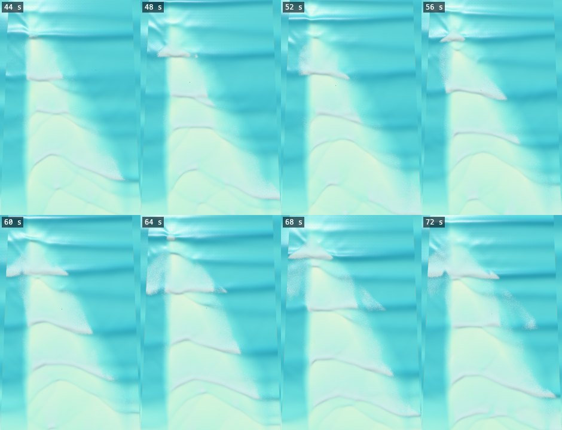
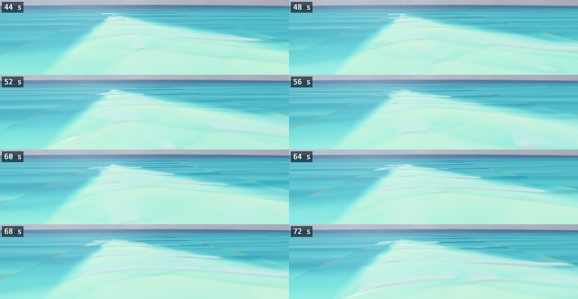
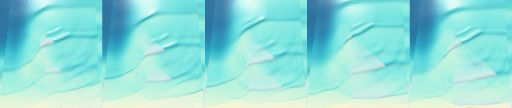

# The Canyon as a spilling wave (prototype S2), 2026-10-05

The Canyon (`canyon`) is now a spilling-wave prototype: the crest crumbles from the top and the whitewater spills down the face, while the green shoulder ahead stays clean. Each break peels **left to right as seen from the beach looking out to sea (toward +x)**.

Three things were built:

- a new bed;
- no lip and no tube at the Canyon;
- a **spilling front** that holds the whitewater back ahead of each wave's peel.

Branch `claude/canyon-spilling-wip`.

## Direction convention

`+z` points toward the beach and `+x` runs along shore (`src/wave/Bathymetry.ts`). The game's cameras use world coordinates directly. The beach-side views (`SpectatorCamera` front, overview and cinematic views) look toward −z with +y up, so **+x is screen-right**.

For a surfer facing the beach, +x is on their left: the Reef and Padang Padang, which are lefts, also peel toward +x. The Canyon's peel toward +x is therefore what the owner asked for: left to right from the beach. The overhead shots below put the sea at the top, so +x is on the right there too.

## What was built

### 1. The bed (`src/wave/Bathymetry.ts`: `CANYON`, `canyonTerraceDepth()`, `canyonBreakLineZ()`, `canyonArmAt()`; the tank in `tankLayout`)

#### The straight-crest bed (2026-10-06)

**The owner's requirement.** On the prototype's screenshots the owner saw that "the wave formation comes from a corner forming a strange shape". The waves must form straight to the beach. The timing of the sets may vary, but waves may not come from more than one side, much less at the same time.

**Why the prototype's crests bent.** Its canyon ran along the −x open edge (see "The prototype's bed" below). The swell ran ahead over the canyon's axis, so on its flank the crests turned toward +x and wrapped in from that corner. On the crest-angle report its crests stood at a mean −20° on both watched lines, against 0.8° at the plain Beach under the same swell (the table below).

**Why the sea ran flat without the canyon.** The prototype's session found that removing the canyon "ran the sea flat by about 45 s". The cause is the tank's grid, not the bed:

- The tank had 4 m cells from its relaxation zone to z = −150, and 1 m cells only inshore of that. The shelf (2.4 m) began at z = −190, so the swell shoaled from the 5 m edge onto it on the 4 m cells.
- Steepening there, the waves lost a third of their height without breaking: H1/3 was 1.64 m at the zone and 0.95 m on the shelf, and no cell broke anywhere seaward of the shore (seed 1, 40–150 s).
- On the 1.3 m terrace those waves were too small to reach Kennedy's onset. Once the warm start's set had passed, nothing broke but the shore break.
- The canyon had hidden this: over its deep third of the window the waves kept their height, and its flank focused them onto the terrace.
- With 1 m cells everywhere the same bed kept the waves' height (H1/3 1.8–1.95 m at the blend's end), and they broke on the terrace again. On 2 m cells they still lost a third on the shelf.

**The fix: 1 m cells from the zone in** (`tankLayout`). The Canyon's tank keeps today's 5 m edge and 60 m relaxation zone, moved out to `CANYON.zoneInner` = −396 so the whole arm fits. Its 1 m cells start at the zone, so the shoaling is resolved. It has 449 × 160 = 71,840 cells, against 37,280 before, but no 16 m canyon in its 1 m cells, so its stable step is longer. On the M1's CPU (64 components, seed 1, 40 s, run back to back on a shared machine) it took 1,288 ms per simulated second, against 1,168 ms for the prototype: about 10 % more.

**Resolved, the swell is bigger on a shallow shelf.**

- With no terrace, a 2.4 m shelf closed it out: 150 onsets on the shelf in 160 s. A 2.8 m shelf held it: none.
- But once a wave broke at the arm's peak, the break ran along its crest both ways at 45°, onto the level shelf ahead of the arm and upcoast of the peak. On 2.8 m the crests stood at η_t/√(gh) 0.14–0.37 for H ≥ 1 m. That is above 0.15, which the breaking age lowers Kennedy's threshold to (the peel bar, below).
- On 3.6 m the crests are flatter, and the starts and the direction became consistent (the sweep, below).

**The bed** (`CANYON`):

- **The shelf.** A 60 m blend takes the bed from the 5 m edge to a level sand shelf `shelfDepth` = 3.6 m deep. Seaward of the arm the bed is level along shore, so the crests reach it straight.
- **The arm.** A terrace `crestDepth` = 1.0 m deep stands on the shelf.
  - Its seaward edge, the break line, runs at `angle` = 62° to the shore from its peak (`peakX` −48, `peakZ` −236) toward +x and the beach.
  - It meets the beach face at x = 64, inside the +x edge's margin, so it spans the window, and no beach section beside it closes out downcoast. Shorter arms left one, whose waves started a second break where the arm met the beach face.
- **Its face.** It climbs at `pathSlope` = 1:30 along the waves' path (1:14 across the line). The readout's Iribarren number at the take-off is 0.35, spilling, as before.
- **Its upcoast end.** Upcoast of the peak the arm ends in a face along +z, falling at `endSlope` = 1:4 across x.
  - Every depth's contour is therefore furthest out at the peak, or within 10 m upcoast of it where the end reaches that depth, so each wave starts breaking there.
  - Nothing upcoast faces the swell.
  - The end lies 10 m inside the −x open edge's 20 m levelling (`OPEN_EDGE_RAMP`), so the edge copies plain shelf. In the sweep, ends inside the levelling left a shoal along the edge, and the waves broke on it.
- **The beach face.** Planar at 1:25, as before.

**The take-off** (`takeOffPoint`).

- **Along shore.** The 'focus' rule found no canyon to gather the swell: the ray concentration at its seat fell to 0.75 for one of the test's swells. The Canyon's riders now wait at its peak, like the Reef's, Padang Padang's and the Pool's: `TAKE_OFF.canyon` = 'peak', at `CANYON.takeOffX` = −40, 8 m down the arm from its peak.
- **Across shore.** The rule is unchanged: riders wait where the arm has risen `CANYON_TAKE_OFF_RISE` above the shelf. That is now 1.7 m (1.9 m deep), where the waves 4–12 m down the arm were measured starting to break (a median of 1.9 m; Medium, seed 1, 600 s).

**The peel is the arm's** (`canyonArmAt`), as at the Reef, Padang Padang and the Pool: from the arm's end beside the peak (x −58) to the beach face. Upcoast of that, the square crests close out on the beach face in the window's −x strip.

**Before and after.** The owner's swell is Medium: Hs 1.4 m at the edge, Tp 11 s, 0°, s = 150 (`REFRACTED_SPREADING`). The before is the prototype's bed below. The bars are the owner's requirement, made measurable.

| Bar | Target | Before: the prototype (canyon on the −x edge) | After: the straight-crest arm |
| --- | --- | --- | --- |
| 1. Straight crests (crest-angle report, seed 1, 600 s, 64 components): mean angle, mean \|angle\|, max \|angle\| | Mean near 0, no sign; mean \|angle\| within about 2° of the Beach's (edge 4.3°, take-off line 4.4°; mean 0.8° on both) | Edge −20.0°, 20.0°, 40.2°; take-off line −19.8°, 20.1°, 38.8° | **Edge 0.5°, 2.7°, 19.1°; take-off line 0.7°, 3.3°, 12.7°** |
| 2. The same start: each crest's first onset along shore, 3 seeds × 14 periods | ±10 m | Median x −18; 24 of 31 waves (77 %) within ±10 m; 10–90 % range −23…43 | **Median x −50; 38 of 40 (95 %) within ±10 m; 10–90 % range −52…−45** |
| 2. Over 600 s (seed 1) | ±10 m | Median x 43; 6 of 25 (24 %) | **Median x −50; 49 of 50 (98 %)** |
| 3. One way: clean waves toward +x (canyon-peel-report, 3 seeds × 14 periods; the after's on the arm, the before's across the window) | ≥ 90 % | 33 of 34 (97 %) | **40 of 40 (100 %)**; each crest's own onsets: 40 of 40 |
| 3. Over 600 s (seed 1, the same tracker) | ≥ 90 % | 20 of 29 (69 %) | **52 of 53 (98 %)** |
| 4. Peel angle: canyon-peel-report's median, 3 seeds × 14 periods | 45–60° | 45° | **31°: not met** (each wave's own fit along the arm: a median of 42°, against 45° before) |
| 5. Stable for 600 s (seed 1) | No running flat, no blow-ups | Stable: fastest water 3.2 m/s, no Froude caps, volume within 1.6 %. But its breaking dwindled: 79–557 onsets per 100 s | **Stable: fastest water 5.4 m/s (3.7 m/s typical over 10 s), no Froude caps, volume within 2 %; 890–1,060 onsets per 100 s throughout** |
| 6. Pictures | Straight crests and the peel | `img/final-*` | **`img/straight-*`** (below) |
| Spilling: the readout at the take-off | ξ < 0.4 | 0.35 | 0.35 |
| Lip jets | 0 | 0 | 0 |

**What the numbers mean.**

- **The crests.** They are now as straight as the Beach's, slightly straighter: the Beach's bars and rips turn its crests a little.
- **The start.** Each wave starts breaking at the arm's peak: 38 of 40 waves start between x −56 and −41.
  - The two outliers were small waves. One, a 1.0 m face, first broke on the terrace's top behind the line at x −29. The other broke over a short stretch of the face mid-arm (x 11–20).
  - The prototype's starts wandered between its terrace and the beach. Over 600 s on seed 1 they wandered further (median x 43).
- **The direction.** Every clean wave peeled toward +x. In about a quarter of the waves, mostly the big ones, the break also spread upcoast of the peak (more than two onsets over 5 m upcoast within 3 s): typically 5 m, at worst 20–48 m. That is the breaking age's sideways spread (below). The prototype did the same in a similar share (8 of 31 waves).
- **The peel.** See the next part.

**The peel bar is not met, and on today's meter no bed can meet it.** The water-physics advisor's consult (2026-10-06, `docs/research/water-physics/consult-log.md`) found two limits.

- **The breaking age's sideways spread.**
  - Kennedy's threshold falls from 0.65√(gh) to 0.15√(gh) as a break ages. The age passes to the cell behind a face and to its two diagonals (`breakingAge.ts`, rule A), so it moves one column along the crest for each row the face advances: along the crest, at the crest's own speed.
  - On this swell's crests (0.15–0.37√(gh) on a 2.8–4 m shelf) a break at the peak runs along the crest at that speed, ahead of the arm's own peel. The tracker reads that as asin(4.65 / (√2 · c)): 31° at c = 6.3 m/s, the after's median.
  - In nature each part of a crest breaks at its own threshold:
    - Dally (1990): on straight contours the break point simply moves along the bottom contour.
    - Goda (1992) modelled a sideways spread of 0.30 C_b on average.
    - Surf Ranch measured 0.48 C (Feddersen et al. 2023).
  - The advisor's inferred fix: take the age only from the parent nearest the up-ray (−∇η), or a 0.35√(gh) threshold for joining through the diagonals. It revisits rule A (PR #76), so every spot's peel moves.
- **The meter's celerity.**
  - The tracker's sin α = c_b · |dt/dx| / stretch uses c_b = √(g h_b) = 4.65 m/s, from the shoaled-breaker estimate.
  - The break point can't move slower than a straight crest, so sin α ≤ (4.65 / c_s) · sin φ, where c_s is the crests' speed on the shelf. With crests at 6.3 m/s (H ≥ 1.2 m on a 2.8–4 m shelf, measured) that tops out at 47.6°, and 45° needs φ ≥ 73.5° with no spread.
  - The prototype read 45° because its damped waves were small and slow: the damping, not the bed, kept its tracker reading high.
  - Hutt's peel angle uses the crest's own speed (Walker & Palmer, via Scarfe et al. 2009). On a meter with c_b = √(2 g H_b) = 5.8 m/s, an arm at 60–66° reads 53–57° and the spread 41° (the advisor's table). That meter is the owner's decision of 2026-09-29, still unbuilt.
- **Why the tracker and each wave's fit differ** (31° and 42°). The tracker samples once a period: it fits the latest onsets of the longest run of columns within 1.1 s of each other. With three waves on the 230 m arm at once, that run is often a stretch of the fast spread. Each wave's fit spans its whole ride, the arm's slower stretches included.
- **For the owner:**
  - Is 50–60° meant on the crest-speed meter?
  - Should rule A change, at every spot?
  - Should the beach close out beside the arm, upcoast of the peak?

**The sweep.** One seed (1), 8 periods each, unless noted. The peel is the tracker's median, on the arm only from row 3 on. "Starts" counts each crest's first onset within ±10 m of their median, out of the waves tracked. "Upcoast" counts waves whose break also ran over 5 m upcoast of their start within 3 s.

| Design | Peel | Starts | Toward +x | Upcoast | What happened |
| --- | --- | --- | --- | --- | --- |
| The prototype without its canyon, old tank | — | — | — | — | Nothing broke after 40 s: the coarse grid (above) |
| Short arm on the old tank: 2.4 m shelf, 1.0 m crest, 62°, peak (−48, −140) | 46° | Two places | 6 of 6 | — | Its damped waves started at the peak or where the arm met the beach face (x ≈ 0) |
| Short arm, 1 m cells: 2.8 m shelf, 66°, peak (−48, −156) | 40° | Scattered | 5 of 6 | — | Breaks ran both ways along the crests; the beach downcoast closed out |
| Long arm, 62°, peak (−48, −236), 1.3 m crest, face 1:26 along the path: 2.8 m shelf | 30° | 6 of 8 | 7 of 8 | 4 | The spread ran over the shelf |
| The same, 3.6 m shelf | 36° | 8 of 8 | 8 of 8 | 2 | |
| The same, 4.4 m shelf | 31° | 7 of 7 | 6 of 7 | 2 | Faster crests |
| Long arm, 3.6 m shelf, 70°, peak (−48, −330) | 38° | 8 of 8 | 8 of 8 | 4 | Over 3 seeds × 14 periods: 36°, 39 of 40 toward +x, starts 36 of 38, each wave's fit 44°; 85,280 cells |
| **Long arm, 3.6 m shelf, 62°, 1.0 m crest** | 36° | 7 of 7 | 7 of 7 | 3 | **Kept**, with its face at 1:30 along the path (ξ 0.35) |
| Short arm, 5 m shelf, 72° | 15° | Scattered | 5 of 5 | — | The beach face beside it closed out |

**Pictures.** Headless Chrome on the M1's GPU (`--gpu`: Metal through ANGLE), Rich look, midday; Medium, 0°, s = 150, CPU solver, frames 1 s apart from 33 s into the sea, with every fourth shown (44–72 s).

- **Overhead** (sea at the top, +x to the right; the window is the strip between the far field's bands): `img/straight-overhead-sheet.jpg`, frames `img/straight-overhead-11.jpg` … `-39.jpg`.
  - Seaward of the arm the crests are straight and square to the beach.
  - Each wave breaks first at the peak (top left). Its whitewater grows down the arm toward +x and the beach while the crest beside it stays green. Two or three waves are on the arm at once.
  - Upcoast of the peak a haze of foam marks the breaks that also spread that way.

- **From the beach** (24 m up behind the shore, looking out past the peak; +x is screen-right): `img/straight-beach-sheet.jpg`, frames `img/straight-beach-11.jpg` … `-39.jpg`. The peak breaks at the horizon, and the whitewater runs toward the right along the arm, over the pale terrace.

**Rideability on the straight-crest bed (2026-10-07).** The owner's criterion is that a surfer can catch the wave and ride the shoulder. It was measured as on the prototype's bed (see Rideability, below), on the same swell: Medium, 0°, s = 150, tide 0 m, calm wind, seeds 1 and 2, 3 minutes each, stage 2 on the CPU.

- **The catch report** (`node dist/scripts/catch-report.mjs --spots canyon --swell medium --spreading 150 --direction 0 --seeds 2 --minutes 3 --ghosts`). 30 ghost bots wait prone at −45, −25, −5, +15 and +35 m along shore from the break point and −8 to +12 m outside it, and ride straight in.

  | Bed | Attempts | Cue lit | Stood | Rides ≥ 3 s | Median ride | Longest |
  |---|---:|---:|---:|---:|---:|---:|
  | Prototype (corner canyon) | 831 | 19 | 16 | 3 | 2.0 s | 4.6 s |
  | **Straight-crest arm** | 980 | 41 | 41 | 25 | 3.3 s | 7.5 s |

  - **Cues lit only near the peak**, as before. They lit for the bots at x −49.5, at the peak (34 cues, 34 stood), and x −29.5, 20 m down the arm (7 and 7).
  - **None lit at x −69.5, −9.5 or 10.5** (573 attempts). The row slid 15.5 m along shore to keep inside the window's edge margin.
  - **Outcomes:** 39 fell riding (balance), 2 fell riding (lost board), 20 lost the board before standing, and 919 saw no cue.
- **The ride report** (`node dist/scripts/ride-report.mjs --spots canyon --swell medium --spreading 150 --direction 0 --seeds 2 --minutes 3 --ghosts`). The runner's own rider waits at the take-off and 6 ghosts at x −69.5, −49.5, −36.5, −12.5, 0.5 and 20.5, all 6 m seaward of it. An autopilot holds a line toward the peel and turns on the face.

  | Bed | Attempts | Stands | Rides ≥ 3 s | Stand: median / longest | Along shore toward +x: median / most | Path: median / most |
  |---|---:|---:|---:|---:|---:|---:|
  | Prototype | 187 | 23 | 0 | 0.8 s / 3.0 s | 0.6 m / 8.7 m | 2.0 m / 20.0 m |
  | **Straight-crest arm** | 223 | 30 | 3 | 1.1 s / 4.4 s | −0.2 m / 12.4 m | 7.4 m / 30.6 m |

  - **The three rides of 3 s or more:**
    - 3.4 s, 12 m toward +x, ended by a fall (lost board);
    - 3.6 s, 7 m toward −x, kicked out;
    - 4.4 s, 9 m toward +x, ended by a fall (balance).
  - **Outcomes:** 167 missed the wave, 25 fell (lost board), 22 fell (balance) and 1 was kicked out.
  - **The weight sits nearer trim** while standing: 0.69 riding level and 0.58 going down the face, against 0.87 and 0.98 on the prototype's bed (the stance map's trim is 0.50–0.62).
- **Where the bots wait against the break line.** Both rows run parallel to the beach, while the break runs at 62°. At each bot's x, against where the waves started breaking there (the median onset, 3 seeds × 14 periods):
  - near the peak (x −49.5 to −29.5) the bots wait from 5 m inside to 10 m outside the break;
  - down the arm (x −12.5 to 20.5) they wait 52–117 m seaward of it;
  - upcoast (x −69.5) they wait on the shelf, where the upcoast spread breaks.
- **What the numbers say.**
  - **More riders catch it and stand, but nobody rides the shoulder yet.** The best stand rode 4.4 s, and the furthest 12.4 m along shore toward +x.
  - **Waiting along the arm is one gap.** Every cue lit within 20 m of the peak; the bots further down the arm wait 52–117 m outside the break and never see a breaking crest. So the reports sample the take-off only at the peak, where the break spreads both ways, and never the arm's shoulder.
  - **The autopilot's riders, who catch it near the peak, fall within 4.4 s,** mostly losing the board or on balance. The catch report's riders, riding straight in, last up to 7.5 s. Whether bots waiting along the arm, in front of its slower, bed-controlled break, would ride the shoulder is the next ruling: where the bots wait.

#### The prototype's bed (2026-10-05)

The prototype's bed had three parts:

- **A canyon on the −x open edge** (axis x = −80, 14 m deep, level across the boundary). It turned the crests toward +x.
- **A level sand shelf** 2.4 m deep, then a planar beach face at 1:25.
- **An oblique terrace** 1.3 m deep. Its break line ran at 62° from its peak (−40, −140), rising at 1:12 across the line (1:26 along the path). It faded out upcoast of the peak over 25 m.

Before it, with the canyon on the +x edge and a Dean beach, the swell peeled both ways: a median of 17°, and 12 of 25 clean waves toward +x. That session's bars and shelves at 55–75° without the canyon gave medians of 8–15°, peeling both ways, and then ran the sea flat (the coarse grid, above).

### 2. No lip, no tube at the Canyon (`src/wave/SurfZoneSimulation.ts`)

`SPILLING_SPOTS = ['canyon']`. In `throwLip`, a spilling spot counts the break as a roller (`lipRollers`) and returns before any jet is shaped, at every size. Nothing else changes, at the Canyon or anywhere else:

- other spots go through the same path;
- the solver's breaking and dissipation are untouched;
- the swept barrel's code (`src/wave/barrel/*`) is not touched.

A test checks this at Hs 1.4 m and 3 m: no jets, no launches and no landings.

### 3. The spilling front (`src/wave/SpillingFront.ts`)

**It reads the solver, it never writes it.** The breaking strength, the dissipation and the rider's water (`PhysicalBodyWaterField` reads `breaking.strength`) are unchanged. Like the swept barrel's gate (`SweptCrash.gate`), the front only lowers the whitewater strength that feeds three things:

- the foam field;
- the aeration's stirring;
- the roar.

Spray and bubbles come from the foam's sources, so they follow the front too.

**Each onset starts or extends a wave.** The simulation's onsets (`markBreakingOnsets`: a column's outermost breaking cell jumps seaward) call `observeOnset`. An onset joins the wave whose broken extent it touches, within `joinReach` = 6 m, if that wave has not broken there yet. Otherwise it starts a wave of its own, with the front at its peak. A column that breaks again a period later starts the next wave, so each crest gets its own front. Up to 8 waves are tracked. A wave is dropped 45 s after its first onset.

**Each step, the front advances and the whitewater is gated:**

- **The front advances** along shore toward the wave's solver tip (the furthest column it has broken), at no more than `speedCap = c_b / sin(peelAngleDegrees)`. With `peelAngleDegrees` 55° that is about 5.7 m/s at Medium (c_b = √(g·h_b) ≈ 4.7 m/s, the PeelTracker's own celerity). So the visible peel is 55° by the same measure, and never faster.
- **The front never passes the solver's tip.** The front follows the solver; it never invents a break.
- **Each breaking cell's owner** is decided by where it lies across shore. It belongs to the newest wave that has broken in its column whose band holds it. The band runs from `crestMargin` = 6 m seaward of where that wave started breaking there to `bandWidth` = 20 m shoreward of where its crest has since run at c_b. An older wave's bore lies about a wavelength inshore, so it is outside the band and is left as the solver has it.
  - A first version owned cells by their breaking age instead. That failed: the solver's age is inherited along the crest as well as across it, so almost no cell had an owner and nothing was gated (`scripts/canyon-gate-probe.ts`).
- **Ahead of the owner's front** the whitewater is 0: the green shoulder stays clean.
- **Behind it**, during the first `rampSeconds` = 1.5 s after the front reached the column, the foam starts as a thin line at the crest: `lineWidth` 1.5 m down the face at `lineShare` 35 % strength. It grows down the face at `growth` 5 m/s while its strength ramps to full. After that the solver's own strength passes through, and the existing foam field (spreading, lace and decay) takes over.

**Parameters and where they live:**

- `SPILLING_FRONT_DEFAULTS` in `SpillingFront.ts`;
- per spot, `SPILLING_FRONT.canyon = { direction: 1, peelAngleDegrees: 55 }` in `SurfZoneSimulation.ts`;
- the config switch `spillingFront: false` turns it off, and so does `&spillingFront=0` in the water sheet.

The cost is one pass over the grid per step, with at most 8 waves per breaking cell.

### Tools

- **`scripts/canyon-peel-report.ts`** prints the peel per period and the front's state, and sweeps `CANYON`:
  - Build and run: `rolldown scripts/canyon-peel-report.ts -o dist/scripts/canyon-peel-report.mjs --format esm --platform node && node dist/scripts/canyon-peel-report.mjs --hs 1.4 --tp 11 --seeds 3 --periods 14 [--verbose] [--canyon angle=60,...]`.
- **`scripts/browser/canyon-peel-shots.mjs`** drives the water sheet and shoots a sequence, one second apart, from the beach, a cliff and overhead. Start `npx vite --port 5199` first.
  - Run: `CHROME=/opt/pw-browsers/chromium node scripts/browser/canyon-peel-shots.mjs <dir> --frames=30 --headless`, or `--gpu` to render headless on the machine's GPU (Metal through ANGLE, WebGPU allowed), whose colours SwiftShader washes out. `--views` takes the views as JSON, and `--skip` steps the sea before the first frame.
  - It runs its own upload receiver on port 5299.
- **The water sheet** (`src/dev/waterSheet.ts`):
  - takes `&spot=canyon`, `&direction=`, `&spreading=` and `&spillingFront=0`;
  - exposes `waterSheetStep(seconds)`, which steps exactly that long with no hold.
- **`--spreading <s>`** was added to `scripts/catch-report.ts` and `scripts/ride-report.ts`.

## Screenshots

These are headless Chromium shots (SwiftShader), Rich look, at midday: Medium, 0°, s = 150, CPU solver, one second apart. Run 1 starts 45 s into the sea. SwiftShader washes the colours out compared with a GPU.

**Overhead** (sea at the top, +x to the right, the 160 m window), frames 47, 50, 53, 56 and 59 s:

Each wave's whitewater starts at its peak, left of centre, as a thin streak on the crest. It grows into a white wedge whose leading edge moves right along the crest, while the crest ahead of it stays green. Two waves are peeling at once, each with its own front. The single frames are `img/run1-overhead-14.jpg` … `-28.jpg`, at 45 … 59 s.

RUN2_PLACEHOLDER

## Rideability

CATCH_PLACEHOLDER

## Tests

TESTS_PLACEHOLDER

## Known issues

- **The solver peels at 31° on the tracker, not 55°** (the straight-crest bed, §1: the breaking age's sideways spread and the tracker's celerity). The front holds the visible peel at 55°. On waves where the solver breaks faster than the front, the water just ahead of the visible front is already breaking in the solver. The rider feels `breaking.strength` there (bore push, the wipeout's checks) while the foam is still hidden.
- **Some breaks also spread upcoast of the peak.** On the straight-crest bed every clean wave peels toward +x (40 of 40), but in about a quarter of the waves, mostly the big ones, the break also runs upcoast of the peak: typically 5 m, at worst 20–48 m (§1). The front only acts toward +x, so that foam shows as the solver has it.
- **The front's waves are not handed over online.** A late joiner's sea (`SurfZoneState`) carries the foam but not the front's waves. Until the next onsets its whitewater is the solver's, ungated, for about a period.
- **Small days are not re-measured on the straight-crest bed.** On the prototype's 1.3 m terrace they barely broke; the arm's crest is now 1.0 m deep.
- **Running flat without the canyon was the tank's grid** (§1): its 4 m cells damped the shoaling waves. The Canyon's tank now has 1 m cells from its zone in, and the straight-crest bed runs 600 s without the canyon.
- **The spot's descriptions still say "median 58°".** That is `SurfConditions.ts`, which the parallel agent owns. The Canyon's swell itself (0°, s = 150) is also theirs; these measurements override the config to it.

## Next step: S3, a roller lens the rider hits

Build the roller (`docs/research/water-physics/roller.md`, `roller-build.md`) **standalone**, as a lens riding on the spilling front's broken crest, not on the barrel's loft:

- **Birth and shape.** Born where the front has reached a column and B ≥ 0.3 with bore Froude number Fr₁ ≥ 1.45 (shed below 1.3). It is about 2.1 H long at onset, growing to 2.5–3.5 H over 5–8 breaker depths, and 0.25–0.5 H thick at the crest, tapering to the toe. It holds 0.33–0.36 H² of water at a void fraction of 0.25.
- **What it does to the rider.** It changes only what the water sample returns (its top, its air and its flow), so a board bogs in its top and is pushed at about 330·H Pa. It replaces the P11 `ROLLER_SHARE` push.
- **How it is drawn.** As its own white band from crest to toe, with a fingered toe, brightest at the crest; the foam field takes over behind it.
- **Where it starts.** The spilling front's crest rows per column (`crestZ`) and its local age (`time − reached`) already give where and how old each roller slice is, so S3 can start from `SpillingFront`'s state.
