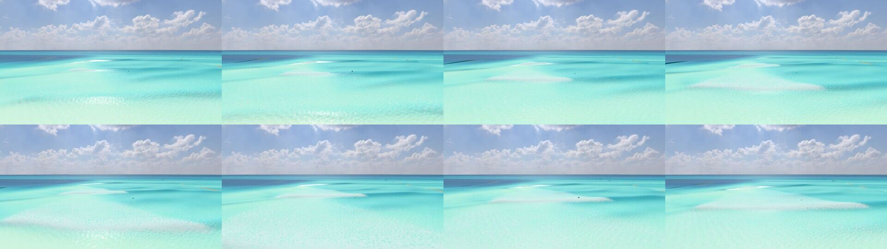
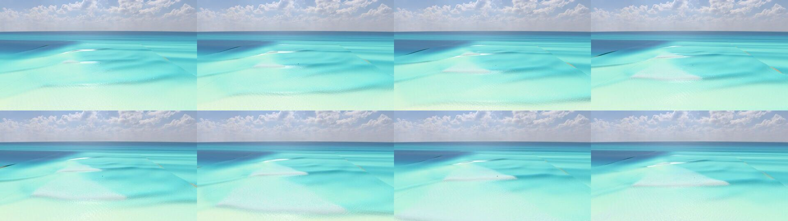
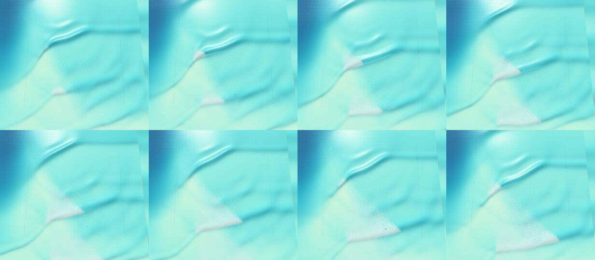

# The Canyon as a spilling wave (prototype S2), 2026-10-05

The Canyon (`canyon`) is now a spilling-wave prototype: the crest crumbles from the top and the whitewater spills down the face, while the green shoulder ahead stays clean. Each break peels **left to right as seen from the beach looking out to sea (toward +x)**.

Three things were built:

- a new bed;
- no lip and no tube at the Canyon;
- a **spilling front** that holds the whitewater back ahead of each wave's peel.

Built on `claude/canyon-spilling-wip`, merged into `claude/canyon-spilling`.

**Status (owner, 2026-10-06).** After seeing the screenshots below, the owner ruled that the wave forms from a corner, in a strange shape. Waves must form straight to the beach. Their timing may be irregular, but waves must never come from more than one side, and never at the same time. The bed in §1 is therefore **the corner-canyon bed, being replaced for straight crests (owner, 2026-10-06)**: the branch `claude/canyon-straight` redesigns it, with the peel coming from an oblique break line. Every Canyon number in this note is the corner-canyon bed's, and its peel is not accepted. Its crest angles are in `docs/research/crest-angle-2026-10-05.md`.

## Direction convention

`+z` points toward the beach and `+x` runs along shore (`src/wave/Bathymetry.ts`). The game's cameras use world coordinates directly. The beach-side views (`SpectatorCamera` front, overview and cinematic views) look toward −z with +y up, so **+x is screen-right**.

For a surfer facing the beach, +x is on their left: the Reef and Padang Padang, which are lefts, also peel toward +x. The Canyon's peel toward +x is therefore what the owner asked for: left to right from the beach. The overhead shots below put the sea at the top, so +x is on the right there too.

## What was built

### 1. The bed (`src/wave/Bathymetry.ts`, `CANYON`, `canyon()`, `canyonBreakLineZ()`)

**Measured first.** The old Canyon had its canyon axis on the +x edge (x = 80) and a Dean beach. Under the owner's swell it did not peel one way. That swell is direction 0°, spreading s = 150 (`PADANG_SPREADING`), Medium (Hs 1.4 m at the edge, Tp 11 s), measured over 3 seeds × 14 periods:

- a median peel angle of 17°;
- 12 of 25 clean waves toward +x and 13 toward −x;
- a median peel speed of 15.8 m/s;
- 235 lip jets.

The canyon's flank focus makes an A-frame whose arms take turns. Moving the canyon alone to the other edge was also mixed: 1 seed, with clean waves both ways.

**What failed, and why.** A square swell meeting an oblique break line peels at sin α = (c_b / c_shelf) · sin φ by phase matching (`ledgePeel.ts`). Here c_b is the breaker celerity, c_shelf the crest speed on the shelf where the crest meets the line, and φ the line's angle to the crest.

- On a deep shelf the angle stays small.
- A long shallow bar acts as a lens. The crests wrap onto it and the break runs along it at 20–30 m/s.

Sweeps with these designs (the bar at 55–75°, shelves 2.4–3.5 m) gave medians of 8–15° with both directions. Removing the canyon outright twice ran the sea flat by about 45 s, probably unstable; that was not chased.

**What works.** The final design has three parts:

- **The canyon on the −x open edge** (`axisX: −80`). It is level across the boundary, as before. The swell runs ahead over the canyon's axis, so on its flank the crests turn toward +x. They reach the break already angled, which is the "oblique swell" a real point break gets from its wrap.
- **A level sand shelf**, `shelfDepth` 2.4 m, then a planar beach face at 1:25.
- **An oblique terrace** on the shelf, `crestDepth` 1.3 m deep. Its seaward edge is the break line. It runs at `angle` 62° to the shore from its peak (`peakX` −40, `peakZ` −140) toward +x and the beach. It rises from the shelf at `edgeSlope` 1:12 across the line, which is 1:26 along the waves' path, so the breakers spill: the readout's Iribarren number is 0.35 at the take-off, and ξ < 0.4 for the breakers the shelf holds (γ·h = 1.9 m). A 1:20 edge also spilled (ξ 0.25), but its median peel was the same 45° over 3 seeds and 51° on seed 1, against 54° for 1:12 on seed 1. Upcoast of the peak the terrace fades out over `fadeWidth` 25 m, so the bed is level along shore at both open edges.

All the values are in `CANYON` and can be changed for the sweep (`scripts/canyon-peel-report.ts --canyon key=value,...`).

**After**, under the same swell and seeds (`canyon-peel-report`, 3 seeds × 14 periods):

| | Before (old bed, lip on) | After (new bed, no lip, front on) |
| --- | --- | --- |
| Clean waves (onset fit r² ≥ 0.3) | 25 | 34 |
| Toward +x / toward −x | 12 / 13 | **33 / 1** |
| Median peel angle (PeelTracker, sin α = c_b·\|dt/dx\|/stretch) | 17° | **45°** (seed 1 alone: 54°, 10 of 10 toward +x) |
| Median peel speed along the break line | 15.8 m/s | **6.6 m/s** |
| Lip jets thrown | 235 | **0** |
| Breaker readout at the take-off | spilling, ξ 0.20 | spilling, ξ 0.35 |

Other sizes, 1 seed each:

- **Big** (Hs 2.4 m, Tp 14 s): 8 of 9 clean waves toward +x, a median of 35°, 10.0 m/s.
- **Small** (Hs 0.9 m, Tp 9 s): few onsets. Most waves are too small to break on the 1.3 m terrace and break at the shore instead, so the peel is unmeasured.

The solver's own peel is 45° at the median. That is below the owner's 50–60°, but it now runs one way and is slow enough to ride.

- Half the clean waves peel at 45–76°.
- The rest peel at 10–44°, where two sets of crests overlap or a set runs ahead.

The spilling front (§3) holds the visible peel at 55° or slower.

**Take-off.** `TAKE_OFF.canyon` stays `'focus'` along shore. On a 0° swell, the rays from the −x canyon gather at x ≈ 13, just downstream of where the breaks start (x ≈ −20…20). If the swell's direction changes, re-check it.

Across shore, the shoaled-breaker estimate put the take-off 15–20 m inside the measured breaks, on the terrace's flank. The Canyon's take-off now sits where the terrace has risen `CANYON_TAKE_OFF_RISE` = 0.05 m above the shelf, which is where its waves were measured breaking (`takeOffPoint`).

### 2. No lip, no tube at the Canyon (`src/wave/SurfZoneSimulation.ts`)

`SPILLING_SPOTS = ['canyon']`. In `throwLip`, a spilling spot counts the break as a roller (`lipRollers`) and returns before any jet is shaped, at every size. Nothing else changes, at the Canyon or anywhere else:

- other spots go through the same path;
- the solver's breaking and dissipation are untouched;
- the swept barrel's code (`src/wave/barrel/*`) is not touched.

A test checks this at Hs 1.4 m and 3 m: no jets, no launches and no landings.

### 3. The spilling front (`src/wave/SpillingFront.ts`)

**It reads the solver, it never writes it.** The breaking strength, the dissipation and the rider's water (`PhysicalBodyWaterField` reads `breaking.strength`) are unchanged. Like the swept barrel's gate (`SweptCrash.gate`), the front only lowers the whitewater strength that feeds three things:

- the foam field;
- the aeration's stirring;
- the roar.

Spray and bubbles come from the foam's sources, so they follow the front too.

**Each onset starts or extends a wave.** The simulation's onsets (`markBreakingOnsets`: a column's outermost breaking cell jumps seaward) call `observeOnset`. An onset joins the wave whose broken extent it touches, within `joinReach` = 6 m, if that wave has not broken there yet. Otherwise it starts a wave of its own, with the front at its peak. A column that breaks again a period later starts the next wave, so each crest gets its own front. Up to 8 waves are tracked. A wave is dropped 45 s after its first onset.

**Each step, the front advances and the whitewater is gated:**

- **The front advances** along shore toward the wave's solver tip (the furthest column it has broken), at no more than `speedCap = c_b / sin(peelAngleDegrees)`. With `peelAngleDegrees` 55° that is about 5.7 m/s at Medium (c_b = √(g·h_b) ≈ 4.7 m/s, the PeelTracker's own celerity). So the visible peel is 55° by the same measure, and never faster.
- **The front never passes the solver's tip.** The front follows the solver; it never invents a break.
- **Each breaking cell's owner** is decided by where it lies across shore. It belongs to the newest wave that has broken in its column whose band holds it. The band runs from `crestMargin` = 6 m seaward of where that wave started breaking there to `bandWidth` = 20 m shoreward of where its crest has since run at c_b. An older wave's bore lies about a wavelength inshore, so it is outside the band and is left as the solver has it.
  - A first version owned cells by their breaking age instead. That failed: the solver's age is inherited along the crest as well as across it, so almost no cell had an owner and nothing was gated (`scripts/canyon-gate-probe.ts`).
- **Ahead of the owner's front** the whitewater is 0: the green shoulder stays clean.
- **Behind it**, during the first `rampSeconds` = 1.5 s after the front reached the column, the foam starts as a thin line at the crest: `lineWidth` 1.5 m down the face at `lineShare` 35 % strength. It grows down the face at `growth` 5 m/s while its strength ramps to full. After that the solver's own strength passes through, and the existing foam field (spreading, lace and decay) takes over.

**Parameters and where they live:**

- `SPILLING_FRONT_DEFAULTS` in `SpillingFront.ts`;
- per spot, `SPILLING_FRONT.canyon = { direction: 1, peelAngleDegrees: 55 }` in `SurfZoneSimulation.ts`;
- the config switch `spillingFront: false` turns it off, and so does `&spillingFront=0` in the water sheet.

The cost is one pass over the grid per step, with at most 8 waves per breaking cell.

### Tools

- **`scripts/canyon-peel-report.ts`** prints the peel per period and the front's state, and sweeps `CANYON`:
  - Build and run: `rolldown scripts/canyon-peel-report.ts -o dist/scripts/canyon-peel-report.mjs --format esm --platform node && node dist/scripts/canyon-peel-report.mjs --hs 1.4 --tp 11 --seeds 3 --periods 14 [--verbose] [--canyon angle=60,...]`.
- **`scripts/browser/canyon-peel-shots.mjs`** drives the water sheet and shoots a sequence, one second apart, from the beach, a cliff and overhead. Start `npx vite --port 5199` first.
  - Run: `CHROME=<path to a Chromium binary> node scripts/browser/canyon-peel-shots.mjs <dir> --frames=30 --headless`.
  - It runs its own upload receiver on port 5299.
- **The water sheet** (`src/dev/waterSheet.ts`):
  - takes `&spot=canyon`, `&direction=`, `&spreading=` and `&spillingFront=0`;
  - exposes `waterSheetStep(seconds)`, which steps exactly that long with no hold.
- **`--spreading <s>`** was added to `scripts/catch-report.ts` and `scripts/ride-report.ts`.

## Screenshots

These are headless Chromium shots (SwiftShader), Rich look, at midday: Medium, 0°, s = 150, CPU solver, with the final build (the band-owned front and the 1:12 terrace edge, commit `9e044c33`). SwiftShader washes the colours out compared with a GPU.

These sequences are the ones the owner saw on 2026-10-06 before ruling that the wave forms from a corner (the status note at the top). The crest-angle probe measures that corner: across the edge line, the crests' −x half leans −30.7° and their +x half −7.0° (`docs/research/crest-angle-2026-10-05.md`).

Each view is 8 frames, 2 s apart: frames 14, 16 … 28 of one sequence shot a second apart. The water sheet settles the sea for at least 30 s before the first frame; the frames' sea times were not kept. Each contact sheet reads left to right: frames 14–20 on the top row, 22–28 below.

**From the beach** (looking out to sea, +x to the right):



On the outer crest, a thin bright line of foam sits left of centre, at the peak. On the wave inside it, the foam has grown down the face into a white band. The band's right end moves right from frame to frame, and the crest beyond it stays green. By frame 28 that wave's foam has spread into a wide lacy patch inshore, and the crest outside it carries a thin line at the peak again. The single frames are `img/final-beach-14.jpg` … `-28.jpg`.

**From a cliff** (higher up, looking the same way; the canyon is the deep blue water on the left):



The same set from higher up. In frame 14 both crests carry only a thin line left of centre. The inner wave's band then widens down the face, and its right end moves from left of centre to right of centre by frame 28, while the shoulder ahead of it stays clean. Behind the band the foam spreads and thins as the bore runs inshore. The single frames are `img/final-cliff-14.jpg` … `-28.jpg`.

**Overhead** (sea at the top, +x to the right):



Two waves are peeling at once, each with its own front. Each wave's whitewater starts at its peak, left of centre, as a short white streak on the crest. It grows into a white wedge whose point runs right along the crest, while the crest ahead of the point stays green. In frame 28 the next crest starts its own streak at the peak. The single frames are `img/final-overhead-14.jpg` … `-28.jpg`.

The straight seams in the water (the dashed lines overhead) stay put from frame to frame; they are not foam.

**Earlier runs.** Runs 1–3 (commits `ee5d2b59`, `85a059f0` and `c107a3a6`) were shot with the first front. It owned cells by the solver's breaking age, so it gated almost nothing (§3): run 2, with that front on, and run 3, with the front off, came out the same. Commit `9e044c33` replaced them with the sequences above. There is no front-off sequence of the final build. So these frames show the front and the solver's own spilling together, and in run 3 the solver's whitewater alone already formed wedges peeling toward +x.

## Rideability

The owner's criterion is that a surfer can catch the wave and ride the shoulder. It was measured on 2026-10-07 on **the corner-canyon bed, being replaced for straight crests (owner, 2026-10-06)**, with these settings:

- Medium: Hs 1.4 m, Tp 11 s, 0°, s = 150 (the Canyon's default swell since the drift fix);
- tide 0 m, calm wind;
- seeds 1 and 2, 3 minutes each, stage 2 on the CPU.

**On this bed, riders catch the wave but nobody rides the shoulder.** Cues light and riders stand, but every stand ends within 4.6 s, almost always in a fall from balance. The riding-the-wave spec's done criteria ask for a median ride of 10 s or more and a best of 15–20 s.

### Catch report

30 ghost bots wait prone, at −45, −25, −5, +15 and +35 m along shore from the break point and −8 to +12 m outside the break line. Each one:

- paddles when a crest rises behind it;
- pops up on the cue;
- rides straight in with no steering.

```sh
npx rolldown scripts/catch-report.ts -o dist/scripts/catch-report.mjs --format esm --platform node
node dist/scripts/catch-report.mjs --spots canyon --swell medium --spreading 150 --direction 0 --seeds 2 --minutes 3 --ghosts --out <report.md> --attempts <attempts.json>
```

| Attempts | Cue lit | Pop-ups | Stood | Rides ≥ 3 s | Median ride | 90th percentile | Longest | Top speed |
|---:|---:|---:|---:|---:|---:|---:|---:|---:|
| 831 | 19 | 19 | 16 | 3 | 2.0 s | 4.2 s | 4.6 s | 9.1 m/s |

- **All 16 riders who stood fell (balance),** after 1.1–4.6 s.
- **Of the other attempts,** 807 saw no cue, 3 popped up but could not stand (balance), and 5 lost the board while prone.
- **By seed:** seed 1 had 5 cues and 5 stood; seed 2 had 14 cues and 11 stood.
- **Cues lit only near the peak.** They lit only for the bots 25 m (15 cues, 12 stood) and 5 m (4 cues, 4 stood) to the −x side of the break point; none lit at −45, +15 or +35 m. The bots wait in a row parallel to the beach, but the terrace's edge runs at 62° to the shore. Across the row's 80 m it moves about 150 m across shore (80 × tan 62°), so the bots at +15 and +35 m wait far outside where the waves break there. This report therefore samples the take-off only near the peak, and it never rides along the shoulder.

### Ride report

The runner's own rider and 6 ghosts wait 5 m outside the break line, at −45 to +45 m along shore from the break point. An autopilot rides each one:

- it paddles for a rising crest and pops up on the cue;
- it holds a line 60° from the wave's travel toward the peel;
- it turns up the face below 35 % of its height and down above 75 %.

```sh
npx rolldown scripts/ride-report.ts -o dist/scripts/ride-report.mjs --format esm --platform node
node dist/scripts/ride-report.mjs --spots canyon --swell medium --spreading 150 --direction 0 --seeds 2 --minutes 3 --ghosts --out <report.md>
```

| Attempts | Stands | Rides ≥ 3 s | Median ride | Best ride | Near the curl |
|---:|---:|---:|---:|---:|---:|
| 187 | 23 | 0 | 0.7 s | 3.0 s | 8 % |

- **Outcomes:** 154 missed the wave, 22 fell (balance), 2 fell (lost board) and 3 were kicked out.
- **How long and how far the 23 stands went:**
  - riding 0.8 s at the median and 3.0 s at most;
  - along shore, 0.6 m at the median, from 3.2 m toward −x to 8.7 m toward +x (the peel's way);
  - a path of 2.0 m at the median and 20.0 m at most.

  No rider travelled along the shoulder.
- **The riders' weight sat far forward while standing.** Over the 27 s they stood in all, the physics' weight (the pelvis point, from the rear foot at 0 to the front foot at 1) averaged 0.87 riding level, against the stance map's trim of 0.50–0.62. It averaged 0.98 going down the face. Whether that is why they fall was not diagnosed.

The report lists rides of 3 s or more one by one, with how far each went along shore. None reached 3 s, so the report (`scripts/ride-report.ts`) now also sums up every stand of any length, which gave the figures above. The run was otherwise identical to the first one, before that line was added.

## Tests

Run on 2026-10-07 on an 8 GB M1, detached (`nohup caffeinate -i`), on `claude/canyon-spilling`. Since the merge (`ef6b37b1`), only scripts and notes have changed, no game code.

**In all, 2,428 tests passed and 28 failed.** Another 15 were expected to fail and did, and 30 were skipped. **Every failure is pre-existing:** the same 28 tests fail on the branch's base, `1fc91b36`, and none fails only on this branch.

**The two slow files** (`npx vitest run src/wave/SurfZoneSimulation.test.ts src/wave/SurfZoneRunner.test.ts`):

- `SurfZoneRunner.test.ts`: 43 of 43 passed, in 98.9 s.
- `SurfZoneSimulation.test.ts`: 86 of 87 passed. The two files took 7,272 s (121 min), most of it in Padang Padang's robustness runs. The one failure is listed with the others below.

**Every other `src` test file** (`npx vitest run src --exclude src/wave/SurfZoneSimulation.test.ts --exclude src/wave/SurfZoneRunner.test.ts`, 293 files, 459 s on 2 workers). With the run above, every `src` test ran once.

- Tests: 2,299 passed and 27 failed; 15 expected to fail did fail, and 30 were skipped.
- Files: 13 failed and 26 were skipped.

`npx vitest run --dir src` finds no test file here, because the config's include globs (`src/**/*.test.ts`) are read relative to `--dir`. The filter form `npx vitest run src` finds all 295.

**The 28 failures.** The 13 failing files of the second run were run on a snapshot of the base `1fc91b36`, with this worktree's dependencies, and so was the simulation file's failing test. The same tests failed there. This round's changes touch none of these tests or the code they test.

- **The 7 known AttachedRider failures** (`src/physics/AttachedRider.test.ts`, being fixed on another branch). They are in "lean, trim, crouch and heading hold":
  - Compress puts the weight over the front foot;
  - the banked body holds Compress taken mid-turn on flat water at 7, at 8 and at 10 m/s (three tests);
  - it holds Compress taken mid-turn at 11 m/s no worse than before the top-turn plan;
  - it makes a deep U at the bottom of the face;
  - it turns at least as hard compressed as crouched, keeping as much speed.

  The last two are expected failures (`it.fails`) that now pass.
- **17 more in the rider's body and pumping**, the same ground (crouch, Compress, pumping):
  - `pumping.test.ts`, 6: gains speed over bumps when timed with the load; over a pump track, timed pumps keep over 0.2 m/s a pump more than the best steady stance, and the track keeps nothing where the path hardly swings the load; through rail changes, down a 15° still face from 6 m/s and down a 12° still face from 7 m/s; and keeps nothing on flat water;
  - `bodyFilm.test.ts`, 3: blends the switches of pumping into a fall out; films pumping, chop and a paddle then a glide, riding throughout; another player's surfer blends the switches out as the local body does;
  - `stanceMotion.test.ts`, 2: keeps the drawn feet with the rig's through a pump; trails the free hands below the shoulders as the body rises in a pump;
  - one each in `faceTrim.test.ts` (a pumping rider planing on the 14° face for 10 s), `ridingPoses.test.ts` (crouches deeper for the drop than in trim, deepest in Compress), `stanceTargets.test.ts` (meets every target the drawn pose owns), `HumanoidRig.test.ts` (bends the knees crouched), `stanceBlend.test.ts` (reads how deep the crouch is) and `stanceExtremities.test.ts` (lifts the heel past the ankle's reach).
- **4 others:**
  - `SurfZoneSimulation.test.ts`, "the tank sized to the swell": "places a big day's take-off by the spot's calibrated breaker index, and today's tanks as before" expects `TAKE_OFF_INDEX` to list five spots, but it lists the Wave Pool too (`pool: BREAKER_INDEX`);
  - `LogbookScreen.test.ts` expects five spots, without the Wave Pool;
  - `schoolModel.test.ts` expects "Bend your knees" on a lesson card;
  - `tierParity.test.ts`: "TierRecorder reads a surf zone as the page and worker run it" read 0 where it expected 36.

## Known issues

- **The solver peels at 45°, not 55°.** The front holds the visible peel at 55°. On waves where the solver breaks faster than the front, the water just ahead of the visible front is already breaking in the solver. The rider feels `breaking.strength` there (bore push, the wipeout's checks) while the foam is still hidden. On the slow waves (about half of them, at 47–60°) the two agree. On the fast ones (15–30°) the lag can reach tens of metres.
  - **Accepted by the owner, 2026-10-06,** as a known issue of the spilling front, with S3 (the roller) next. That day the owner first accepted the round as it stood: the solver's median 45° and the front's 55°. After seeing the screenshots, the owner withdrew that acceptance for the bed (see the status note at the top): the peel numbers here are the corner-canyon bed's, which is being replaced for straight crests, and its peel is not accepted. The gap is to be measured again on the new bed.
- **Some waves still go the other way.** 3 of 34 clean waves peeled toward −x (seed 2), and some periods mix two peaks. The front only acts toward +x, so foam on a −x arm shows as the solver has it.
- **The front's waves are not handed over online.** A late joiner's sea (`SurfZoneState`) carries the foam but not the front's waves. Until the next onsets its whitewater is the solver's, ungated, for about a period.
- **Small days barely break on the terrace** (1.3 m deep). The surf moves to the shore break.
- **Without the canyon, the bed ran flat or unstable** in two sweeps. The canyon on the −x edge is load-bearing.
- **The spot's description still says "median 58°"** (`SurfConditions.ts`, the old bed's). It is left as it is until the straight-crest bed is measured, since it changes again with that bed (owner, 2026-10-06). The Canyon's swell (0°, s = 150) has been its default since the drift fix merged, so the reports no longer need an override to get it.

## Next step: S3, a roller lens the rider hits

Build the roller (`docs/research/water-physics/roller.md`, `roller-build.md`) **standalone**, as a lens riding on the spilling front's broken crest, not on the barrel's loft:

- **Birth and shape.** Born where the front has reached a column and B ≥ 0.3 with bore Froude number Fr₁ ≥ 1.45 (shed below 1.3). It is about 2.1 H long at onset, growing to 2.5–3.5 H over 5–8 breaker depths, and 0.25–0.5 H thick at the crest, tapering to the toe. It holds 0.33–0.36 H² of water at a void fraction of 0.25.
- **What it does to the rider.** It changes only what the water sample returns (its top, its air and its flow), so a board bogs in its top and is pushed at about 330·H Pa. It replaces the P11 `ROLLER_SHARE` push.
- **How it is drawn.** As its own white band from crest to toe, with a fingered toe, brightest at the crest; the foam field takes over behind it.
- **Where it starts.** The spilling front's crest rows per column (`crestZ`) and its local age (`time − reached`) already give where and how old each roller slice is, so S3 can start from `SpillingFront`'s state.
