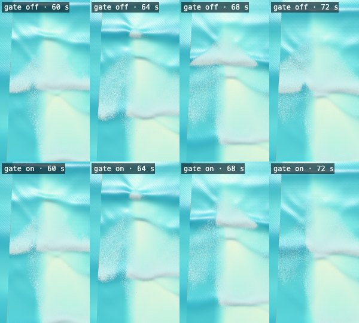
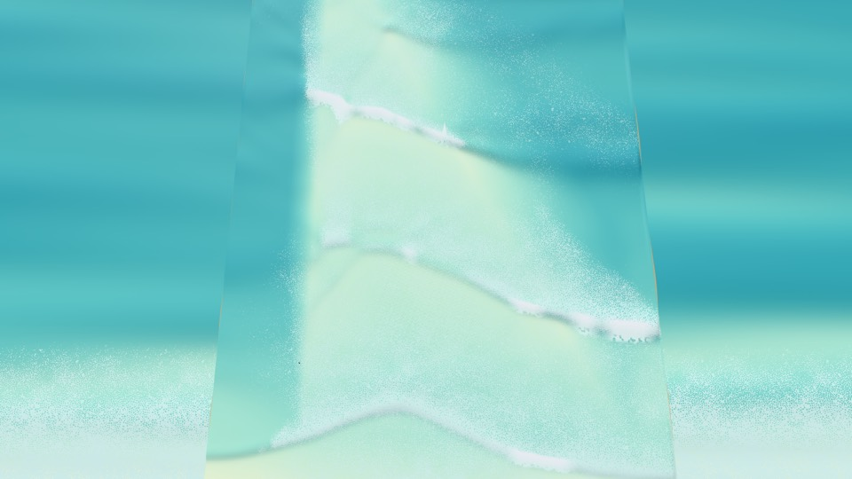
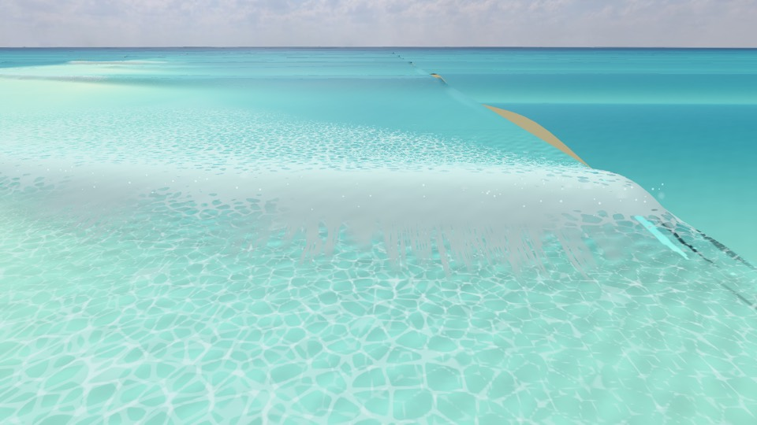
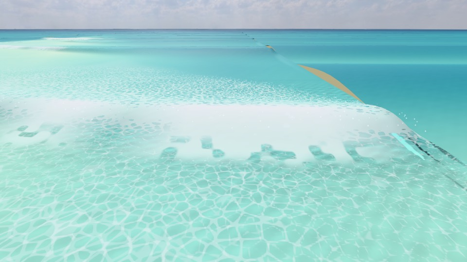
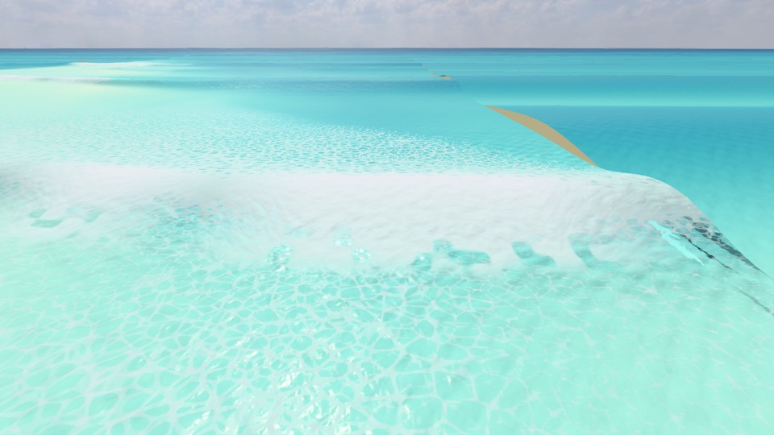
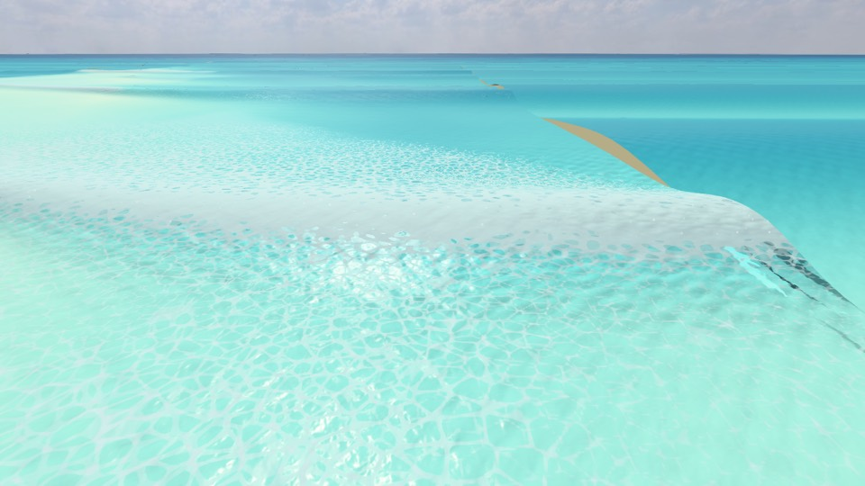

# The Canyon as a spilling wave (prototype S2), 2026-10-05

The Canyon (`canyon`) is now a spilling-wave prototype: the crest crumbles from the top and the whitewater spills down the face, while the green shoulder ahead stays clean. Each break peels **left to right as seen from the beach looking out to sea (toward +x)**.

Three things were built:

- a new bed;
- no lip and no tube at the Canyon;
- a **spilling front** that holds the whitewater back ahead of each wave's peel.

Built on `claude/canyon-spilling-wip`, merged into `claude/canyon-spilling`.

**Status (owner, 2026-10-06).** After seeing the screenshots below, the owner ruled that the wave forms from a corner, in a strange shape. Waves must form straight to the beach. Their timing may be irregular, but waves must never come from more than one side, and never at the same time. The bed in §1 is therefore **the corner-canyon bed, being replaced for straight crests (owner, 2026-10-06)**: the branch `claude/canyon-straight` redesigns it, with the peel coming from an oblique break line. Every Canyon number in this note is the corner-canyon bed's, and its peel is not accepted. Its crest angles are in `docs/research/crest-angle-2026-10-05.md`.

**Status (2026-10-09).** The owner found Big unsurfable. Big broke on the level shelf, before the arm, and closed out. The bed is now a deep platform with a fan-faced arm and a trough behind its line, so every size breaks on the arm and peels toward +x (§1, "Every size on the arm"). The straight-crest bed's numbers below are kept as the before.

## Direction convention

`+z` points toward the beach and `+x` runs along shore (`src/wave/Bathymetry.ts`). The game's cameras use world coordinates directly. The beach-side views (`SpectatorCamera` front, overview and cinematic views) look toward −z with +y up, so **+x is screen-right**.

For a surfer facing the beach, +x is on their left: the Reef and Padang Padang, which are lefts, also peel toward +x. The Canyon's peel toward +x is therefore what the owner asked for: left to right from the beach. The overhead shots below put the sea at the top, so +x is on the right there too.

## What was built

### 1. The bed (`src/wave/Bathymetry.ts`: `CANYON`, `canyonTerraceDepth()`, `canyonBreakLineZ()`, `canyonHingeZ()`, `canyonFootZ()`, `canyonArmAt()`; the tank in `tankLayout`, the swell in `edgeHeight`, the take-off in `canyonTakeOffDepth`)

#### Every size on the arm: the deep platform and the fan face (2026-10-09)

**The owner's report.** The owner played the Canyon at Big and found it unsurfable. The readout flipped between "closes out", "a right at 32° · fast" and "a left at 45°", with surf 3.3–3.7 m. Only Medium had been measured; Small and Big never had.

**How it was measured.** Wave only: no riders, and no catch or ride reports (the owner's rule). The tool is `scripts/canyon-size-report.ts`. Each size's own swell was used (`SWELLS`: Small Hs 0.9 m and Tp 9 s, Medium 1.4 m and 11 s, Big 2.4 m and 14 s), square to the beach with s = 150, tide 0 and calm wind, over 3 seeds × 14 periods. The report gives:

- **The tracker**, sampled once a period as the peel report samples it. Its readout words follow `waveInfo`: "closes out" under 27°, "a left" toward +x, "a right" toward −x.
- **The readout as the player sees it.** The game reads the tracker on every status update, so the report replays the tracker every second from the same onsets. The replay agrees with the run's own samples to within 2–4°.
- **Each crest.** The simulation's onsets are grouped into crests by phase: the onset's time less the crest's travel time down its column from the relaxation zone. Each onset joins the nearest peak of the phases' density. For each crest the report gives:
  - its start, its first onset, along shore and across, and the bed there;
  - whether it closed out, meaning it broke over 40 m or more of shore within 2 s of its start;
  - whether it also ran upcoast (more than two onsets over 5 m upcoast within 3 s, the straight-crest bed's count below);
  - its own fit along the arm.
  On the old bed this grouping reproduces the straight-crest bed's Medium figures below: 40 crests, 38 of them within ±10 m of x −50.
- **Where every onset lies.** The blend, the level shelf, the arm's face or upcoast end, its top behind the line, or the beach face.

**Before: the straight-crest bed of 2026-10-07** (3.6 m shelf, 5 m edge, a 62° arm on a single 1:30 face).

| | Small | Medium | Big |
| --- | --- | --- | --- |
| Tracker: clean samples toward +x | 36 of 36 | 40 of 40 | 38 of 40 |
| Tracker: median peel | 29° | 31° | 41° |
| Readout every second: closes out / a left / a right | 49 % / 51 % / 0 % | 43 % / 57 % / 0 % | 27 % / 71 % / 2 % |
| Readout every second: clean reads toward +x | 323 of 325 | 420 of 420 | 486 of 531 (92 %) |
| Crests | 40 | 40 | 51 |
| Starts within ±10 m of their median (median x; 10–90 %) | 35 (x −48; −50…−36) | 38 (x −50; −52…−46) | **32** (x −51; −58…15) |
| Where the crests start | arm face 14, arm top 13, arm end 13 | arm end 27, arm face 10, arm top 3 | arm end 29, arm face 11, **blend 8, shelf 3** |
| Close-outs: crests breaking over ≥ 40 m within 2 s | 0 | 0 | **7** (up to 82 m) |
| Crests also running upcoast | 0 | 10 | 27 |
| Each crest's own fit: toward +x; median | 34 of 34; 38° | 38 of 38; 41° | 42 of 43; 44° |
| Onsets on the level shelf or the blend | 0 % | 5.6 % | **46 %** (2,256 + 257 of 5,507) |
| Onsets' median depth | 1.26 m | 1.94 m | 3.28 m |

**Why Big closed out or went both ways.** Big broke on the level shelf before it reached the arm.

- **Its breaking depth was the shelf's.** The shoaled-breaker estimate puts Big's breaking depth at 3.39 m, against the shelf's 3.6 m. At the 5 m edge, Big's Hs/h was 0.48, past the flat-bed decay line for the significant height (Goda 2010: about 0.45). About 7 % of its waves exceed 0.55 h there (the water-physics advisor, 2026-10-09).
- **So its waves broke where the bed is level along shore.** 46 % of Big's onsets lay on the shelf and the blend, at a median depth of 3.28 m. Medium had 5.6 % there.
- **Those crests broke along shore all at once.** 11 of Big's 51 crests started on the shelf or in the blend, away from the arm. 7 broke over 40–82 m of shore within 2 s: the readout's "closes out".
- **And some ran back upcoast.** A break that started downcoast on the shelf ran back toward −x. The tracker read that 3 times in 41 samples (at 2–10°), and 2 % of the time when read every second: the owner's "a right".
- **The arm could not catch them.** It offered oblique contours only down to 3.6 m, so Big's larger waves met no oblique line at their breaking depth.
- **Mead's platform limit.** Mead (2000) found the same on Bingin's reef: a platform caps the wave height a spot can take, and bigger waves close out on it.

**Small and Medium** broke on the arm and peeled toward +x. Small's crests are often too low for the face: 13 of 40 started behind the line, on the 1 m top. Its readout sits on the 27° line (29°), so half its readings said "closes out".

**The redesign** (`CANYON`, `CANYON_SWELL_DEPTH`, `canyonTakeOffDepth`). The water-physics advisor was consulted (`docs/research/water-physics/consult-log.md`, 2026-10-09).

- **A deep platform.** A 60 m blend takes the bed from the edge to a level sand platform 6 m deep (`shelfDepth`).
  - By Froude similarity, Big on 5.7–6 m stands as Medium did on 3.6 m: Hs/h about 0.4, kh 0.35.
  - So Big's waves reach the arm unbroken.
- **A deeper edge.**
  - The tank's edge is 7.9 m deep (`edgeDepth`): 3.3 Big Hs, the wave-sizes spec's rule for a big day's edge.
  - Its relaxation zone is 90 m long (`zoneLength`), 0.75 of Big's wavelength there.
  - The zone forces the solver's own (Madsen–Sørensen) wave numbers, as other deep tanks do.
- **The sizes keep their meaning.**
  - Each size's Hs is given at the old 5 m edge (`CANYON_SWELL_DEPTH`) and de-shoaled by linear theory to the deeper edge. At 7.9 m, Small, Medium and Big enter at 0.83, 1.28 and 2.17 m, so the same waves reach 5 m depth as before.
  - Hs·D^¼ hardly changes, so the tracker's c_b moves by under 1 %: 4.69 m/s at Medium (was 4.65), 5.80 m/s at Big (was 5.77).
  - Whether the sizes should instead be given at the new edge is the owner's call (the advisor's question 1).
- **The arm.**
  - The crest is 1.0 m deep, as before.
  - The break line runs at 70° from its peak at (−38, −305) toward +x and the beach. It meets the beach face at x = 64, as before, so it spans the window.
  - The peak is 69 m further seaward and 10 m further downcoast, so the arm's end (still 1:4 across x) reaches the platform at x −58, clear of the −x edge's levelling.
- **A fan face** (`fan` 15°, `hingeDepth` 2.8 m, `hingeRounding` 8 m).
  - Below the hinge, the face climbs at 1:30 along the waves' path to a hinge line at 55°.
  - Between the hinge line and the break line the depth runs linearly. The shallow face is therefore 1:30 at the peak and gentler downcoast: 1:58 at x 0 and 1:95 at x 50.
  - So its shallow contours, where Small and Medium break, run more obliquely than its deep ones, where Big breaks.
  - Each size meets contours matched to how far it has already refracted crossing the deep ones (the advisor, after Mead's refraction compensation).
  - Every depth's contour from 1.5 m to 5 m is furthest out at the arm's end, at x −40 to −54, so every size starts there.
- **A trough behind the line** (`flatWidth` 10 m, `lagoonDepth` 2 m).
  - Behind the line the top is 1 m deep for 10 m, then falls at 1:30 to 2 m until the beach face closes it, as at the Wave Pool's reef.
  - At 70°, the level 1 m top was 45 % wider than at 62°, and bores re-broke across it along shore all at once: Small's readout pointed toward −x.
- **A taper.** Past the arm's end the terrace tapers into the platform over 12 m (`endTaper`), so the +x open edge copies plain beach face.
- **The take-off.** Riders wait where the arm's face is as deep as their size's waves start breaking: `canyonTakeOffDepth(Hs)` = 0.96 + 0.65 Hs m, a least-squares line through each size's median start depth on the arm (Small 1.49 m, Medium 1.96 m, Big 2.50 m). The old rule, 1.7 m above the shelf, would have seated Big's riders about 45 m inside its break. It still waits at x −30, 8 m down the arm from the peak.
- **Spilling.** The readout's Iribarren number at the take-off is 0.28–0.30 at every size (was 0.34–0.36).

**The sweep.** All runs use the deep platform (6 m), the 7.9 m edge with Hs given at 5 m, and a peak at x −38. The first runs are 1 seed × 8 periods. The finalists were then run at 3 seeds × 14 periods, and the readout (read every second) and the starts on the arm decided between them.

| Design | Runs | Big | Medium | What happened |
| --- | --- | --- | --- | --- |
| Today's bed, for scale | 1 × 8 | tracker 6 of 8 toward +x, 37°; starts 2 of 10 within ±10 m; 2 close-outs | tracker 7 of 7, 32° | Big broke on the shelf and the blend |
| Planar face, 62°, peak (−38, −217) | 1 × 8 | 7 of 7, 33°; 5 of 7; 1 close-out | 6 of 6, 31°; starts 8 of 11 | Big still started 69 m out, near the platform |
| Planar face, 70°, peak (−38, −305) | 1 × 8 | 8 of 8, 40°; 10 of 10; none | 5 of 6, 32°; 7 of 8 | Half of Medium's onsets were bores re-breaking on the wide 1 m top |
| Fan 10° (deep contours at 60°) | 1 × 8 | 7 of 7, 35°; 9 of 10; none | 5 of 6, 31°; 9 of 9 | |
| Fan 15° (deep contours at 55°) | 1 × 8, then 3 × 14 | 3 × 14: 40 of 40, 33°; 43 of 46; none | 3 × 14: 33 of 36, 26°; starts on the arm 91 %; 5 % of reads "a right" | Small's readout: 74 % "closes out", 8 % "a right" (re-breaks on the top) |
| **Fan 15° + the trough** | 3 × 14 | the table below | readout 44 % / 55 % / 1 %; starts on the arm 87 % | **Kept** |
| Fan 15° + trough, the fan's width capped at 100 m | 3 × 8 | — | — | Small: 63 % "closes out", 4 % "a right", worse than the trough alone |
| Planar 70° + the trough | 3 × 14 | — | 33 of 35, 32°; starts on the arm 72 % (15 mid-arm); 4 % "a right" | Without the fan, many more crests broke first mid-arm |
| Fan 20° + trough | 3 × 14 | — | 36 of 37, 33°; readout 40 % / 58 % / 2 %; starts on the arm 87 % | Within the noise of fan 15° |
| Fan 15°, hinge 3.5 m, + trough | 3 × 14 | — | 37 of 38, 29°; readout 46 % / 53 % / 1 %; starts on the arm 91 % | Within the noise of fan 15° |

Rejected without a run:

- **A seaward extension of the line with a crest deepening seaward** (the Pool's ramped crest). The contour of depth h on the arm runs at dz/dx = tan(angle) − r/pathSlope, where r is the crest's rise per metre along shore.
  - A gentle ramp makes each wave start where the crest is its own breaking depth, so Medium's starts would spread along the arm with each wave's height.
  - A steep one (r > 0.063) turns the contours back, an A-frame.
  - It would still need the deep platform: downcoast, Big's crests would close out on a 3.6 m shelf.
- **A two-slope face** (1:10 below 3.6 m). Snell refraction is the same over a step as over a slope, so it saves nothing for Medium. And Big would break on the steep part with ξ about 1.0: it would plunge.

**After: the deep platform, the fan face and the trough** (3 seeds × 14 periods).

| | Small | Medium | Big |
| --- | --- | --- | --- |
| Tracker: clean samples toward +x | 29 of 30 | 35 of 35 | **40 of 40** |
| Tracker: median peel | 29° | 30° | **31°** |
| Readout every second: closes out / a left / a right | 70 % / 30 % / 1 % | 44 % / 55 % / 1 % | 41 % / 59 % / **0 %** |
| Readout every second: clean reads toward +x; median | 241 of 247 (98 %); 23° | 355 of 362 (98 %); 32° | **523 of 525 (99.6 %)**; 31° |
| Crests | 40 | 50 | 49 |
| Starts within ±10 m of their median (median x; 10–90 %) | 29 (x −33; −40…21) | 41 (x −37; −42…5) | **43** (x −43; −47…−32) |
| Where the crests start | **arm face 32, arm end 6**, arm top 2 | arm face 28, arm end 16, arm top 3, edge strip 2, beach face 1 | **arm end 38, arm face 9**, beach face 1, edge strip 1 |
| Close-outs: crests breaking over ≥ 40 m within 2 s | 0 | 1 (in the +x edge strip, below) | **1**, at the threshold (below) |
| Crests also running upcoast | 5 | 8 | 19 |
| Each crest's own fit: toward +x; median | 35 of 36; 40° | 45 of 45; 44° | 39 of 39; 42° |
| Onsets on the level platform or the blend | 0 % | 0.8 % | **5.3 %** |
| Onsets' median depth | 1.41 m | 1.87 m | 2.87 m |

**Stable for 600 s** (seed 1; Medium 55 periods, Big 43; `--stability`: the fastest water is |q|/h where h > 5 cm, every 10 steps).

| | Medium | Big |
| --- | --- | --- |
| Fastest water | 6.15 m/s (5.4 m/s on the old bed) | 8.40 m/s |
| Froude caps | 0 | 0 |
| Volume | within 0.36 % | within 0.41 % |
| Onsets per 100 s, throughout | 657–889 | 695–857 |
| Tracker: clean samples toward +x; median | 44 of 45; 30° | 40 of 41; 32° |
| Readout every second: closes out / a left / a right | 45 % / 53 % / 2 % | 38 % / 60 % / 2 % |
| Starts within ±10 m of their median | 53 of 57 | 43 of 48 |
| Close-outs | 0 | 1 (below) |
| Each crest's own fit: toward +x; median | 52 of 52; 48° | 41 of 41; 46° |

**Straight crests** (the crest-angle report, Medium, seed 1, 600 s, 64 components; mean angle, mean |angle|, max |angle|).

| Line | The old bed | The new bed | The Beach (mean \|angle\|) |
| --- | --- | --- | --- |
| The fine zone's edge | 0.5°, 2.7°, 19.1° | **0.4°, 2.7°, 9.1°** (43 crests) | 4.3° |
| 30 m seaward of the take-off | 0.7°, 3.3°, 12.7° | 5.3°, 6.5°, 15.0° (30 crests; 28 more broke before they could be followed across half the window) | 4.4° |

**The cost.**

- **The tank.** 160 × 636 = 101,760 cells, against 160 × 449 = 71,840 (+42 %).
- **The CPU.** On the M1, back to back (Medium, seed 1, 64 components, 40 s each, load 1.3–2), the new tank took 1,368–1,378 ms per simulated second against 947–965 ms (+43 %).

**What the numbers mean.**

- **Big now breaks on the arm and peels one way.**
  - 47 of its 49 crests start on the arm, 43 of them within ±10 m of x −43 (the other two: a shore break upcoast of the arm and one in the +x edge strip).
  - Every clean tracker sample peels toward +x, and so do 523 of the 525 clean reads every second. None reads "a right".
  - It starts breaking 43 m seaward of the line, at a median 2.5 m deep on the arm. Only 5.3 % of its onsets lie on the platform (46 % before).
  - Its peel is at least as slow as Medium's by the same tracker: 31° against Medium's 30° on this bed (Medium read 31° on the old bed).
  - **Close-outs: one in 49, and one in 48 over 600 s, against 7 in 51 before.**
    - In the 3 × 14 runs, one crest broke over exactly 40 m within 2 s, the threshold: a 3.2 m face that started at the arm's end and peeled toward +x at 25° on its own fit, a fast section of the biggest wave.
    - Over 600 s one crest, a 3.0 m face, broke on the deep face beside the peak, 3.4 m deep and 85 m outside the line, over 46 m within 2 s both ways.
    - Before, 7 crests in 51 broke over 41–82 m from the shelf and the blend. "No close-outs" is therefore nearly met, not strictly.
  - **The readout no longer says "a right"** (0 % of the reads every second, 2 % before), but it says "closes out" more often than before: 41 % of the reads against 27 %.
    - Before, the shelf took the biggest waves' height, and the waves that reached the arm broke slower there.
    - Now Big's full-size waves reach the arm, and the tracker's sideways spread runs along their faster crests, reading 29–31°.
    - These are clean +x peels just under 27°, the meter's sideways spread (the straight-crest bed's peel, below). Medium's own readout does the same 43–45 % of the time, which the owner left alone on 2026-10-07.
  - Crests still run upcoast in 19 of 49, a median of 6 m (at most 26 m). The spilling front's upcoast gate (§3) withholds their foam beyond 6 m.

- **Medium keeps its bars, but a little looser.**
  - Toward +x: every clean tracker sample, and 98 % of the clean reads every second. Its readout is as before: "closes out" 44 % of the time against 43 %, "a right" 1 % against 0 %, median 32° against 30°.
  - Each crest's own fit is slower than before: 44° against 41°.
  - **Starts:** 41 of 50 crests start within ±10 m of x −37, at the arm's end.
    - Three of the nine others are not the arm's: two in the +x edge strip and one shore break upcoast of the arm. The solver copies the arm's profile at x = 60 across the 20 m strip, so a short shoal breaks there; the one "close-out" is a grouping of that strip's onsets.
    - The other six broke first mid-arm (x −16 to 28) and peeled toward +x from there. That is 87 % of the crests on the arm, against 95 % (38 of 40) on the old bed.
    - On the 3.6 m shelf Medium's biggest waves were depth-limited, which evened out the crests' heights along shore. On the 6 m platform a crest keeps its along-shore swell, and a taller stretch mid-arm sometimes breaks first.
    - The fan holds this down: the planar 70° face had 15 mid-arm starts in 54, the fans 4–6 (the sweep).
  - **The crests' straightness.**
    - They reach the arm as straight as before: on the fine zone's edge the mean |angle| is 2.7°, as before, against the Beach's 4.3°.
    - 30 m seaward of the take-off they lean 5.3° on average (mean |angle| 6.5°, against the Beach's 4.4° there: just past "within about 2°").
    - The old bed's line there lay mostly on the level shelf. The new one crosses the arm's face for x < 39, where the crests bend toward its oblique contours as they climb it. That is the refraction that sets the peel, not a corner wrap.
- **Small now breaks on the arm.**
  - 38 of its 40 crests start on the arm's face or end, against 27 before; only 2 start on the top behind the line, against 13.
  - Each crest's own fit runs toward +x (35 of 36, 40°), and so do 98 % of the clean reads every second.
  - Its starts spread more: 29 of 40 within ±10 m of x −33 (35 of 40 before), with 11 breaking first mid-arm.
  - Its readout says "closes out" more often: 70 % of the reads against 49 %, median 23°. Its +x reads over 27° have a median of 39°. Small's crests are low and slow, so its peel sits near the 27° line on either bed.
  - Without the trough, bores re-breaking on the top made its readout point toward −x 8 % of the time; with it, 1 %.

#### The straight-crest bed (2026-10-06)

*The bed of 2026-10-07 to 2026-10-09, now the "before" of "Every size on the arm" above: its shelf, edge, angle and face have changed since.*

**The owner's requirement.** On the prototype's screenshots the owner saw that "the wave formation comes from a corner forming a strange shape". The waves must form straight to the beach. The timing of the sets may vary, but waves may not come from more than one side, much less at the same time.

**Why the prototype's crests bent.** Its canyon ran along the −x open edge (see "The prototype's bed" below). The swell ran ahead over the canyon's axis, so on its flank the crests turned toward +x and wrapped in from that corner. On the crest-angle report its crests stood at a mean −20° on both watched lines, against 0.8° at the plain Beach under the same swell (the table below).

**Why the sea ran flat without the canyon.** The prototype's session found that removing the canyon "ran the sea flat by about 45 s". The cause is the tank's grid, not the bed:

- The tank had 4 m cells from its relaxation zone to z = −150, and 1 m cells only inshore of that. The shelf (2.4 m) began at z = −190, so the swell shoaled from the 5 m edge onto it on the 4 m cells.
- Steepening there, the waves lost a third of their height without breaking: H1/3 was 1.64 m at the zone and 0.95 m on the shelf, and no cell broke anywhere seaward of the shore (seed 1, 40–150 s).
- On the 1.3 m terrace those waves were too small to reach Kennedy's onset. Once the warm start's set had passed, nothing broke but the shore break.
- The canyon had hidden this: over its deep third of the window the waves kept their height, and its flank focused them onto the terrace.
- With 1 m cells everywhere the same bed kept the waves' height (H1/3 1.8–1.95 m at the blend's end), and they broke on the terrace again. On 2 m cells they still lost a third on the shelf.

**The fix: 1 m cells from the zone in** (`tankLayout`). The Canyon's tank keeps today's 5 m edge and 60 m relaxation zone, moved out to `CANYON.zoneInner` = −396 so the whole arm fits. Its 1 m cells start at the zone, so the shoaling is resolved. It has 449 × 160 = 71,840 cells, against 37,280 before, but no 16 m canyon in its 1 m cells, so its stable step is longer. On the M1's CPU (64 components, seed 1, 40 s, run back to back on a shared machine) it took 1,288 ms per simulated second, against 1,168 ms for the prototype: about 10 % more.

**Resolved, the swell is bigger on a shallow shelf.**

- With no terrace, a 2.4 m shelf closed it out: 150 onsets on the shelf in 160 s. A 2.8 m shelf held it: none.
- But once a wave broke at the arm's peak, the break ran along its crest both ways at 45°, onto the level shelf ahead of the arm and upcoast of the peak. On 2.8 m the crests stood at η_t/√(gh) 0.14–0.37 for H ≥ 1 m. That is above 0.15, which the breaking age lowers Kennedy's threshold to (the peel bar, below).
- On 3.6 m the crests are flatter, and the starts and the direction became consistent (the sweep, below).

**The bed** (`CANYON`):

- **The shelf.** A 60 m blend takes the bed from the 5 m edge to a level sand shelf `shelfDepth` = 3.6 m deep. Seaward of the arm the bed is level along shore, so the crests reach it straight.
- **The arm.** A terrace `crestDepth` = 1.0 m deep stands on the shelf.
  - Its seaward edge, the break line, runs at `angle` = 62° to the shore from its peak (`peakX` −48, `peakZ` −236) toward +x and the beach.
  - It meets the beach face at x = 64, inside the +x edge's margin, so it spans the window, and no beach section beside it closes out downcoast. Shorter arms left one, whose waves started a second break where the arm met the beach face.
- **Its face.** It climbs at `pathSlope` = 1:30 along the waves' path (1:14 across the line). The readout's Iribarren number at the take-off is 0.35, spilling, as before.
- **Its upcoast end.** Upcoast of the peak the arm ends in a face along +z, falling at `endSlope` = 1:4 across x.
  - Every depth's contour is therefore furthest out at the peak, or within 10 m upcoast of it where the end reaches that depth, so each wave starts breaking there.
  - Nothing upcoast faces the swell.
  - The end lies 10 m inside the −x open edge's 20 m levelling (`OPEN_EDGE_RAMP`), so the edge copies plain shelf. In the sweep, ends inside the levelling left a shoal along the edge, and the waves broke on it.
- **The beach face.** Planar at 1:25, as before.

**The take-off** (`takeOffPoint`).

- **Along shore.** The 'focus' rule found no canyon to gather the swell: the ray concentration at its seat fell to 0.75 for one of the test's swells. The Canyon's riders now wait at its peak, like the Reef's, Padang Padang's and the Pool's: `TAKE_OFF.canyon` = 'peak', at `CANYON.takeOffX` = −40, 8 m down the arm from its peak.
- **Across shore.** The rule is unchanged: riders wait where the arm has risen `CANYON_TAKE_OFF_RISE` above the shelf. That is now 1.7 m (1.9 m deep), where the waves 4–12 m down the arm were measured starting to break (a median of 1.9 m; Medium, seed 1, 600 s).

**The peel is the arm's** (`canyonArmAt`), as at the Reef, Padang Padang and the Pool: from the arm's end beside the peak (x −58) to the beach face. Upcoast of that, the square crests close out on the beach face in the window's −x strip.

**Before and after.** The owner's swell is Medium: Hs 1.4 m at the edge, Tp 11 s, 0°, s = 150 (`REFRACTED_SPREADING`). The before is the prototype's bed below. The bars are the owner's requirement, made measurable.

| Bar | Target | Before: the prototype (canyon on the −x edge) | After: the straight-crest arm |
| --- | --- | --- | --- |
| 1. Straight crests (crest-angle report, seed 1, 600 s, 64 components): mean angle, mean \|angle\|, max \|angle\| | Mean near 0, no sign; mean \|angle\| within about 2° of the Beach's (edge 4.3°, take-off line 4.4°; mean 0.8° on both) | Edge −20.0°, 20.0°, 40.2°; take-off line −19.8°, 20.1°, 38.8° | **Edge 0.5°, 2.7°, 19.1°; take-off line 0.7°, 3.3°, 12.7°** |
| 2. The same start: each crest's first onset along shore, 3 seeds × 14 periods | ±10 m | Median x −18; 24 of 31 waves (77 %) within ±10 m; 10–90 % range −23…43 | **Median x −50; 38 of 40 (95 %) within ±10 m; 10–90 % range −52…−45** |
| 2. Over 600 s (seed 1) | ±10 m | Median x 43; 6 of 25 (24 %) | **Median x −50; 49 of 50 (98 %)** |
| 3. One way: clean waves toward +x (canyon-peel-report, 3 seeds × 14 periods; the after's on the arm, the before's across the window) | ≥ 90 % | 33 of 34 (97 %) | **40 of 40 (100 %)**; each crest's own onsets: 40 of 40 |
| 3. Over 600 s (seed 1, the same tracker) | ≥ 90 % | 20 of 29 (69 %) | **52 of 53 (98 %)** |
| 4. Peel angle: canyon-peel-report's median, 3 seeds × 14 periods | 45–60° | 45° | **31°, accepted by the owner, 2026-10-07: drawn and felt at 55° by the spilling front** (each wave's own fit along the arm: a median of 42°, against 45° before) |
| 5. Stable for 600 s (seed 1) | No running flat, no blow-ups | Stable: fastest water 3.2 m/s, no Froude caps, volume within 1.6 %. But its breaking dwindled: 79–557 onsets per 100 s | **Stable: fastest water 5.4 m/s (3.7 m/s typical over 10 s), no Froude caps, volume within 2 %; 890–1,060 onsets per 100 s throughout** |
| 6. Pictures | Straight crests and the peel | `img/final-*` | **`img/straight-*`** (below) |
| Spilling: the readout at the take-off | ξ < 0.4 | 0.35 | 0.35 |
| Lip jets | 0 | 0 | 0 |

**What the numbers mean.**

- **The crests.** They are now as straight as the Beach's, slightly straighter: the Beach's bars and rips turn its crests a little.
- **The start.** Each wave starts breaking at the arm's peak: 38 of 40 waves start between x −56 and −41.
  - The two outliers were small waves. One, a 1.0 m face, first broke on the terrace's top behind the line at x −29. The other broke over a short stretch of the face mid-arm (x 11–20).
  - The prototype's starts wandered between its terrace and the beach. Over 600 s on seed 1 they wandered further (median x 43).
- **The direction.** Every clean wave peeled toward +x. In about a quarter of the waves, mostly the big ones, the break also spread upcoast of the peak (more than two onsets over 5 m upcoast within 3 s): typically 5 m, at worst 20–48 m. That is the breaking age's sideways spread (below). The prototype did the same in a similar share (8 of 31 waves).
- **The peel.** See the next part.

**The peel: the solver's peel accepted by the owner, 2026-10-07: drawn and felt at 55° by the spilling front.** The front draws the visible peel at 55°, and once S3's roller rides on it the rider feels it at 55° too. Rule A and the peel meter stay as they are.

Why the solver reads 31°, and why on today's meter no bed could reach 45–60°: the water-physics advisor's consult (2026-10-06, `docs/research/water-physics/consult-log.md`) found two limits.

- **The breaking age's sideways spread.**
  - Kennedy's threshold falls from 0.65√(gh) to 0.15√(gh) as a break ages. The age passes to the cell behind a face and to its two diagonals (`breakingAge.ts`, rule A), so it moves one column along the crest for each row the face advances: along the crest, at the crest's own speed.
  - On this swell's crests (0.15–0.37√(gh) on a 2.8–4 m shelf) a break at the peak runs along the crest at that speed, ahead of the arm's own peel. The tracker reads that as asin(4.65 / (√2 · c)): 31° at c = 6.3 m/s, the after's median.
  - In nature each part of a crest breaks at its own threshold:
    - Dally (1990): on straight contours the break point simply moves along the bottom contour.
    - Goda (1992) modelled a sideways spread of 0.30 C_b on average.
    - Surf Ranch measured 0.48 C (Feddersen et al. 2023).
  - The advisor's inferred fix: take the age only from the parent nearest the up-ray (−∇η), or a 0.35√(gh) threshold for joining through the diagonals. It revisits rule A (PR #76), so every spot's peel moves.
- **The meter's celerity.**
  - The tracker's sin α = c_b · |dt/dx| / stretch uses c_b = √(g h_b) = 4.65 m/s, from the shoaled-breaker estimate.
  - The break point can't move slower than a straight crest, so sin α ≤ (4.65 / c_s) · sin φ, where c_s is the crests' speed on the shelf. With crests at 6.3 m/s (H ≥ 1.2 m on a 2.8–4 m shelf, measured) that tops out at 47.6°, and 45° needs φ ≥ 73.5° with no spread.
  - The prototype read 45° because its damped waves were small and slow: the damping, not the bed, kept its tracker reading high.
  - Hutt's peel angle uses the crest's own speed (Walker & Palmer, via Scarfe et al. 2009). On a meter with c_b = √(2 g H_b) = 5.8 m/s, an arm at 60–66° reads 53–57° and the spread 41° (the advisor's table). That meter is the owner's decision of 2026-09-29, still unbuilt.
- **Why the tracker and each wave's fit differ** (31° and 42°). The tracker samples once a period: it fits the latest onsets of the longest run of columns within 1.1 s of each other. With three waves on the 230 m arm at once, that run is often a stretch of the fast spread. Each wave's fit spans its whole ride, the arm's slower stretches included.
- **The owner's rulings, 2026-10-07:**
  - the peel accepted, as above; rule A and the peel meter left alone;
  - the upcoast haze held back: the spilling front also withholds whitewater upcoast of each crest's first onset, beyond 6 m (§3). Crests showing foam over 12 m upcoast of the peak went from 5 of 40 to 1.
  - Still open: whether the beach should close out beside the arm, upcoast of the peak.

**The sweep.** One seed (1), 8 periods each, unless noted. The peel is the tracker's median, on the arm only from row 3 on. "Starts" counts each crest's first onset within ±10 m of their median, out of the waves tracked. "Upcoast" counts waves whose break also ran over 5 m upcoast of their start within 3 s.

| Design | Peel | Starts | Toward +x | Upcoast | What happened |
| --- | --- | --- | --- | --- | --- |
| The prototype without its canyon, old tank | — | — | — | — | Nothing broke after 40 s: the coarse grid (above) |
| Short arm on the old tank: 2.4 m shelf, 1.0 m crest, 62°, peak (−48, −140) | 46° | Two places | 6 of 6 | — | Its damped waves started at the peak or where the arm met the beach face (x ≈ 0) |
| Short arm, 1 m cells: 2.8 m shelf, 66°, peak (−48, −156) | 40° | Scattered | 5 of 6 | — | Breaks ran both ways along the crests; the beach downcoast closed out |
| Long arm, 62°, peak (−48, −236), 1.3 m crest, face 1:26 along the path: 2.8 m shelf | 30° | 6 of 8 | 7 of 8 | 4 | The spread ran over the shelf |
| The same, 3.6 m shelf | 36° | 8 of 8 | 8 of 8 | 2 | |
| The same, 4.4 m shelf | 31° | 7 of 7 | 6 of 7 | 2 | Faster crests |
| Long arm, 3.6 m shelf, 70°, peak (−48, −330) | 38° | 8 of 8 | 8 of 8 | 4 | Over 3 seeds × 14 periods: 36°, 39 of 40 toward +x, starts 36 of 38, each wave's fit 44°; 85,280 cells |
| **Long arm, 3.6 m shelf, 62°, 1.0 m crest** | 36° | 7 of 7 | 7 of 7 | 3 | **Kept**, with its face at 1:30 along the path (ξ 0.35) |
| Short arm, 5 m shelf, 72° | 15° | Scattered | 5 of 5 | — | The beach face beside it closed out |

**Pictures.** Headless Chrome on the M1's GPU (`--gpu`: Metal through ANGLE), Rich look, midday; Medium, 0°, s = 150, CPU solver, frames 1 s apart from 33 s into the sea, with every fourth shown (44–72 s).

- **Overhead** (sea at the top, +x to the right; the window is the strip between the far field's bands), retaken with the upcoast gate (§3) on 2026-10-07: `img/straight-overhead-sheet.jpg`, frames `img/straight-overhead-11.jpg` … `-39.jpg`.
  - Seaward of the arm the crests are straight and square to the beach.
  - Each wave breaks first at the peak (top left). Its whitewater grows down the arm toward +x and the beach while the crest beside it stays green. Two or three waves are on the arm at once.
  - The same sea without the gate, where a haze of foam spread upcoast of the peak: `img/straight-nogate-overhead-sheet.jpg`.
  - Upcoast of the peak, zoomed: `img/straight-gate-compare.jpg`. At 68 and 72 s, a wedge of foam upcoast of the peak without the gate; with it, the foam starts at the peak and runs only toward +x. Some older foam still drifts upcoast at 60–64 s.


- **From the beach** (24 m up behind the shore, looking out past the peak; +x is screen-right): `img/straight-beach-sheet.jpg`, frames `img/straight-beach-11.jpg` … `-39.jpg`. The peak breaks at the horizon, and the whitewater runs toward the right along the arm, over the pale terrace.


**Rideability on the straight-crest bed (2026-10-07).** The owner's criterion is that a surfer can catch the wave and ride the shoulder. It was measured as on the prototype's bed (see Rideability, below), on the same swell: Medium, 0°, s = 150, tide 0 m, calm wind, seeds 1 and 2, 3 minutes each, stage 2 on the CPU.

- **The catch report** (`node dist/scripts/catch-report.mjs --spots canyon --swell medium --spreading 150 --direction 0 --seeds 2 --minutes 3 --ghosts`). 30 ghost bots wait prone at −45, −25, −5, +15 and +35 m along shore from the break point and −8 to +12 m outside it, and ride straight in.

  | Bed | Attempts | Cue lit | Stood | Rides ≥ 3 s | Median ride | Longest |
  |---|---:|---:|---:|---:|---:|---:|
  | Prototype (corner canyon) | 831 | 19 | 16 | 3 | 2.0 s | 4.6 s |
  | **Straight-crest arm** | 980 | 41 | 41 | 25 | 3.3 s | 7.5 s |

  - **Cues lit only near the peak**, as before. They lit for the bots at x −49.5, at the peak (34 cues, 34 stood), and x −29.5, 20 m down the arm (7 and 7).
  - **None lit at x −69.5, −9.5 or 10.5** (573 attempts). The row slid 15.5 m along shore to keep inside the window's edge margin.
  - **Outcomes:** 39 fell riding (balance), 2 fell riding (lost board), 20 lost the board before standing, and 919 saw no cue.
- **The ride report** (`node dist/scripts/ride-report.mjs --spots canyon --swell medium --spreading 150 --direction 0 --seeds 2 --minutes 3 --ghosts`). The runner's own rider waits at the take-off and 6 ghosts at x −69.5, −49.5, −36.5, −12.5, 0.5 and 20.5, all 6 m seaward of it. An autopilot holds a line toward the peel and turns on the face.

  | Bed | Attempts | Stands | Rides ≥ 3 s | Stand: median / longest | Along shore toward +x: median / most | Path: median / most |
  |---|---:|---:|---:|---:|---:|---:|
  | Prototype | 187 | 23 | 0 | 0.8 s / 3.0 s | 0.6 m / 8.7 m | 2.0 m / 20.0 m |
  | **Straight-crest arm** | 223 | 30 | 3 | 1.1 s / 4.4 s | −0.2 m / 12.4 m | 7.4 m / 30.6 m |

  - **The three rides of 3 s or more:**
    - 3.4 s, 12 m toward +x, ended by a fall (lost board);
    - 3.6 s, 7 m toward −x, kicked out;
    - 4.4 s, 9 m toward +x, ended by a fall (balance).
  - **Outcomes:** 167 missed the wave, 25 fell (lost board), 22 fell (balance) and 1 was kicked out.
  - **The weight sits nearer trim** while standing: 0.69 riding level and 0.58 going down the face, against 0.87 and 0.98 on the prototype's bed (the stance map's trim is 0.50–0.62).
- **Where the bots wait against the break line.** Both rows run parallel to the beach, while the break runs at 62°. At each bot's x, against where the waves started breaking there (the median onset, 3 seeds × 14 periods):
  - near the peak (x −49.5 to −29.5) the bots wait from 5 m inside to 10 m outside the break;
  - down the arm (x −12.5 to 20.5) they wait 52–117 m seaward of it;
  - upcoast (x −69.5) they wait on the shelf, where the upcoast spread breaks.
- **What the numbers say.**
  - **More riders catch it and stand, but nobody rides the shoulder yet.** The best stand rode 4.4 s, and the furthest 12.4 m along shore toward +x.
  - **Waiting along the arm is one gap.** Every cue lit within 20 m of the peak; the bots further down the arm wait 52–117 m outside the break and never see a breaking crest. So the reports sample the take-off only at the peak, where the break spreads both ways, and never the arm's shoulder.
  - **The autopilot's riders, who catch it near the peak, fall within 4.4 s,** mostly losing the board or on balance. The catch report's riders, riding straight in, last up to 7.5 s. Whether bots waiting along the arm, in front of its slower, bed-controlled break, would ride the shoulder is the next ruling: where the bots wait.

#### The prototype's bed (2026-10-05)

The prototype's bed had three parts:

- **A canyon on the −x open edge** (axis x = −80, 14 m deep, level across the boundary). It turned the crests toward +x.
- **A level sand shelf** 2.4 m deep, then a planar beach face at 1:25.
- **An oblique terrace** 1.3 m deep. Its break line ran at 62° from its peak (−40, −140), rising at 1:12 across the line (1:26 along the path). It faded out upcoast of the peak over 25 m.

Before it, with the canyon on the +x edge and a Dean beach, the swell peeled both ways: a median of 17°, and 12 of 25 clean waves toward +x. That session's bars and shelves at 55–75° without the canyon gave medians of 8–15°, peeling both ways, and then ran the sea flat (the coarse grid, above).

### 2. No lip, no tube at the Canyon (`src/wave/SurfZoneSimulation.ts`)

`SPILLING_SPOTS = ['canyon']`. In `throwLip`, a spilling spot counts the break as a roller (`lipRollers`) and returns before any jet is shaped, at every size. Nothing else changes, at the Canyon or anywhere else:

- other spots go through the same path;
- the solver's breaking and dissipation are untouched;
- the swept barrel's code (`src/wave/barrel/*`) is not touched.

A test checks this at Hs 1.4 m and 3 m: no jets, no launches and no landings.

### 3. The spilling front (`src/wave/SpillingFront.ts`)

**It reads the solver, it never writes it.** The breaking strength, the dissipation and the rider's water (`PhysicalBodyWaterField` reads `breaking.strength`) are unchanged. Like the swept barrel's gate (`SweptCrash.gate`), the front only lowers the whitewater strength that feeds three things:

- the foam field;
- the aeration's stirring;
- the roar.

Spray and bubbles come from the foam's sources, so they follow the front too.

**Each onset starts or extends a wave.** The simulation's onsets (`markBreakingOnsets`: a column's outermost breaking cell jumps seaward) call `observeOnset`. An onset joins the wave whose broken extent it touches, within `joinReach` = 6 m, if that wave has not broken there yet. Otherwise it starts a wave of its own, with the front at its peak. A column that breaks again a period later starts the next wave, so each crest gets its own front. Up to 8 waves are tracked. A wave is dropped 45 s after its first onset.

**Each step, the front advances and the whitewater is gated:**

- **The front advances** along shore toward the wave's solver tip (the furthest column it has broken), at no more than `speedCap = c_b / sin(peelAngleDegrees)`. With `peelAngleDegrees` 55° that is about 5.7 m/s at Medium (c_b = √(g·h_b) ≈ 4.7 m/s, the PeelTracker's own celerity). So the visible peel is 55° by the same measure, and never faster.
- **The front never passes the solver's tip.** The front follows the solver; it never invents a break.
- **Each breaking cell's owner** is decided by where it lies across shore. It belongs to the newest wave that has broken in its column whose band holds it. The band runs from `crestMargin` = 6 m seaward of where that wave started breaking there to `bandWidth` = 20 m shoreward of where its crest has since run at c_b. An older wave's bore lies about a wavelength inshore, so it is outside the band and is left as the solver has it.
  - A first version owned cells by their breaking age instead. That failed: the solver's age is inherited along the crest as well as across it, so almost no cell had an owner and nothing was gated (`scripts/canyon-gate-probe.ts`).
- **Ahead of the owner's front** the whitewater is 0: the green shoulder stays clean.
- **Behind it**, during the first `rampSeconds` = 1.5 s after the front reached the column, the foam starts as a thin line at the crest: `lineWidth` 1.5 m down the face at `lineShare` 35 % strength. It grows down the face at `growth` 5 m/s while its strength ramps to full. After that the solver's own strength passes through, and the existing foam field (spreading, lace and decay) takes over.
- **Upcoast of the peak beyond `upcoastMargin` = 6 m the whitewater is 0 (the upcoast gate; the owner, 2026-10-07: hold the upcoast haze back).**
  - **Why:** the solver's break can spread along the crest both ways from the peak (the breaking age's sideways spread, §1), and that foam showed as a haze upcoast of the peak.
  - **Where it counts from:** each wave keeps where its crest first broke (`crestX`). A break further along the same crest, where an older wave's crest has since run, keeps that crest's start; the next crest, a period behind, starts its own. The gate counts from the most upcoast crest start among the live waves, so a break that starts mid-arm never gates the arm behind it.
  - **The margin, 6 m, provisional:** the front's own `joinReach`. The arm's end puts each break contour's most seaward point up to 5.6 m upcoast of the peak at the measured break depths. Before the gate, half the crests' foam reached no further than 6 m upcoast of their first onset.
  - **Like the rest of the front, it only lowers the whitewater.** It acts on the cells a wave owns, so breaking in a column where no onset registered still shows.
  - **Measured** (`scripts/canyon-haze-report.ts`; Medium, 0°, s = 150, 3 seeds × 14 periods, 40 crests; each crest's foam over 0.3 in its band, for 5 s after its first onset):

    | | Before the gate | With the gate (6 m) |
    |---|---:|---:|
    | Crests whose foam showed upcoast of x −60 (12 m upcoast of the peak) | 5 | **1** |
    | … upcoast of x −70 | 4 (out to the window's edge, −80) | **0** |
    | Foam's reach upcoast of each crest's first onset: median / 90th percentile | 6 m / 28 m | 6 m / 11 m |
    | The solver's breaking upcoast of x −60 (unchanged) | 8 crests | 8 crests |
    | Whitewater let through, as a share of the solver's breaking, x −80…−65 seaward of z −120 | 0.85–0.88 | 0.16–0.31 |
    | The same, x −55 and downcoast | 0.64–0.97 | identical |

    The two crests whose foam still reaches 63 and 67 m back from their first onset started mid-arm (x 11 and 15). Their foam lies on the arm, downcoast of the peak.
  - **Pictures:** the overhead sheet retaken with the gate (§1, Pictures), and the upcoast side zoomed, without and with it, on the same sea:

    

  - **Tests:** `SpillingFront.test.ts`. Whitewater upcoast beyond the margin is withheld; within it, and all of it downcoast, matches the front without the gate. The gate counts from the crest's first onset when the crest breaks again further along. A later break that no older crest's run holds leaves the arm behind it alone. The next crest starts its own count. It mirrors for a spot peeling toward −x.

**Parameters and where they live:**

- `SPILLING_FRONT_DEFAULTS` in `SpillingFront.ts`;
- per spot, `SPILLING_FRONT.canyon = { direction: 1, peelAngleDegrees: 55 }` in `SurfZoneSimulation.ts` (the upcoast gate's 6 m margin is the default's);
- the config switch `spillingFront: false` turns it off, and so does `&spillingFront=0` in the water sheet.

The cost is one pass over the grid per step, with at most 8 waves per breaking cell.

### Tools

- **`scripts/canyon-size-report.ts`** measures one swell size, wave only (§1, "Every size on the arm"). It reports the tracker per period, the readout replayed every second, each crest's start, close-out and own fit, and where every onset lies. With `--stability` it adds the session's health.
  - Build and run: `rolldown scripts/canyon-size-report.ts -o dist/scripts/canyon-size-report.mjs --format esm --platform node && node dist/scripts/canyon-size-report.mjs --size big --seeds 3 --periods 14 [--canyon key=value,...] [--json <file>]`.
  - `--from <file>` re-reads a run's onsets without running the sea.
- **`scripts/crest-angle-report.ts`** takes `--canyon key=value,...` as well.
- **`scripts/canyon-peel-report.ts`** prints the peel per period and the front's state, and sweeps `CANYON`:
  - Build and run: `rolldown scripts/canyon-peel-report.ts -o dist/scripts/canyon-peel-report.mjs --format esm --platform node && node dist/scripts/canyon-peel-report.mjs --hs 1.4 --tp 11 --seeds 3 --periods 14 [--verbose] [--canyon angle=60,...]`.
- **`scripts/browser/canyon-peel-shots.mjs`** drives the water sheet and shoots a sequence, one second apart, from the beach, a cliff and overhead. Start `npx vite --port 5199` first.
  - Run: `CHROME=<path to a Chromium binary> node scripts/browser/canyon-peel-shots.mjs <dir> --frames=30 --headless`, or `--gpu` to render headless on the machine's GPU (Metal through ANGLE, WebGPU allowed), whose colours SwiftShader washes out. `--views` takes the views as JSON, and `--skip` steps the sea before the first frame.
  - It runs its own upload receiver on port 5299.
- **The water sheet** (`src/dev/waterSheet.ts`):
  - takes `&spot=canyon`, `&direction=`, `&spreading=` and `&spillingFront=0`;
  - exposes `waterSheetStep(seconds)`, which steps exactly that long with no hold.
- **`--spreading <s>`** was added to `scripts/catch-report.ts` and `scripts/ride-report.ts`.

## Screenshots

These are headless Chromium shots (SwiftShader), Rich look, at midday: Medium, 0°, s = 150, CPU solver, with the final build (the band-owned front and the 1:12 terrace edge, commit `9e044c33`). SwiftShader washes the colours out compared with a GPU.

These sequences are the ones the owner saw on 2026-10-06 before ruling that the wave forms from a corner (the status note at the top). The crest-angle probe measures that corner: across the edge line, the crests' −x half leans −30.7° and their +x half −7.0° (`docs/research/crest-angle-2026-10-05.md`).

Each view is 8 frames, 2 s apart: frames 14, 16 … 28 of one sequence shot a second apart. The water sheet settles the sea for at least 30 s before the first frame; the frames' sea times were not kept. Each contact sheet reads left to right: frames 14–20 on the top row, 22–28 below.

**From the beach** (looking out to sea, +x to the right):


On the outer crest, a thin bright line of foam sits left of centre, at the peak. On the wave inside it, the foam has grown down the face into a white band. The band's right end moves right from frame to frame, and the crest beyond it stays green. By frame 28 that wave's foam has spread into a wide lacy patch inshore, and the crest outside it carries a thin line at the peak again. The single frames are `img/final-beach-14.jpg` … `-28.jpg`.

**From a cliff** (higher up, looking the same way; the canyon is the deep blue water on the left):


The same set from higher up. In frame 14 both crests carry only a thin line left of centre. The inner wave's band then widens down the face, and its right end moves from left of centre to right of centre by frame 28, while the shoulder ahead of it stays clean. Behind the band the foam spreads and thins as the bore runs inshore. The single frames are `img/final-cliff-14.jpg` … `-28.jpg`.

**Overhead** (sea at the top, +x to the right):


Two waves are peeling at once, each with its own front. Each wave's whitewater starts at its peak, left of centre, as a short white streak on the crest. It grows into a white wedge whose point runs right along the crest, while the crest ahead of the point stays green. In frame 28 the next crest starts its own streak at the peak. The single frames are `img/final-overhead-14.jpg` … `-28.jpg`.

The straight seams in the water (the dashed lines overhead) stay put from frame to frame; they are not foam.

**Earlier runs.** Runs 1–3 (commits `ee5d2b59`, `85a059f0` and `c107a3a6`) were shot with the first front. It owned cells by the solver's breaking age, so it gated almost nothing (§3): run 2, with that front on, and run 3, with the front off, came out the same. Commit `9e044c33` replaced them with the sequences above. There is no front-off sequence of the final build. So these frames show the front and the solver's own spilling together, and in run 3 the solver's whitewater alone already formed wedges peeling toward +x.

## Rideability

The owner's criterion is that a surfer can catch the wave and ride the shoulder. It was measured on 2026-10-07 on **the corner-canyon bed, being replaced for straight crests (owner, 2026-10-06)**, with these settings:

- Medium: Hs 1.4 m, Tp 11 s, 0°, s = 150 (the Canyon's default swell since the drift fix);
- tide 0 m, calm wind;
- seeds 1 and 2, 3 minutes each, stage 2 on the CPU.

**On this bed, riders catch the wave but nobody rides the shoulder.** Cues light and riders stand, but every stand ends within 4.6 s, almost always in a fall from balance. The riding-the-wave spec's done criteria ask for a median ride of 10 s or more and a best of 15–20 s.

### Catch report

30 ghost bots wait prone, at −45, −25, −5, +15 and +35 m along shore from the break point and −8 to +12 m outside the break line. Each one:

- paddles when a crest rises behind it;
- pops up on the cue;
- rides straight in with no steering.

```sh
npx rolldown scripts/catch-report.ts -o dist/scripts/catch-report.mjs --format esm --platform node
node dist/scripts/catch-report.mjs --spots canyon --swell medium --spreading 150 --direction 0 --seeds 2 --minutes 3 --ghosts --out <report.md> --attempts <attempts.json>
```

| Attempts | Cue lit | Pop-ups | Stood | Rides ≥ 3 s | Median ride | 90th percentile | Longest | Top speed |
|---:|---:|---:|---:|---:|---:|---:|---:|---:|
| 831 | 19 | 19 | 16 | 3 | 2.0 s | 4.2 s | 4.6 s | 9.1 m/s |

- **All 16 riders who stood fell (balance),** after 1.1–4.6 s.
- **Of the other attempts,** 807 saw no cue, 3 popped up but could not stand (balance), and 5 lost the board while prone.
- **By seed:** seed 1 had 5 cues and 5 stood; seed 2 had 14 cues and 11 stood.
- **Cues lit only near the peak.** They lit only for the bots 25 m (15 cues, 12 stood) and 5 m (4 cues, 4 stood) to the −x side of the break point; none lit at −45, +15 or +35 m. The bots wait in a row parallel to the beach, but the terrace's edge runs at 62° to the shore. Across the row's 80 m it moves about 150 m across shore (80 × tan 62°), so the bots at +15 and +35 m wait far outside where the waves break there. This report therefore samples the take-off only near the peak, and it never rides along the shoulder.

### Ride report

The runner's own rider and 6 ghosts wait 5 m outside the break line, at −45 to +45 m along shore from the break point. An autopilot rides each one:

- it paddles for a rising crest and pops up on the cue;
- it holds a line 60° from the wave's travel toward the peel;
- it turns up the face below 35 % of its height and down above 75 %.

```sh
npx rolldown scripts/ride-report.ts -o dist/scripts/ride-report.mjs --format esm --platform node
node dist/scripts/ride-report.mjs --spots canyon --swell medium --spreading 150 --direction 0 --seeds 2 --minutes 3 --ghosts --out <report.md>
```

| Attempts | Stands | Rides ≥ 3 s | Median ride | Best ride | Near the curl |
|---:|---:|---:|---:|---:|---:|
| 187 | 23 | 0 | 0.7 s | 3.0 s | 8 % |

- **Outcomes:** 154 missed the wave, 22 fell (balance), 2 fell (lost board) and 3 were kicked out.
- **How long and how far the 23 stands went:**
  - riding 0.8 s at the median and 3.0 s at most;
  - along shore, 0.6 m at the median, from 3.2 m toward −x to 8.7 m toward +x (the peel's way);
  - a path of 2.0 m at the median and 20.0 m at most.

  No rider travelled along the shoulder.
- **The riders' weight sat far forward while standing.** Over the 27 s they stood in all, the physics' weight (the pelvis point, from the rear foot at 0 to the front foot at 1) averaged 0.87 riding level, against the stance map's trim of 0.50–0.62. It averaged 0.98 going down the face. Whether that is why they fall was not diagnosed.

The report lists rides of 3 s or more one by one, with how far each went along shore. None reached 3 s, so the report (`scripts/ride-report.ts`) now also sums up every stand of any length, which gave the figures above. The run was otherwise identical to the first one, before that line was added.

## Tests

Run on 2026-10-07 on an 8 GB M1, detached (`nohup caffeinate -i`), on `claude/canyon-spilling`. Since the merge (`ef6b37b1`), only scripts and notes have changed, no game code.

**In all, 2,428 tests passed and 28 failed.** Another 15 were expected to fail and did, and 30 were skipped. **Every failure is pre-existing:** the same 28 tests fail on the branch's base, `1fc91b36`, and none fails only on this branch.

**The two slow files** (`npx vitest run src/wave/SurfZoneSimulation.test.ts src/wave/SurfZoneRunner.test.ts`):

- `SurfZoneRunner.test.ts`: 43 of 43 passed, in 98.9 s.
- `SurfZoneSimulation.test.ts`: 86 of 87 passed. The two files took 7,272 s (121 min), most of it in Padang Padang's robustness runs. The one failure is listed with the others below.

**Every other `src` test file** (`npx vitest run src --exclude src/wave/SurfZoneSimulation.test.ts --exclude src/wave/SurfZoneRunner.test.ts`, 293 files, 459 s on 2 workers). With the run above, every `src` test ran once.

- Tests: 2,299 passed and 27 failed; 15 expected to fail did fail, and 30 were skipped.
- Files: 13 failed and 26 were skipped.

`npx vitest run --dir src` finds no test file here, because the config's include globs (`src/**/*.test.ts`) are read relative to `--dir`. The filter form `npx vitest run src` finds all 295.

**The 28 failures.** The 13 failing files of the second run were run on a snapshot of the base `1fc91b36`, with this worktree's dependencies, and so was the simulation file's failing test. The same tests failed there. This round's changes touch none of these tests or the code they test.

- **The 7 known AttachedRider failures** (`src/physics/AttachedRider.test.ts`, being fixed on another branch). They are in "lean, trim, crouch and heading hold":
  - Compress puts the weight over the front foot;
  - the banked body holds Compress taken mid-turn on flat water at 7, at 8 and at 10 m/s (three tests);
  - it holds Compress taken mid-turn at 11 m/s no worse than before the top-turn plan;
  - it makes a deep U at the bottom of the face;
  - it turns at least as hard compressed as crouched, keeping as much speed.

  The last two are expected failures (`it.fails`) that now pass.
- **17 more in the rider's body and pumping**, the same ground (crouch, Compress, pumping):
  - `pumping.test.ts`, 6: gains speed over bumps when timed with the load; over a pump track, timed pumps keep over 0.2 m/s a pump more than the best steady stance, and the track keeps nothing where the path hardly swings the load; through rail changes, down a 15° still face from 6 m/s and down a 12° still face from 7 m/s; and keeps nothing on flat water;
  - `bodyFilm.test.ts`, 3: blends the switches of pumping into a fall out; films pumping, chop and a paddle then a glide, riding throughout; another player's surfer blends the switches out as the local body does;
  - `stanceMotion.test.ts`, 2: keeps the drawn feet with the rig's through a pump; trails the free hands below the shoulders as the body rises in a pump;
  - one each in `faceTrim.test.ts` (a pumping rider planing on the 14° face for 10 s), `ridingPoses.test.ts` (crouches deeper for the drop than in trim, deepest in Compress), `stanceTargets.test.ts` (meets every target the drawn pose owns), `HumanoidRig.test.ts` (bends the knees crouched), `stanceBlend.test.ts` (reads how deep the crouch is) and `stanceExtremities.test.ts` (lifts the heel past the ankle's reach).
- **4 others:**
  - `SurfZoneSimulation.test.ts`, "the tank sized to the swell": "places a big day's take-off by the spot's calibrated breaker index, and today's tanks as before" expects `TAKE_OFF_INDEX` to list five spots, but it lists the Wave Pool too (`pool: BREAKER_INDEX`);
  - `LogbookScreen.test.ts` expects five spots, without the Wave Pool;
  - `schoolModel.test.ts` expects "Bend your knees" on a lesson card;
  - `tierParity.test.ts`: "TierRecorder reads a surf zone as the page and worker run it" read 0 where it expected 36.

## Known issues

- **The solver peels at 31° on the tracker, not 55°** (the straight-crest bed, §1: the breaking age's sideways spread and the tracker's celerity). The front holds the visible peel at 55°. On waves where the solver breaks faster than the front, the water just ahead of the visible front is already breaking in the solver. The rider feels `breaking.strength` there (bore push, the wipeout's checks) while the foam is still hidden.
- **Some breaks also spread upcoast of the peak.** On the straight-crest bed every clean wave peels toward +x (40 of 40). But in about a quarter of the waves, mostly the big ones, the solver's break also runs upcoast of the peak: typically 5 m, at worst 20–48 m (§1).
  - The upcoast gate (§3) now withholds that foam beyond 6 m. The rider can still meet breaking water there, as ahead of the visible front.
  - Breaking in a column where no onset registered is not withheld: 1 crest in 40 still showed foam out to x −70.
- **The front's waves are handed over online since S3** (Task 5, below): a late joiner's sea carries the front's waves and the roller's lenses exactly. A sea from an older build still leaves a fresh front, whose waves come back with the next onsets.
- **Every size is measured since 2026-10-09** (§1, "Every size on the arm"). Every size's readout still says "closes out" for part of its reads (Big 41 %, Medium 44 %, Small 70 %) while its crests peel one way: the tracker's sideways spread dipping under 27°.
- **Medium's starts are a little looser on the deep platform:** 87 % of the crests on the arm start within ±10 m of the peak, against 95 % on the 3.6 m shelf. The rest break first mid-arm and peel toward +x from there.
- **The +x open edge copies the arm's profile at x = 60** across its 20 m strip, so a short shoal breaks there at every size. It is outside the tracker's margins, but the size report counts its breaks as crests (1–2 per size).
- **Running flat without the canyon was the tank's grid** (§1): its 4 m cells damped the shoaling waves. The Canyon's tank now has 1 m cells from its zone in, and the straight-crest bed runs 600 s without the canyon.
- **The spot's descriptions still say "median 58°".** That is `SurfConditions.ts`, which the parallel agent owns. The Canyon's swell itself (0°, s = 150) is also theirs; these measurements override the config to it.

## S3: the roller lens the rider hits (2026-10-06 to 2026-10-08)

Built on `claude/canyon-roller` to the plan `docs/superpowers/plans/2026-10-06-canyon-roller-s3.md`. Each broken face at the Canyon now carries a light lens of aerated water from its crest to its toe. The rider meets it in the water sample, both looks draw it as a white band, and it travels online.

**The owner, after playing the build (2026-10-08):** the Canyon can be ridden on a diagonal. "It's ok for now, it requires more work after but for now I'm happy."

### The brief

Build the roller (`docs/research/water-physics/roller.md`, `roller-build.md`) **standalone**, as a lens riding on the spilling front's broken crest, not on the barrel's loft:

- **Birth and shape.** Born where the front has reached a column and B ≥ 0.3 with bore Froude number Fr₁ ≥ 1.45 (shed below 1.3). It is about 2.1 H long at onset, growing to 2.5–3.5 H over 5–8 breaker depths, and tapers from the crest to the toe. It holds 0.33–0.36 H² of water at a void fraction of 0.25.
- **Its thickness at the crest is provisional** (the advisor's Q2, 2026-10-06). Both figures are inferred from the same water, not measured:
  - 0.20–0.27 H for the recipe's quarter ellipse, which S3 builds (0.27 H at birth, 0.20 H developed);
  - 0.26–0.44 H for a wedge holding the same water (from 3.5 H long down to 2.1 H).

  The earlier 0.25–0.5 H came from LiDAR-fitted areas at lighter densities. Our own Basilisk runs will settle the shape.
- **What it does to the rider.** It changes only what the water sample returns (its top, its air and its flow), so a board bogs in its top and is pushed at about 330·H Pa. It replaces the P11 `ROLLER_SHARE` push.
- **How it is drawn.** As its own white band from crest to toe, with a fingered toe, brightest at the crest; the foam field takes over behind it.
- **Where it starts.** The spilling front's crest rows per column (`crestZ`) and its local age (`time − reached`) already give where and how old each roller slice is, so S3 can start from `SpillingFront`'s state.

### What was built

1. **The model** (`src/wave/SpillingRoller.ts`). Each column holds up to four lenses, one per wave broken there (two until 2026-10-09; see "The carry in the game" below). A lens is seeded in a free slot where its wave first breaks in the column, then follows its own crest. Each step a section along the column gives its crest, trough, toe, H and the bore's Froude number. It is born where B ≥ 0.3 and Fr₁ ≥ 1.45, grows over 6.5 breaker depths of travel, and sheds once Fr₁ < 1.3, B < 0.1 or a lost crest has held 0.2 s. Its table (crest, length across shore, scale g, thickness, the water's velocity c·n̂, the trough depth h₁ and the toe's roughness d′max) is what is drawn and felt. Its decision paths use only + − × ÷, √, floor, min and max, so every client keeps the same lenses.
2. **In the simulation** (`SurfZoneSimulation.ts`). The roller runs after the spilling front, which masks it: a lens is drawn and felt only behind its wave's visible front. Its top rises the node heights, so both looks, the host's `heightAt` and remote boards sit on it. It never writes the water: a sea with the roller steps bit for bit as one without.
3. **The rider's water** (`PhysicalSurfWater.ts`, `BoardBody.ts`, `AttachedRider.ts`). Inside a lens the water sample returns its top, its air and its flow, and the rider's along-body shelter is lifted. The owner's option B (2026-10-07): a one-sided linear froth drag (500 N·s/m, provisional) and lens-scoped water entry. Outside a lens nothing changes: `rollerScope.test.ts` pins five riders' trajectories bit for bit.
4. **The drawing** (`src/scene/water/rollerGlsl.ts`, `rollerLook.ts`, `WaterSurface.ts`).
   - The table travels in the snapshot and is uploaded as an RGBA32F texture, two texels per column and one row per slot, in both looks. Rows outside the lenses' reach across shore leave the band's chunk at once.
   - The band covers from the crest to a fingered toe: two octaves of pcg3d value noise at 11.25 m (dominant) and 1.5 m (7.5 and 1 reference trough depths), wandering by 1.5 d′max, with holes in the toe half. The noises' lattice and clock are the reference depth's: scaled by the local h₁, which varies along the crest, they turned several times faster than their lattice and drew the toe as icicles in the first shots. The GLSL matches its TypeScript twin to 10⁻⁴ on the GPU.
   - It reads white (the ruling of 2026-10-07): fresh whitewater's albedo at the crest, flat at the foam colour's brightest channel, falling to the surrounding foam's colour at the toe; lit as a volume scatterer, the surface's light plus the sun wrapped round the face ((N·L + 1)/2, provisional). It never shows darker than the foam it covers. In Rich, where the band covers, the churn is fresh and carried with the lens's water.
   - The band's chunk is compiled in only at a spot with a roller: every other spot's programs are as before, and only the Canyon's Classic look snapshot is new.
5. **One crest per wave** (`SpillingFront.ts`). The first shots showed streaks: the front had joined onsets a wavelength apart into one wave, so its lenses' crest normals lay along shore and their length across shore reached 69 m. Now an onset joins a wave only within 10 m of that wave's crest beside it; each wave's crest is recorded only on its own crest; the front tracks 24 waves (each keeps its 45 s); and the roller's normal fit and gap fill stop at a crest jump over 10 m. On the shot frame (108 s): lenses with n̂_z < 0.5 went from 11 to 0 and the longest L_eff/n̂_z from 68.8 m to 12.0 m. Over 120 s (Medium, seed 1): adjacent crest jumps 279 → 1, tipped lenses 508 → 21 over 50 samples. The upcoast gate is unchanged.
6. **Online** (`surfZoneState.ts`). The front (its waves, their crests and joins per column) and the live lenses travel in the sea state's header as exact doubles. A Canyon handed over in-process steps on bit for bit; over the 32-bit wire its drawn lens columns are within 2 of the donor's and their crests within 0.5 m. A state without them leaves a fresh front, as before.

**The feel checks** (`src/physics/rollerFeel.test.ts`, unit tests on a synthetic lens; as of `dd1f6c1e`):

- the free carry stays under 1.2 c (1.10, 1.11 and 1.10 c);
- open checks, each a known miss against an estimated target, kept by the owner (2026-10-07): the push at 0.5 m (34 N against 58–108 N), the push at 1.5 m (398 N against 174–322 N), the paddler's knock-off (1.62 s against 0.5–0.9 s) and the hit force (median 131 N against 1.4–2.8 kN).

The owner's rule drops the riding measurements (the plan's catch, ride and duck-dive reports): the owner rides and records the videos.

### The cost

On the 8 GB M1 under load, the Canyon at Medium (0°, s = 150), 1280 × 720, headless on the GPU (Metal through ANGLE). The GPU's cost is the median frame with the band against the same frame with its rows emptied, on the busiest table seen (about 210 live lenses):

| | Classic | Rich |
| --- | --- | --- |
| GPU, from the beach | 0–0.4 ms | 0.7–0.8 ms |
| GPU, overhead | within noise | 0.9 ms |
| Worker, the roller's step | 0.32 ms mean, 4.2 ms at most | same |
| Worker, the front's step (with the breaking) | 0.66 ms mean | same |
| Snapshot | 10 KB a frame (160 columns × 2 slots × 8 float32); 20 KB with four slots (2026-10-09) | same |

These were measured with two slots. Four slots (2026-10-09) double the snapshot and the band's slot loop in the shader, where an empty slot costs two texel fetches; the GPU cost was not re-measured.

### Pictures

The same frame, 108 s into the water sheet's Canyon (Medium, 0°, s = 150), on the GPU. Overhead, sea at the top, +x to the right; the first band (left), with its grey crest strips and the streaks of crest normals along shore, and the final one (right):

 

Close up on one lens (x ≈ 67 m), the first band, grey, its toe in icicles (left), and the final, white, its toe in lobes (right), in Classic:

 

In Rich, the band (left) against the same frame with it emptied (right):

 

From the beach and overhead in Rich: `img/s3-beach-rich.jpg`, `img/s3-overhead-rich.jpg`.

Against the emptied frame, the band now only brightens: in Classic no pixel darker in any view; in Rich 64 of 12,693 changed pixels from the beach, none overhead, and 2,342 of 109,991 close up (the churn's pattern inside the band).

### Open

- **The toe's look is provisional**, for the owner to judge on film: its octaves' weights, the holes' threshold and the fade from 0.75 to 1 of the lens's length (R3 §4).
- **A tan crescent at the tank's +x edge** (top right of the close-ups) is the seabed seen through the seam between the tank's water and the far ocean, where the Canyon's breaking crest stands above the far ocean's linear swell. The water there is 2.4–3.7 m deep: not the bar drying. Not fixed: closing the seam (a curtain along the tank's open edges, from its edge heights down to just under the far ocean, `FarFieldProfile.elevation`) changes every spot.
- **The feel checks above stay open**, as the owner kept them.
- **The roller's step** costs about 0.3 ms, four times the plan's estimate (0.07 ms).

### The carry in the game (2026-10-09)

**The owner's playtest (2026-10-09):** "The roller spilling wave has some shape now and pushes the board a lot. Looks realistic from the physics part, but goes too fast, breaking the wave, making the wave not surfable." In the videos a prone board in the whitewater climbed from 2 to about 9 m/s on a bore running at about 5. The fixture (`RollerWater`) held the carry to 1.10 c.

**The probe** (`scripts/roller-carry-probe.ts`, opt-in: about 40 s a run on an idle M1, too slow for a test):
- the Canyon at Medium (0°, s = 150, mid tide, calm), built as the game builds it;
- stepped at 1/60 s, water first;
- a prone board placed 1 m ahead of a developed lens's toe, with no bots riding.

It prints the board's speed against the lens's c, where it lies in the lens, its draft and wetted area, and the forces on hull and rider. At the end it names how the lens let go.

**Reproduced** on seed 1 with the 24-component sea at 22 s. The lens: wave 5's in column 49, H 1.22 m over h₁ 1.00 m, Fr₁ 2.08, c 5.6 m/s, t_c 0.13 m, L_r 6.6 m.
- **For 2.8 s the lens carried the board** at up to 1.06 c (5.85 m/s), riding at ξ 0.5–0.8, as in the fixture.
- **Then its lens was taken from under it.** Wave 15 is the next crest, 46 m further out, and has the same slot (15 mod 2 = 1). It broke in the board's column and took the slot from the live lens: "the oldest yields". The neighbouring columns went a step earlier, so `alongCrest`'s shoulder had already brought g at the board down to 0.2.
- **Released high on the bare broken face** (slope −0.3), with no froth drag and no lens-scoped entry, the board slid down it. Gravity along the face pushed about 200 N. On each landing, the water entry outside a lens slammed it forward, up to 230 N along +z, with its wetted area at 0 between landings. It reached 7.67 m/s = 1.37 c, ran out ahead of the bore onto flat water, and slowed.
- **With a 2 m/s start:** 7.30 m/s, 1.30 c. **Paddling:** 6.67 m/s, 1.19 c, released the same way.

**Why the fixture differs.** It has one bore, with one lens that never goes away. The game's Canyon holds up to three broken crests' lenses in a column:
- on the 24-component sea (seed 1, counted with room for eight lenses), three in 10 % of columns, four in 0.08 %, five never;
- on the 64-component sea (seeds 1 and 2), with four slots, three in 0.8–3.6 %, four in under 0.3 %.

Its front also starts a wave per onset, several per crest, so even two crests in a column often share a parity. So the plan's §2 rule failed: two slots, the slot the wave's id mod 2, the oldest yielding. Over 38 s (seed 1, 64 components) the roller overflowed 159 times, and 127 lens-columns developed to g ≥ 0.9 were taken while active. The brief's hypotheses:
- **"The board leaves the footprint and planes down the face":** the other way round. The footprint left the board, and the board then planed on the solver's water outside any lens.
- **"The game's lens is thinner or shorter":** it is thinner. The game's lenses are 0.04–0.13 m at the crest, against 0.2–0.3 m in the fixture, because the measured H is 0.5–1.2 m. Thin ones fail the other way: the board falls behind them, at 0.5–0.9 c. While a lens lives on a bore of 3 m/s or more, it holds the carry at or under 1.12 c.
- **"The push builds over a longer time":** no. The lens brings the board to c within 2 s.

**The fix** (`SpillingRoller`; nothing outside a lens changes):
- **Four slots.** A column keeps up to four lenses (`ROLLER_SLOTS`), and a new lens takes any free slot.
- **Yielding.** Only a full column makes a lens yield, and only to a wave newer than all the column's lenses: a shedding lens first, then the oldest. A wave that lost its place never takes another's back.
- **The table.** Each step it seats each wave's run along its crest in one slot (interval colouring). `alongCrest`, the readers' interpolation and the band then see whole runs, whatever slots the lenses are kept in. Runs too short to draw take no slot.
- **The normal.** The crest normal fits the same wave's lenses in any slot.
- **The band.** The GLSL loops over four slots.

**After**, the same lens, pinned:

| The 24-component case | Before | After |
| --- | --- | --- |
| From rest | 7.67 m/s = 1.37 c, released at 2.9 s | 5.48 m/s = 1.10 c, carried 11.8 s of 12, never released |
| From 2 m/s | 7.30 m/s = 1.30 c | 5.30 m/s = 1.06 c |
| Paddling, from 2 m/s | 6.67 m/s = 1.19 c, released at 3.1 s | 5.52 m/s = 1.04 c, carried 8.5 s |

- With room for eight lenses, the same board was carried 20 s and 93 m inshore at 0.92–1.12 c.
- **Over 38 s** (64 components), the roller overflowed 159 times on seed 1 and 43 on seed 2, and took 127 and 21 developed lens-columns while active. Now it overflows 0 times, takes no live lens, and leaves no run unseated (`counts.crowded` 0).
- **On the 64-component sea**, the owner's GPU tier, thirteen placements were run: seeds 1–3 at three start times from 2 m/s, three paddling, and one pinned. None went over 1.2 c, before or after. No eviction fell on a carried board. Before and after matched, except one swash lens's board (seed 1 at 30 s), carried 0.4 s longer after.
- One board was pinned on a lens that was evicted (seed 2, wave 7, column 121). Before, its lens was taken from under it at 4.3 s, but on a gentler face, so it peaked at 1.03 c. After, it is carried 7.5 s at up to 1.08 c.
- The release needs a carried board and a tall, steep face. The fix removes the release.
- The fixture's checks pass (`rollerFeel`), and `rollerScope`'s outside-lens fingerprints are unchanged.

**Cost.** The roller's step went from 0.60 to 0.77 ms mean on seed 1, and from 0.50 to 0.61 ms on seed 2 (64 components, the M1 under other agents' load, so noisy). The snapshot went from 10 to 20 KB a frame. The GPU was not re-measured.

**Open.**
- The owner's 9 m/s (about 1.8 c) is beyond the 1.37 c reproduced here. The fixture's boards reached 1.8–1.9 c in the same outside-lens slam before the owner's option B, so a release on a taller face fits it, but the probe has not found that case.
- The probe's lens c is the tracked crest's, relaxed over 0.3 s. A scratch survey put a board ahead of every developed run every 8 s, on seeds 1–3 at 64 components, before and after: 29 boards, none faster than 4.6 m/s. Its ratios over 1.2 c came only where a lens had slowed near the beach: two boards at 2.2–2.3 m/s read 1.2–1.7 c inside their lenses, and one at 0.8 m/s read 5.7 c on a stalled lens.

### Tests

`SpillingRoller.test.ts`, `SpillingFront.test.ts`, `rollerLook.test.ts`, `waterLooks.test.ts`, `WaterSurface.test.ts`, `SurfZoneHost.test.ts`, `WorkerSurfZone.test.ts`, `PhysicalSurfWater.test.ts`, `rollerScope.test.ts` and `rollerFeel.test.ts`, with `surfZoneState.test.ts`'s handover and `SurfZoneSimulation.test.ts`'s Canyon tests.
