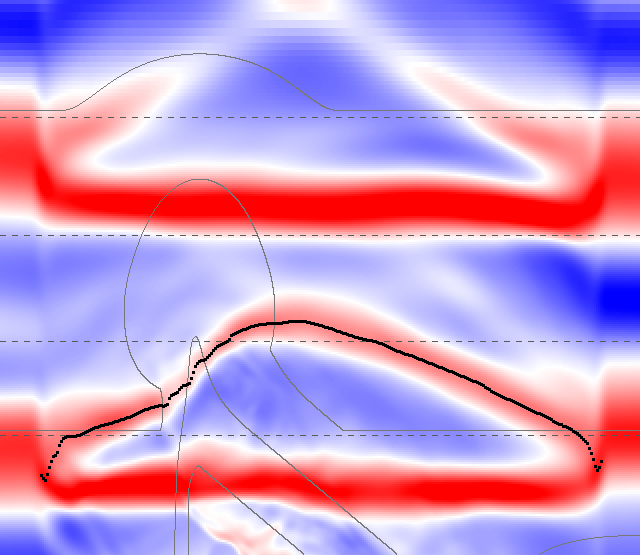
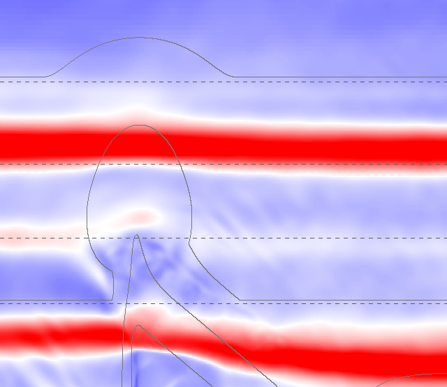
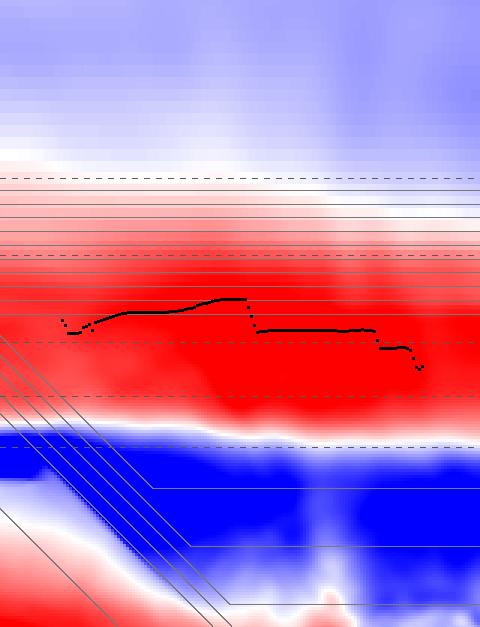

# Why the Reef's and Padang Padang's crests bend (2026-10-07)

**The rule (owner, 2026-10-06):** waves come from one direction, never from more than one side at once.

**What broke it** (`docs/research/crest-angle-2026-10-05.md`, Medium, seed 1, 600 s):

- **Padang Padang:** 3 crests of 34 on the take-off line bent into a chevron, with halves of −30.1° / +24.4°, −20.9° / +28.3° and −31.8° / +28.8°.
- **The Reef:** 1 crest of 32 on the edge line ran two ways at once (−10.9° / +11.7°), and its crests bend more than the Beach's (straightness 3.01 m against 0.97 m).

For each, this note says which crests bend, where and when, and then sorts the cause into one of three:

- the bed's refraction or reflection (real physics);
- the tank (its zone, blend, open sides or side feed);
- the swell's spread (components crossing).

It also says what would remove the cause, with numbers. Nothing was changed: every swell and bed below is an override for one run.

## Summary

- **Padang Padang: the tank's side feed.** The feed holds each crest back at both sides of the window, so every big set wave sheds a wake from both sides. The two wakes meet in the middle about 8 s behind the wave, as a Λ-shaped crest that runs two ways at once. With the feed off, on the same sea and bed, the chevrons are gone. On the take-off line, the 90th percentile of the bend falls from 49.2° to 6.5°, and the two-way crests from 3 to 0. The reef's own refraction is real but small.
- **The Reef: the swell's spread and the reef's own reflections, not the tank.** Each one alone bends the Reef's long, flat-topped crests: removing only one leaves the other doing it, and removing both straightens them seaward of the reef (bend p90 at z −200 from 29.2° to 9.5°). Feeding the sides changes nothing. The flagged crest was a low one (0.58 m), whose highest row the probe cannot place. Measured at the crest's centroid, the edge line bends no more than the Beach's (p90 12.3° against 13.3°), and no crest runs two ways at once.

## How it was measured

`scripts/crest-angle-report.ts` (as in the crest-angle note), with diagnostic options that change nothing in the game:

- each crest's followed points (`--points`);
- more watched lines (`--lines`);
- the surface around the lines whenever a crest runs two ways at once (`--snapshots`);
- the crest at the centroid of its top fifth (`--crest-point centroid`);
- one-factor overrides: `--spreading`, `--reef key=value`, `--no-side-feed` and `--side-feed reef`.

`scripts/crest-snapshot-image.ts` draws the snapshots, and `scripts/crest-snapshot-residual.ts` subtracts the tank's own linear sea from them. The runs used the Medium swell and seed 1: 600 s for the Reef (about 20–25 min each) and 450 s for Padang Padang (about 95 min each), on an 8 GB M1.

```sh
npx rolldown scripts/crest-angle-report.ts -o dist/scripts/crest-angle-report.mjs --format esm --platform node
node dist/scripts/crest-angle-report.mjs --spot padang --swell medium --seed 1 --seconds 450 --quiet --points \
  --lines -300,-200 --snapshots padang-snap.json --snap-line take-off --json padang.json [--no-side-feed]
node dist/scripts/crest-angle-report.mjs --spot reef --swell medium --seed 1 --seconds 600 --quiet --points \
  --lines -200,-175,-110 --json reef.json [--spreading 5000] [--reef crestDepth=10,lagoonDepth=10] [--side-feed reef] [--crest-point centroid]
npx rolldown scripts/crest-snapshot-image.ts -o dist/scripts/crest-snapshot-image.mjs --format esm --platform node
node dist/scripts/crest-snapshot-image.mjs --snapshots padang-snap.json --crests padang.json --out img --scale 2 --range 2
```

## Padang Padang: a wake from the side feed

### Which crests, where and when

All three chevrons are small crests that come 8–9 s after a big set wave, about half a period (Tp 17 s):

| Crest on the take-off line | η above still water | Vertex | Arms | Trails |
|---|---|---|---|---|
| 424.3 s | 0.94 m | x −12, z −258 | −32.7° / +24.3° | the 3.30 m crest of 415.9 s, by 8.4 s |
| 458.5 s | 0.85 m | x −20, z −258 | −25.8° / +27.5° | the 2.06 m crest of 449.8 s, by 8.7 s |
| 755.0 s | 0.70 m | x −19, z −265 | −34.2° / +28.1° | the 3.07 m crest of 746.6 s, by 8.4 s |

On the take-off line, the 9 crests that came less than 0.65 Tp after the one before bent 22.5° on average (|right − left|), against 4.5° for the rest. The chevrons also reach the take-off line only 1.5–5 s after a crest crosses the edge line, while a wave takes 13–15 s to travel between the two lines. So they are not waves that came in from the edge: they form inside the window.



*At 424.3 s, side feed on: the surface above still water (red up, blue down), the reef's 2 m depth contours (grey), the watched lines (dashed), and the tracked crest (black). The sea is at the top and +x to the right, over the whole 320 m window.*

The tracked crest is a Λ. Its vertex lies near the middle of the window (x −12), not at the reef's peak (x −60). Its arms are straight for about 130 m each, and they end where the side feed's strips begin (the outer 30 m, |x| ≥ 130). There they merge into the crest of the big wave that passed 8 s earlier. In the strips, that wave stands further out to sea than in the middle.

### The test: the same sea and bed with the side feed off

`--no-side-feed`, same seed and spread, 450 s (sea time 330–780):

| Line | Straightness, feed on → off | Bend p90, on → off | Two ways (±10°), on → off | Halves mean −x / +x, on → off |
|---|---|---|---|---|
| edge (z −360) | 3.24 → 1.27 m | 8.5° → 4.8° | 0 → 0 | +1.0° / +0.5° → +1.4° / +1.3° |
| z −300 | 4.43 → 1.73 m | 11.4° → 8.0° | 2 → 0 | −1.6° / +3.2° → +0.8° / +1.0° |
| take-off (z −248) | 5.28 → 2.33 m | 49.2° → 6.5° | 3 → 0 | −2.1° / +5.4° → +0.2° / +2.0° |
| z −200 | 7.25 → 2.68 m | 53.2° → 6.2° | 5 → 0 | −5.0° / +8.5° → +0.6° / +2.9° |

With the feed off, the crests at 424, 459, 479 and 755 s do not exist. The waves arrive at the same times and run straight across the window, except for a small bend where they break over the reef's peak:



### The mechanism

The side feed (`src/wave/SideFeed.ts`, Padang Padang only) relaxes each side's outer 30 m toward the incoming sea. That sea is shoaled and refracted linearly (WKB, with the solver's own dispersion) from the offshore zone's inner edge (z −1033), over 785 m, to where the sets break. The solver's crests run ahead of that linear target. In the snapshots, for the same crest:

| Snapshot | Crest | z in the middle (x −100…100) | z in the strips (\|x\| ≥ 145) | η middle → strips |
|---|---|---|---|---|
| 424.3 s, feed on | incoming | −313…−317 | −330…−342 | 2.4–2.9 → 1.7–1.8 m |
| 424.3 s, feed on | passed | −172…−177 | −195…−202 | 1.8–2.4 → 1.7–1.9 m |
| 755.0 s, feed on | passed | −176…−181 | −192…−196 | 1.8–2.9 → 1.4–1.6 m |
| 424.3 s, feed off | incoming | −311…−314 | −311…−314 | 2.3–3.2 → 2.5–3.0 m |

With the feed on, each crest lags 15–28 m in the strips and stands 30–40 % lower there. Over the 785 m, that makes the linear target 2–3.5 % slower than the solver's crests: the amplitude dispersion of a swell growing to a third of the depth (Hs 2.2 m shoaling from 25 m to 7 m). Big crests travel 8.28–8.44 m/s between the two lines, and those of 0.8–1.4 m at 7.64–7.81 m/s.

A crest held back at the sides while it runs on in the middle sheds waves from both sides. In steady state their fronts make an angle θ with the beach, where cos θ = c / V:

- c is the free waves' speed: 7.6–7.9 m/s at 6–7 m depth (the solver's dispersion, Tp 17 s);
- V is the crest's speed: 8.3–8.5 m/s.

That gives 17–26°, and the arms measure 24–34° (mean 29°). The fronts from the two sides travel inward and meet in the middle, 130 × tan 26° ≈ 63 m behind the crest at the sides, about 8 s at 8 m/s. Hence a Λ about 8 s behind every big wave, with its vertex near x = 0 wherever the reef is, and largest behind the biggest sets.

**The cause is the tank, not the reef or the swell.** The reef's peak does bend crests slightly (as seen with the feed off), and real reefs do. But the two-way crests are the side feed's wake.

### What would remove it

Each option is the owner's or the advisor's call, since the side feed was a decision (2026-09-28: the feed reaches where the sets break, because stopping it at 0.45 h let the window drain).

1. **Switch Padang Padang's side feed off** (one entry in `SIDE_FEED_SPOTS`). Measured above, this removes every two-way crest; the take-off line's bend p90 goes from 49.2° to 6.5°. The drain the feed was built against did not show here: with the feed off, the sides were as high as the middle at the three snapshots (2.5–3.0 m against 2.3–3.2 m), and the big crests at the take-off were as tall or taller (3.41, 3.34, 2.56 and 3.29 m, against 3.30, 2.75, 2.06 and 3.07 m with the feed). That is 450 s and three snapshots, though. Before switching it off, the size report should check that heights hold across the 320 m window over a full session.
2. **Keep the feed, but give its target the solver's crest speed**: a phase that runs 2–3.5 % ahead over the 785 m, or more precisely amplitude dispersion in the target. Then the strips would no longer hold the crests back.
3. **Keep the feed, but stop it from fighting the interior**: relax only the strips' wave height, not their phase, or fill them from the solver's own water a few metres inside.
4. **Ending the feed further out would not do.** The lag is already 15–27 m at z −315 to −342, seaward of the reef, so the feed would have to stop hundreds of metres out, against the reason it exists.

## The Reef: the swell's spread and the reef's own reflections, on long, flat crests

### Which crests, where and when

The two crests flagged on the edge line were 412.3 s (halves −10.0° / +11.2°) and 449.7 s (−10.9° / +11.7°). Only the second passes the Beach reference's ±10.6°. Both are among the lower crests: 1.08 m and 0.58 m above still water, against about 1.1 m for the sets.

Over the whole run, the Reef's bends grow as crests get lower. The lowest quarter bent 13.7° on average (|right − left|) and the highest quarter 6.9°. The Beach shows the same, at 8.0° against 2.3°.



*At 412.3 s: the crest is a band 40–50 m wide across shore (red), and the tracked crest (black) jumps about 10 m within it. The 45° ledge's depth contours are at the bottom left.*

**Why the crest line jumps.** A 16 s swell is 130–160 m long on the 10 m shelf and 260 m long in the tank's 30 m water. Its crest is a broad, flat-topped band. The probe takes each column's highest row, and on such a crest a few centimetres of other water move that row by metres. For a crest a = 0.7 m high with k = 0.04 rad/m, the highest row shifts by ε k / (a k²) ≈ 1.8 m for a perturbation of ε = 5 cm. On the Beach's shorter crests the same perturbation moves it about 0.8 m.

Measured instead at the centroid of each column's top fifth (`--crest-point centroid`), on the same sea, the edge line changes as follows:

- its 90th-percentile bend falls from 22.6° to 12.3°, level with the Beach's 13.3° measured the same way;
- no crest runs two ways at once (2 with the highest row);
- the 449.7 s crest reads −9.8° / +7.2°.

The wiggle is still larger than the Beach's (straightness 2.73 m against 1.04 m), but it has no direction.

**Where it starts.** The crests are already crooked at z −200, in the tank's level 30 m water seaward of the forereef: straightness 2.94 m, against 0.35 m for the tank's own linear sea at the zone's edge. There, the solver's surface less that linear sea leaves 0.08–0.27 m (rms) of other water, about 20–100 % of the incoming sea's own rms, growing toward the forereef. Some of that is bound harmonics (about 0.1 m at kh 0.72) and the straight reflection off the forereef, neither of which bends a crest. The rest varies along shore on 30–60 m scales.

### The tests, one factor at a time

Medium, seed 1, 600 s each:

| Run | What changed | Edge line: straightness / bend p90 / two ways | z −200: straightness / bend p90 / two ways |
|---|---|---|---|
| R0 | nothing (baseline) | 3.01 m / 22.6° / 2 | 2.94 m / 29.2° / 2 |
| R1 | swell nearly from one direction (s 5000, about 1°) | 3.03 m / 15.2° / 2 | 2.68 m / 24.1° / 1 |
| R2 | side feed on at the Reef | 3.08 m / 22.3° / 2 | 2.71 m / 36.9° / 2 |
| R3 | no ledge or reef flat (a level 10 m shelf) | 3.35 m / 23.2° / 2 | 2.07 m / 25.0° / 2 |
| R5 | both: s 5000 and no ledge or reef flat | 2.17 m / 17.9° / 0 | 1.35 m / 9.5° / 0 |
| R0c | nothing, measured at the crest's centroid | 2.73 m / 12.3° / 0 | 2.94 m / 27.4° / 1 |

"Two ways" counts crests with halves leaning opposite ways, each past ±10°.

- **The tank is not the cause.** Feeding the Reef's sides (R2) changes nothing.
- **The swell's spread and the reef each bend the crests on their own.** Removing only one of them leaves the other doing it (R1, R3). Removing both (R5) brings the z −200 line to 1.35 m and 9.5°, about the Beach's, with no two-way crest there or on the edge line (z −110, on the shelf, still had 2).
- **The reef's part is its own reflection and scattering**, travelling back out across the incoming crests. Turning the ledge shore-parallel (s 5000, `angle=0`) moved its foot onto the edge line, so that run does not separate the ledge's angle. At z −200, though, it bent crests as much as the 45° ledge (bend p90 25.8° against 24.1°, and 9.5° without a reef). So the reef's back-scatter bends crests whatever the ledge's angle.

  In the long-wave limit, the 45° ledge alone, from 10 m to 1.5 m, would reflect about 30 % of a non-breaking wave's amplitude along shore toward +x:

  R = (√h₁ cos θ₁ − √h₂ cos θ₂) / (√h₁ cos θ₁ + √h₂ cos θ₂), with θ₂ = 16° by Snell's law.

  The forereef's step from 30 m to 10 m reflects about 27 % straight back out.

**The cause is real physics:** the swell's spread, and the reef's reflections. The probe's highest-row crest line exaggerates both on a long, flat-topped swell. Measured at the crest's centroid, the edge line bends no more than the Beach's, and no crest runs two ways at once.

### What would remove it

- **Nothing in the tank:** the sides do not matter (R2).
- **A narrower swell alone, or a reef alone, would not do** (R1, R3). It takes both, and neither is on the table: the spread is the advisor's s = 150, and the ledge is the Teahupo'o spec's sourced 1:2.29 slab. The ledge's reflection is part of a real slab.
- **For judging the owner's rule at long-period spots, measure crests at their centroid** (`--crest-point centroid`). That is a change to the probe only, and it finds no two-way crest at the Reef's edge line.
