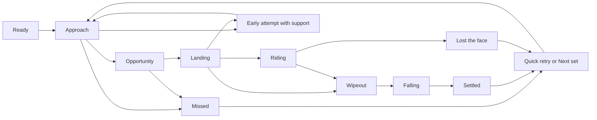

# Practice and natural-session experience

Status: **proposed UX specification**, 2026-09-25. This plans player-facing behavior only; no game code changes are included. It follows the confirmed choices in the [board and surfer physics plan](board-surfer-physics-plan.md) and uses the [validation protocol](board-surfer-validation-protocol.md) for physical event definitions. The active P2c water branch may change element names and diagnostics before implementation.

## Goal and interface boundary

A new player should be able to launch into **Practice**, see how to paddle and manually time a pop-up, ride the face, understand a miss or wipeout, and try again immediately. **Natural Sets** is one clear selection away and makes wave variability visible without promising every wave is rideable. The surf face stays the main visual focus; detailed forces remain available in the Wave Lab.

The eventual **Practice / Natural Sets** control selects a *gameplay session*. It must not be confused with the current Wave Lab **legacy / physical water model** selector. The latter is a temporary integration/debug choice: the active P2c physical mode is still view-only. Once physical play is accepted, the session modes use the same authoritative physical water, board forces and control rules; practice changes incoming-wave conditions only.

## Screen-state map

| State visible to player | Main cue and concise copy | Primary action | Secondary information |
|---|---|---|---|
| **Practice ready** (startup default) | Wide view of the incoming face; “Hold Space to paddle · Enter to stand · ← → to steer.” On touch, show the corresponding buttons. | Paddle | Session mode, stance and assists visible but unobtrusive; Wave Lab can stay collapsed. |
| **Approach / paddling** | Wave face and direction remain visible. Small status: “Paddling.” Do not cover the lip with a tutorial card. | Keep or release paddle; choose a line | Show board speed and a compact crest/face cue; full water-relative diagnostics live in Wave Lab. |
| **Pop-up opportunity** | Subtle board/face highlight and “Stand now” near the action; Get Up gains emphasis. The cue is computed from the same face position, crest-relative motion and support as the physics. | Press Enter / Get Up | The cue indicates a favorable moment, not a guarantee. |
| **Early/late attempt with support** | Show hand push or knee support, then a return to prone if recovery succeeds. Copy: “Reset your stance; keep paddling.” | Paddle or try standing on the next opportunity | Log support and timing; do not call this a wipeout while contact remains recoverable. |
| **Standing / catching** | Short transition state while feet load the board; “Hold your line.” | Steer | Keep feet/contact and wave face readable; avoid declaring a ride from a timer alone. |
| **Riding** | Compact speed, face-relative progress and occasional maneuver callouts derived from path/contact diagnostics. | Steer and trim through the one-axis control | Wave Lab can expose forces, stance, assist interventions and replay trace. |
| **Missed face** | Cause-specific message, e.g. “The peak passed before the board matched it.” | Practice: **Quick retry**. Natural: **Next set**. | Offer Replay exact setup and Wave Lab as secondary actions. |
| **Wipeout / falling** | Show the rider and board separate and move with water. State the observed cause, e.g. “Rear foot lost contact” or “Lip impact.” | **Quick retry** available immediately in Practice | The physical fall keeps running until restart or settling; no forced three-second freeze. |
| **Fall settled** | Short outcome card over a still-readable scene. | Quick retry / Next set | Replay exact setup, New Wave and detailed run report remain available. |

The Get Up action and its **readiness cue are separate**. The existing button is disabled whenever `popUpAvailable` is false, which suits the legacy MVP but would suppress the agreed early/late recoverable attempts. In the physical ride, enable an attempt while the rider still has valid prone support; emphasize it only inside the favorable opportunity. Disable it when a pop-up is already in progress, after separation, or when the board/rider state makes an attempt physically impossible. Keyboard and touch must follow the same rule. A grossly premature attempt may simply return to prone; the physics and contact state determine whether it succeeds, recovers or falls.

## Mode, restart and replay semantics

| Action | Practice | Natural Sets |
|---|---|---|
| **Mode selection** | Default at launch; controlled incoming waves keep a rideable face available. | One persistent, labeled control opens the set-based mode. Preserve selected stance and assists. |
| **Quick retry** | Reposition board and rider for a new attempt **without resetting or pausing the water**. Safe spawn and wave phase come from the continuing practice field. | Not the default; **Next set** advances to the next seeded opportunity after a miss/fall. Exact skip mechanics wait for P2c's set runner. |
| **Replay** | Reset the full seed, settings, wave phase, board/rider and input start state for a comparable attempt. | Same full reset for the selected natural set. |
| **New Wave** | Secondary action to generate a new seeded condition while staying in Practice. | Generate a different seed/sea state within the selected spot and settings. |
| **Settings change** | Show “Applies on next attempt”; do not alter forces mid-ride. | Same rule. Replaying an old trace retains the settings captured for that trace. |

Use **Quick retry** as the prominent post-wipeout action in Practice. Keep **Replay** available for diagnosis and learning, with copy that clearly says it returns to the same starting conditions. The present `R` shortcut and existing Replay/New Wave buttons can be retained; Quick retry and Next set need distinct bindings when implemented. Do not silently alias Quick retry to Replay, because the agreed practice wave continues through a retry.

## Assist, stance and feedback settings

- **Assists** default on. A clearly labeled Off setting is available before a run and shown in run history. Assists smooth input and guide a recoverable rider posture; the UI never describes them as changing wave strength or board grip. Toggling takes effect on the next attempt and does not rewrite a saved run.
- **Stance** offers Regular and Goofy before an attempt. Left and right still request the same travel direction; contact and animation coordinates mirror internally. Show stance in the expanded setup, not as a large permanent badge.
- **Failure copy** names only what diagnostics can support: insufficient crest-relative entry speed, late face position, lost hand/foot support, rail/fin release, lip impact, or loss of rideable face. If the physics cannot disambiguate the cause, say “Lost board contact” and expose the trace; do not invent a precise explanation.
- **Maneuver labels** follow path, heading and position on the face as specified in the validation protocol. They are brief celebrations, not acceptance evidence. FLOW and speed readouts remain descriptive, not hidden sources of force.

## Desktop and narrow-screen layout

**Desktop:** Keep the current wide scene, session pill, Wave Lab and bottom action cluster. Add a compact Practice / Natural Sets selector near the session status, and place stance/assists in the expanded Wave Lab or a small setup drawer. During action, collapse verbose telemetry to board speed, state, face cue and one concise outcome line; the expanded panel retains force and water detail. The pop-up cue belongs near the surfer/face or Get Up action, with enough contrast against both foam and sunset glare.

**Narrow/touch:** Preserve the existing left/paddle/right thumb controls and the large Get Up action. Mode and settings must remain reachable without covering those controls; use a small top menu or collapsible sheet before an attempt. Quick retry takes the prominent action slot after a fall. Outcome text stays above thumb controls and does not obscure the rider or next wave. All state changes have text as well as color, and buttons retain visible focus and accessible names.

**Cameras:** Keep the wide ride framing that shows rider, open face and advancing lip together, as recorded in the [video brief](gameplay-video-reference.md). Profile and underwater views remain optional inspection tools. The mode selector should not force a camera switch. During a fall, follow enough of the rider and board to make their separation legible; Quick retry returns to the approach composition.

## Walkthroughs

1. **First desktop attempt:** Load Practice → see the approaching face and three concise controls → hold Space to paddle → watch the face/board cue brighten → press Enter → feet load the board → release paddle and use arrows to traverse, bottom turn and climb the face → if wiped out, see the physical fall and a cause-specific message → select Quick retry while the wave continues.
2. **First touch attempt:** Load Practice → hold the paddle button while steering with the thumb buttons → tap Get Up when emphasized → steer while the action controls remain in place → tap Quick retry after a fall. A panel can show full telemetry without becoming part of the required control path.
3. **Natural session:** Select Natural Sets → choose spot/conditions or use defaults → watch a set and pick an attempt → catch or miss based on actual face motion → choose Next set for a fresh opportunity, or Replay to reproduce the exact starting conditions. Some sets close out or pass without a catch.

## Review gates before UI code

1. Walk through all states on desktop and narrow layouts with no physics implementation assumptions beyond the existing plan. Every primary action has one visible label and an accessible keyboard/touch path.
2. Verify that Get Up **attempt availability** and **recommended timing** are distinct concepts. A recoverable early/late attempt must be expressible in the UI and outcome history.
3. Verify that Quick retry, Replay and Next set have distinct behavior and copy. A Practice retry cannot silently reset the water, and a Replay cannot silently change seed or assists.
4. Confirm the HUD derives its cue and failure reason from the same physics snapshot used by board/rider contacts. If a diagnostic is missing after P2c/B2, show a general cause rather than guessing.
5. Keep the default action view sparse enough to read the lip and board. Expanded diagnostics can remain dense for Wave Lab users.

Implementation begins only after the physical mode is playable and the relevant P2c/B2/B4 diagnostics exist. UI work should follow the agreed states rather than temporarily tying Practice / Natural Sets to the legacy / physical model selector.
