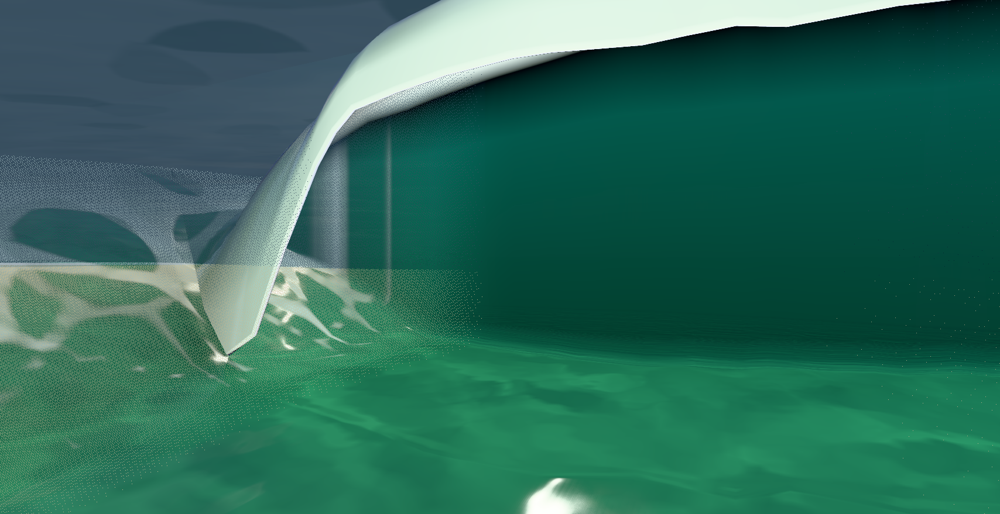
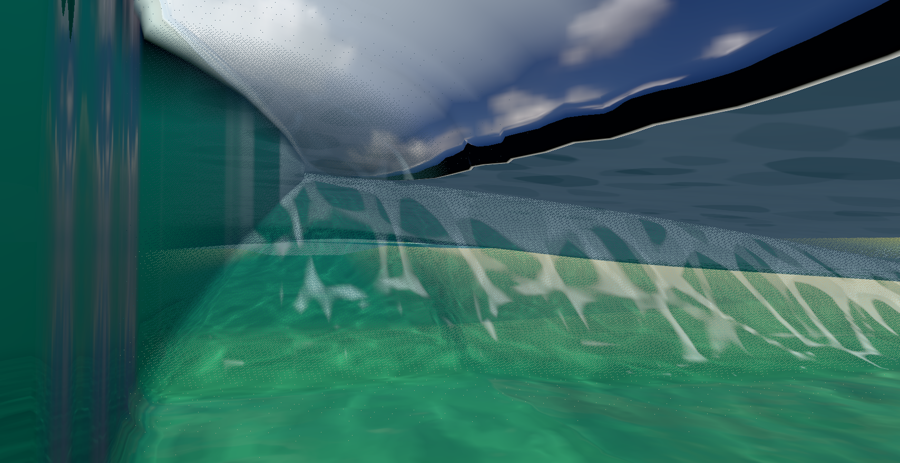

# Tube curve and ordinary-control checkpoint — 2026-10-05

The local curve refinement adds stations only where quarter, midpoint or three-quarter cap probes exceed a 1.5 cm chord error. It retains raw stations and existing clock midpoints, with three subdivision levels, a 6.25 cm minimum span and the existing hard geometry budget. The cap-only profile query uses the full profile’s existing float32 controls. This improves sampling; it does not change the authored opening coefficients.

The dev `tube` autopilot uses ordinary steering and crouch, with an opt-in current-geometry mouth query. Normal player steps do not perform the route search. Current status exposes seven published pose points and seven actual volume-equivalent physics part spheres for independent observation. These spheres and points do not enclose the complete skin or limb segments. The controller’s phases and cavity cue are not evidence of a completed ride.

Rich sheet body transmission now uses the mean geometric entry normal, consistent with its geometric exit normal; surface perturbation still shades gloss. The fixed-camera capture does not establish that this resolves the dark band.

Root executed the final 39-file scoped checks: **378/378 passed**, 24.61 s. Root separately executed the four cap tests and the production TypeScript/Vite build, both successfully. The retained logs are direct command outputs. Earlier failed interpolation checks led to the triad probe decision; the independent error test was not relaxed.

## Actual fixed-camera capture

Root executed the finite native capture successfully: zero physical steps, sea time 276.3293560552737, 127.70 s total. The first eligible joined pair has sampled cap64/floor104 clearances 1.2025576085 m and 1.2042677850 m. All 37 active loft arrays, raw fronts, eight board words, 33 rider words and the original camera survived each inspection and restoration unchanged. The prior side and interior camera poses/projections were copied exactly. The owner verified source/build pins before and after, closed only its owned 4301/9711 resources and preserved the four play previews, including 4315/PID87796.

Saved-loft analysis found identical raw front bytes and bounded-C control source. The visible prior corner at front41/x74.25 bends 33.8249 degrees in the baseline and 26.0085 degrees in this candidate. Visible row spacing changes from 0.25 m to 0.125–0.25 m. The candidate still has a 33.2759-degree local bend at x75.625. All twelve prior retained positive-fade raw stations remain; the candidate is below the vertex budget. Epoch metadata is not identical, and whole-geometry equality was not required.

Root actually viewed both baseline and candidate side/interior images. **The visual improvement is modest.** The side opening remains angular; the interior retains a prominent diagonal black strip, a broad grey angular band and dense stippled/triangular cuts. This is not reference-quality acceptance, body clearance, an exposed entrance, or proof of an ordinary ridden entry/travel/exit. The next work is the independent ordinary-control ride trial and a matched render that bypasses only the swept discard to investigate the cuts.

The manifest retains direct outputs and source pins. The full loft/raw-front sidecar is gzip-compressed without changing its contents. Helper files preserve their original absolute temporary dependency references; they are evidence of the actual run, not a portable one-command runner. Previous baseline outputs are retained in the adjacent `tube-body-mouth-2026-10-05` archive.

## Later observations in this checkpoint

The first ordinary-control native attempt stopped on an incorrect harness requirement that the rendered actor clock equal the worker clock. The actual game’s SnapshotTrack deliberately trails the newest physics snapshot by up to one step. One physical step advanced, but zero trace rows were retained before the assertion failed; this is an infrastructure failure, not a physical fall or a ride result. The native owner closed its resources and preserved4312–4315. Root separately verified all139 application/source pins after the failure. Original failed inputs/outputs remain unchanged under `ordinary-v1-clock-failure`. The replacement observer preserves interpolation and checks both current physical witnesses and the seven delayed displayed pose points.

The matched mask diagnostic completed successfully with zero steps in194.31s. It reproduced the cap capture’s exact37 active loft arrays and raw fronts. Four region images compare the unchanged swept discard against removal of precisely that statement at the same two fixed cameras. Both masked repeats are pixel-exact; water-mask bytes/grid, actual indexed geometry, depth/stencil settings and original-state restoration passed. The owner preserved all previews and closed4301/9711.

Root actually viewed all four images. Bypassing the swept discard removes most stippling and exposes coherent solid floor/wall ownership, establishing that the discard contributes to those gaps. A broad grey angular gap remains. This bypass is a diagnostic, not a production change or proof that every authored fade is erroneous. Authored-mask support and the independent shaded transmission/reflection candidates need separate evaluation.

### Corrected ordinary-control trial

The replacement v2 owner completed successfully in 468.94 seconds, preserving the authored visual interpolation delay and checking exact requested controls. It advanced 1,535 steps (25.58 physical seconds) before a prone lost-board separation. The pilot received no positive takeoff cue, emitted no pop-up input, and never reached standing. It therefore supplied no tube-containment or entry/travel/exit observation. The initial and terminal normal-follower images show the ordinary spawn offshore; the terminal board was near x=-33.69, z=-239.94, away from the earlier fixed tube inspection.

The [ordinary-v2 archive](./ordinary-v2/manifest.json) preserves the closed owner, trace, two images, exact loft snapshots, helper sources and executed trace analysis. The owner checked every trace control and the intentional up-to-one-step interpolation lag, then closed its own 4301/9711 resources while preserving all four play previews. A complete infrastructure result is recorded separately from the failed ride acceptance. The next riding task is to understand normal takeoff reachability before using this controller as a tube trial.

### Authored coverage analysis and candidate

A root-executed four-ray analysis of the completed mask comparison found changed pixels at interpolated authored masks approximately 0.74856 and 0.93620; its sampled full-mask1 pixel was unchanged. This strengthens the discard-contribution observation without proving full-core coverage loss in the captured scene. The production candidate uploads the loft's existing final mask and retains max(texture coverage, authored coverage) under the original dither threshold. It does not multiply fades again. Ordinary water remains on the texture predicate, so extra retained loft pixels may overlap water; existing depth/stencil ordering decides visibility. Native appearance verification remains pending.

### Matched wall-light and reflection diagnostics

The [sheet-fill comparison](./sheet-fill/manifest.json) completed its zero-step owner in 149.08 seconds. It used the exact earlier full37 loft/raw fronts and fixed interior/side cameras. Six normal Rich images separately compare original shading, A (effective sky/wall background share), and B (reflection-occlusion multiplier bypass). All four restored baseline repeats were pixel exact; ordinary water, mask, drawing geometry, actors and depth/stencil settings stayed fixed. Root viewed all six images. A replaces the conspicuous black diagonal upper-right interior strip with modeled green wall light. B leaves that black strip and mainly changes floor reflection. The broad grey angular band, existing silhouette corners and stippling remain.

A is adopted in the source: the existing approximate direction/TIR gate controls the sky share once, and the remaining share receives the already-modeled wall background. The safe nonzero environment ray and Classic body remain intact. It does not trace a true internal reflection or wall hit. B is retained as a diagnostic only. Combined wall-light plus authored-coverage native verification is pending. The [four-ray support analysis](./mask-ray-analysis/manifest.json) is also archived with its actual output and visibility limitations.

### Source checkpoint verification

The source checkpoint adds the final authored mask to every swept look/view and the Rich-only effective sky/wall background. It also recognizes an already-positive crest during tube-style positioning, using the existing catch transition and actual-cue-only pop-up; other demo styles retain their original timing. The [verification receipts](./verification/manifest.json) record 57 passing scene-barrel tests, 43 passing Autopilot tests, and a terminal successful TypeScript/Vite build with BUILD_ID `tube-guided-early-crest-20261005`. The authored-support comparison stopped once before launching because a listener identity query exceeded its 0.35-second timeout; root verified no test resources or outputs started and all protected previews remained, then invoked the same sealed comparison again. Its native appearance result and the next actual riding result remain pending at this checkpoint.

### Completed authored-mask and combined comparison

The [authored-mask comparison](./authored-mask-comparison/manifest.json) completed its zero-step owner in 179.85 seconds after the earlier preflight-only timeout. It retained ten images: interior/side in normal Rich and region views, each comparing original versus max(texture, final authored mask), plus a fifth interior Rich pair combining that mask with tested wall-light A. All five restored original repeats were pixel exact. Active final-mask words/upload, original full37/raw fronts/draw arrays, ordinary-water mask/material/geometry, actors, cameras and depth/stencil parameters were checked; original attributes and shaders restored after every pair. Own4301/9711 resources closed and all four play previews stayed unchanged.

Root viewed all ten images. Authored support visibly reduces missing pixels on the side wall and lip, with a smaller improvement in the interior. Dense partial-fade stippling remains; the broad grey band and angular contour remain. Combined A retains that coverage improvement and replaces the interior black diagonal strip with green modeled wall light. These are incremental appearance improvements, not reference-quality tube acceptance. The corrected ordinary-control V3 trial now uses the freshly built source checkpoint, retains the actual cue-only pop-up and all independent union21 acceptance rules, and remains pending.

### V3 takeoff observation and diagnostic deadline

The [V3 archive](./ordinary-v3-wall-deadline/manifest.json) preserves an actual failed diagnostic execution and its complete recorded prefix. Native execution reached its predeclared 640-second deadline, and the owner exited 1 after cleanup. It closed 4301/9711, removed all owned process members and preserved 4312–4315. The normal post-execution pin gate was not reached; root independently verified all 203 unique source/build/sealed pins after terminal, before further source edits. Neither owner nor native completion is claimed.

The prefix contains 1,525 complete rows, or 25.42 physical seconds. Root executed the read-only prefix analyzer after terminal. Early catch eliminated the earlier 12.6 seconds of commanded idle time: V3 started catch on the first actual positive-crest observation and recorded no prone idle action. Its actual positive takeoff cue and single pop-up input occurred at step 1,162. Current standing began at 1,234 and displayed standing at 1,235. All 292 standing rows were independently classified outside, with no approach guide or partial entry. The rider reached ordinary standing, but tube entry, travel and exit remain unobserved. Only the initial image/loft were captured; there is no terminal checkpoint or completed physical outcome.

The trace also exposed a controller bug: every missing-guide seek update cleared the pose record before estimating yaw and bank rate. The source now retains pose history while independently clearing stale mouth transport and route intent. Both controller test files pass (53 tests), including actual motion damping, duplicate-clock hold, reset and loss of guide. This correction has not yet been observed in a new ordinary ride. Missing guidance still cannot distinguish an absent mature mouth within 16 metres from a route or body/board-envelope rejection.

### Shared lip correction and remaining grey band

The current library applies a centered continuous carrier-width mean only to the analytic leaf's reach. It retains the actual crest/toe and outside carrier words, rebuilds the inner/root/floor from the corrected leaf, and tapers the correction to zero at the original authored hold. Full drawing, cap lookup and contact consumers use the same parameter path. Saturation bounds the correction within both thickness room and the existing fully formed 0.85-width leaf domain. The adversarial steep-carrier test first reproduced a 0.84453-width leaf under the initial correction, then passed after this shared bound was added. A generic cap test observes reduced bend; saturation and other carrier changes can retain kinks, so a globally C1 cap trajectory is not established.

The [verification archive](./shared-leaf-verification/manifest.json) records the broad barrel run (360 pass and four timeouts), the unchanged-limit sequential recheck (all 22 tests in those four files pass), the 53 controller tests, the demonstrated domain regression and final 29 affected tests, and the final successful TypeScript/Vite build. The matched current-optics geometry comparison [failed before any images](./shared-leaf-native-process-query-failure/manifest.json): a periodic OS process query exceeded its 0.35-second limit and the owner stopped the test HTTP server. Root independently verified that the owned group and ports later closed, all four play previews remained unchanged and all 99 unique sealed/source/build pins still matched. The failed owner and report remain unchanged. A separate revised observer recipe increases bounded OS query time and treats periodic query timeouts as observations while retaining the same process. Visual improvement is still pending.

The [grey-band offline evidence](./grey-band-ownership/manifest.json) fixes two points inside the broad grey wedge and two swept-roof/wall controls. Both grey samples retain identical encoded colours across seven earlier captured variants and have zero forward in-frustum intersections with the saved full loft. The controls intersect the loft and respond as expected to region and wall-light changes. This supports another drawable at the grey samples; it does not identify that drawable or attribute the entire band. A fixed-camera drawable-ID proposal is ready but has not run.

### Completed shared-leaf geometry comparison

The [matched current-optics geometry comparison](./shared-leaf-matched-geometry/manifest.json) completed successfully in 58.08 seconds, with zero physical steps and eight saved images. Both geometry variants passed through the same unmodified current material and the current candidate’s unchanged ordinary-water surface/mask. All four restored baseline repeats were pixel exact. The raw front words, actor words, fixed cameras and epoch were preserved; post-execution source/build gates passed, the owned group and 4301/9711 closed, and 4312–4315 stayed unchanged.

Root viewed all eight images and executed the independent saved-cap analyzer. At the predeclared front41 world crest X75.625, the indexed cap bend decreases from 33.27588° to 21.47927° with the same 0.125 m neighbor spacing. The largest eligible visible bend within the declared world-X74–77 neighborhood is now 26.06073° at X74.25. Candidate slices decrease from 81 to 80; all twelve previously retained positive-fade raw stations remain.

The visual improvement is modest: the interior roof edge has smaller notches, while the side remains similar. The broad grey angular band and dense partial-fade stippling persist. This improves one contour term; it does not establish a smooth complete tube, coherent moving joins, or ordinary rider entry/travel/exit. The next fixed-camera ID probe will test the surviving drawable at the predeclared grey samples using the immutable earlier optical build, while passive future ride telemetry will distinguish missing mature cap reach from route/envelope rejection.

### Feasible lip correction and same-query guidance diagnostics

The [new verification archive](./passive-guide-and-leaf-verification/manifest.json) records the stronger shared correction and passive approach diagnostics. The scalar bound now preserves feasible mean-width corrections exactly within 60% of the existing reach budget, then joins the same bounded asymptote smoothly. It retains the original curvature/domain allowance, anchors, thickness and lifecycle. The independently measured falling-height sampling corner is a separate mechanism; no globally C1 trajectory is claimed.

The opt-in tube guide records detached scalar observations from its existing query: nearest eligible cap before reach filtering, bounded rejection reasons, search counts and first envelope obstruction. This adds no geometry search and does not feed the controller. The three affected files pass 41 tests; eight lip/domain/contact files pass 104 tests. Root applied both pinned proposals and completed a fresh TypeScript/Vite build and a current 77-source diagnostic compilation with BUILD_ID `tube-guided-passive-telemetry-20261005`.

The next ordinary trial is prepared from those actual fresh builds, retaining the same normal controls, actual-cue-only takeoff and independent current/displayed union21 witnesses. First standing/guide/partial-entry checkpoints and passive wall timings provide earlier evidence within the finite observation window. This paragraph records preparation, not a completed ride or native visual acceptance. The fixed human preview on 4315 remains unchanged.

### Ordinary V4 browser-startup failure

The [prepared V4 trial](./ordinary-v4-browser-startup-failure/manifest.json) stopped during browser startup after 16.97 seconds on an owned-process identity assertion, before any physical step, trace row or image. Its owner terminated the verified test group, proved closure and preserved all four previews. Root independently verified 218 executable-policy pins and exact protected identities afterward. The precise offending identity change was not recorded, so the next resource-guard review must preserve stable group ownership while adding useful mismatch evidence. No new riding result is inferred.

### Saved-cap causes and preserved ownership failures

The [offline residual analysis](./shared-leaf-residual-analysis/manifest.json) reconstructs 17 cap rows from the actual stored float32 inputs: X/Z agree exactly and Y within one float32 ULP. Its successful executed decomposition attributes the remaining X75.625 bend mainly to authored width reversal surviving attenuation of feasible smoothing corrections. The separate X74.25 turn mainly follows the existing falling-height curve sampled at unequal intervals; this does not prove a continuity break. The initial strict-JSON NaN failure and subsequent successful offline calculations remain distinct. This evidence motivated the tested identity-core bound, whose new native visual benefit remains pending.

The [ownership-failure archive](./grey-band-ownership-failures/manifest.json) preserves actual V2 preparation failure, V3 native failure on an incorrect empty legacy-mesh range assumption, and V4 native failure on direct source/draw index equality. V3 and V4 stopped before baseline images or shader probes, with zero steps/PNGs. Root's later independent 223- and 227-pin closure checks are separate receipts; neither failed owner is relabeled complete. The exact historical renderer reverses triangle winding when its geometric facing test is negative; a proposed corrected guard must retain every triangle and the actual drawn index bytes across probes. No drawable ownership or lighting conclusion has been established.

### Owner-anchor checks and expected draw winding

Root packaged the [owner-anchor verification](./owner-anchor-verification/manifest.json) and executed its 20 synthetic tests successfully, with two Python source parses. These checks establish the bounded pure contract, not real process identity. The helper cannot independently know the caller's latest accepted state: every signal must consume a new successful required read, checked against that latest state, with no reuse of an earlier observation after a failed read. Root reports that the revised owner source/syntax integration now passes and a new fixed identity capture is running; its native outcome remains pending. Five exact protected preview identities are retained, including the immutable human preview on 4316. Corrected drawable-ID and ordinary V5 source recipes remain pending at this checkpoint.

The [draw-winding audit](./draw-winding-audit/manifest.json), also packaged by root, preserves one completed offline calculation by `/root/tube_approach_passive_patch`. Its source and stdout are explicitly reconstructed from the original execution transcript; preservation did not rerun the calculation. The exact saved sidecar and historical renderer imply 14,490 b/c swaps among 20,748 triangles. This is expected offline winding, not an observed runtime draw prefix. The failed IDV4 guard stopped before images or probes, so no runtime drawable-ownership result is recorded.

The documentation check verified 26 direct manifest copies and two reused archived sources, including the reused gzip's encoded bytes and lossless decoded content, plus 40 unique original source paths. All 106 byte/hash assertions passed. This check performed no geometry calculation, test rerun, process/port observation or native execution and did not alter either evidence archive or any preview.

### Unadopted angular cap trial and identity-owner expiry

The [angular trial archive](./angular-cap-trial-failure/manifest.json) preserves an isolated private-source proposal, its unchanged failed assertion, and root's completed offline provider-fixture comparison. Actual run21713 passed7/8 tests and exited1 in3.06s. The trial maximum is39.616° at X5, above both the old positional-adaptive maximum32.822° at X5 and the mandatory-plan maximum38.691° at X4.75, although the height-related X4.75 corner decreases21.312°→14.205°. The rosters use unequal adjacent secants; this establishes neither a derivative discontinuity nor a water/budget cause. The full-weight flat-water fixture and retained depth/spacing diagnostics are preserved. Bundle79961 and offline computation11563 exited0. The candidate remains unadopted, with no new native or riding result.

The [identity-core V1 failure](./identity-core-comparison/failed-v1/manifest.json) records an actual44.32s failed owner with0 steps/PNGs: a completed process read took2.059s and exceeded the unchanged2s window. Root separately verified690 post-failure pins, absent group43952, closed4301/9711 and all five protected previews. The failed owner remains failed; the replacement V2 result is pending at this checkpoint. These records do not establish a drawable-ID V5 execution or a visual improvement.

### Identity V2 normal-startup timeout

The [V2 failure archive](./identity-core-comparison/failed-v2/manifest.json) records actual owner49623 terminal1 after210.11s, before any diagnostic step or PNG. The revised guard kept the same process through13 late periodic reads, including a completed2.02865s read rejected without state refresh. Native then timed out at its180s ordinary paused-ride conjunction; browser closure succeeded, owned group47730 and4301/9711 closed, and all five previews stayed unchanged. Root independently verified698 pins after terminal. The immediate returned menuStartup copy is not final page evidence, and no final screen/host snapshot was saved, so the failed startup/pause condition remains unknown. No new visual or riding result is claimed. The corrected immutable-reference IDV5 has passed source/syntax checks and preparation; its actual native result remains pending.

### Current checkpoint: preserved failures and remaining proposals

The [IDV5 archive](./grey-band-ownership-v5/manifest.json) preserves actual owner98635 terminal1 after134.68s. The corrected winding guard reached the fixed baseline check, which rejected an image differing from the completed reference before any ownership probe; zero diagnostic steps or PNGs were saved. This does not establish a drawable or lighting cause. The original failed reports remain unchanged. Root separately verified893 unique pin versions, including all584 current source files and49 build assets, observed group50808 absent and4301/9711 closed, and verified all five protected preview identities. Historical source and pre-review metadata versions are verified through their exact preserved copies. Two failed audit attempts stopped before OS reads and are retained separately.

Read-only startup review found no source-proven pause/readiness deadlock. The identity V2 failure retained no fresh final predicate snapshot, so a future fixed run needs bounded read-only startup evidence before browser closure while preserving its existing controls and deadline. The [equal-span reach proposal](./reach-analysis-proposal/manifest.json) remains source-only and unexecuted; it specifies33 fixed grid points plus the exact authored-hold event without claiming a derivative discontinuity. The [ordinary V5 recipe](./ordinary-v5-source-recipe/manifest.json) passed root source/syntax and hash checks but remains unprepared and unexecuted. Neither proposal changes production behavior or establishes tube entry, travel or exit.

The immutable human preview at `http://localhost:4316` serves code checkpoint `3e75550c228d9efb7ba9182b86353478304fb1c4` (Padang → Big). Later archive-only commits preserve that exact playable build while ongoing tube work remains isolated.

### User-requested pause

The goal is now paused at the user's request. The [pause checkpoint report](./pause-checkpoint-2026-10-05.md) records the completed 34-sample reach analysis, terminal-frame boundary finding, user-interrupted ordinary V5 test and independent cleanup verification. It distinguishes applied game changes from unimplemented next steps. The fixed preview on4316 remains available; the isolated test owner/group and4301/9711 have closed. Further implementation or experiments require the user to resume the goal.
