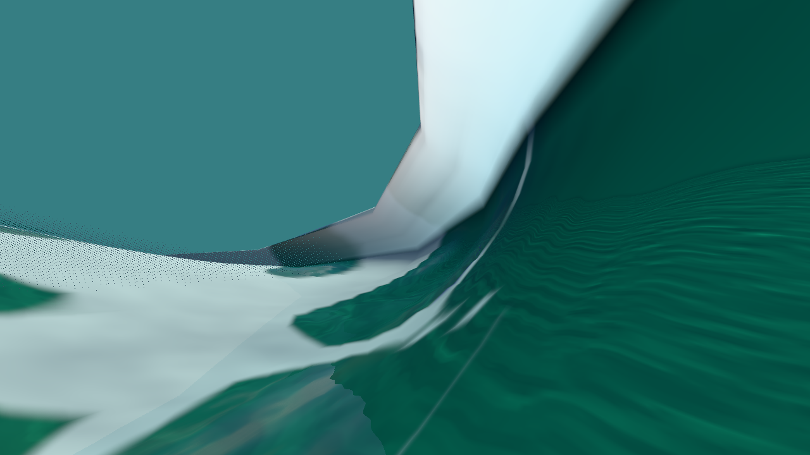
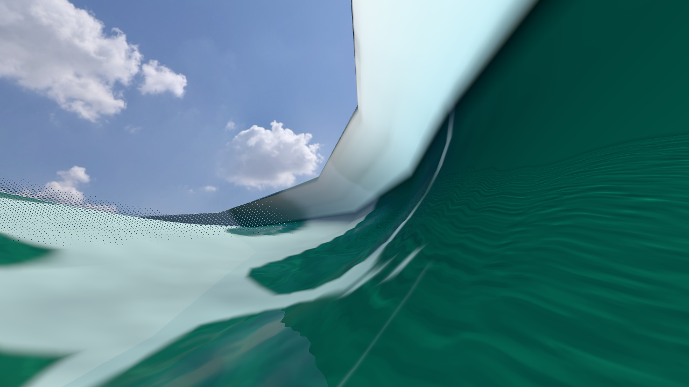
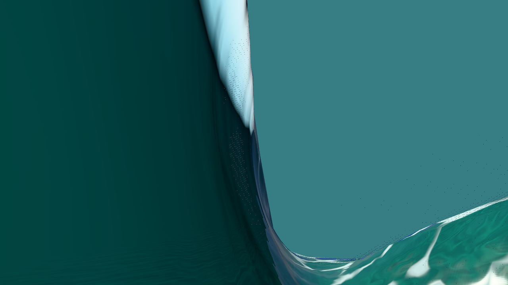
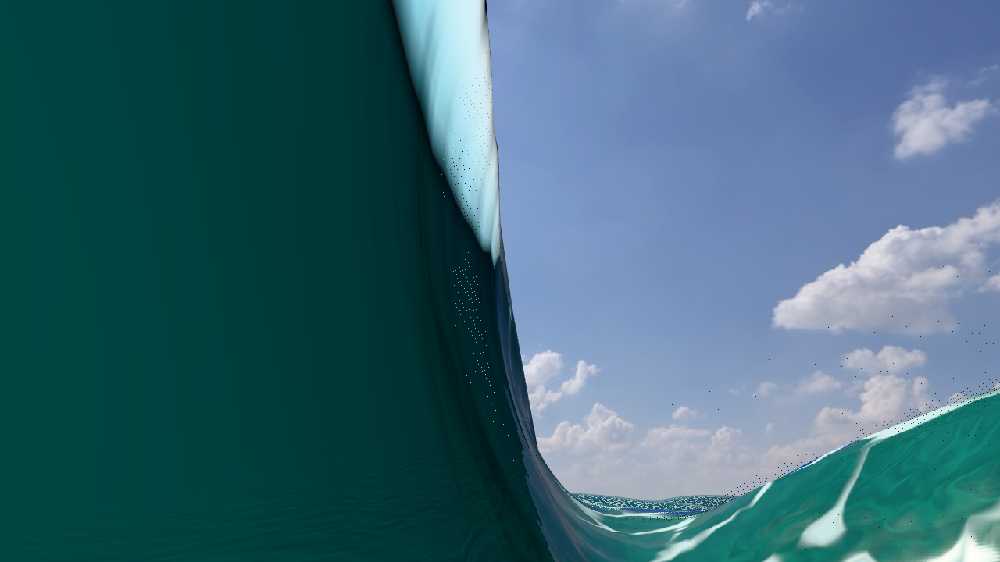

# Held cavity fog proof — isolated prototype

Canonical4201 and isolated fog4207 both passed all8 held views, with0 solver advances and empty failure lists. Their owned Chromes closed after6.679s and6.939s respectively, within the original60s serial-pair deadline. Production source remains unchanged; this archive is evidence for a prototype, not a default rollout or FPS result.

The lower camera at each exact captured column is in indexed/contact-authoritative air but below the host's raw heightfield. The prototype shows photographed sky through the same retained wall/floor, replacing the canonical teal underwater background. These are actual supplied `renderView` cameras. PhysicalMode's unused own camera was kept at y20 and classified dry in both runtimes; it did not determine these results.

| Capture/view | Eye y | Raw host.heightAt | Canonical underwater fog | Prototype underwater fog |
|---|---:|---:|---|---|
| 10 lower air | .835540383 | 1.050738341 | true | false |
| 10 under-floor | .520342425 | 1.050738341 | true | true |
| 10 roof band | 1.539179647 | 1.050738341 | false | false |
| 10 outside | .717845683 | .917845683 | true | true |
| 20 lower air | 1.139146868 | 1.499766489 | true | false |
| 20 under-floor | .678527246 | 1.499766489 | true | true |
| 20 roof band | 2.727076124 | 1.499766489 | false | false |
| 20 outside | −.786751570 | −.586751570 | true | true |

The exact floor/underside/top bounds at10 are .720342425/1.436574490/1.641784804; at20, .878527246/2.538703744/2.915448503. Both lower eyes have four locally sampled mask nodes255, full alpha1, and independently retained indexed/contact witnesses. Outside controls have four nodes0. Snapshot.tubeCount remains0; raw host lookup is therefore the actual bilinear fallback, rather than an assumed Rich cubic lookup.

## Real draw and GPU evidence

The QA adapter calls the original `PhysicalMode.prototype.drawBarrel`, after installing the exact captured host snapshot, front/status and real WaterSurface source. It never manually sets private draw freshness or uploads an exported mesh in place of the real draw. Generated position, normal, canonical index and vertex-mask prefixes match canonical exports. Actual uploaded facing-normalized indices, full draw range(start0/exact count), and actual rasterized water mask also match. Cross-build render attributes/indices/mask, camera matrices, CPU texture hashes and water uniforms are byte-exact in all8 views. Native caustics, normal High/Rich water/swept shaders, original pixel normals,256 FFT and actual midday lighting remain active.

Scene state and actual GPU program observations are separate in [held-proof.json](held-proof.json). Lower prototype views have `scene.fog=null`; actual main-scene `onAfterRender` program reads show `USE_FOG=false`, `FOG_EXP2=false`, and inactive fog uniforms(`null`). This is not a density-zero toggle. Canonical lower/under-floor/outside programs have active Exp2 fog. Under-floor/outside prototype programs retain the same GPU fogColor `[.211770579,.494123369,.513731122]` and float density `.03500000014901161`. Scene fog's linear color `[.036889450,.208636870,.226965873]` and density `.035` are separately recorded. Shader source hashes are retained, but program IDs/compilation variants are not treated as cross-runtime identities.

## Image comparisons and limits

All4 roof/outside control PNG pairs are byte-identical. Under-floor classifiers, actual GL fog uniforms, source, geometry and water uniforms remain exact, while their native pixels differ slightly: at10,16,803/921,600 pixels(1.823%) change with max RGB delta3 and mean absolute channel delta.006689; at20,8,627(.936%) with max7 and mean.004259. The cause of these small cross-build differences was not isolated; they are not claimed to be caustic noise or exact pixel parity. Native repeat images are exact in15/16 cases. The candidate20 lower-air repeat changes4pixels by1; that repeat is also retained. [Pixel measurements](pixel-comparison.json) use integer RGB differences with no acceptance threshold.

The roof-band controls are independently inside the physical roof water yet above the raw host heightfield, so both classifiers remain dry. This is an explicit limitation: the change overrides only verified bounded drawn air. It does not replace the water-volume/contact model. Translucent/dithered footprint seams use raw fallback; only full local opacity and exactly3 finite distinct indexed crossings certify air. Empty/hidden/stale/partial/ambiguous/degenerate/overflow columns also fall back conservatively. Listener calls before the fresh draw may retain raw classification. Those guards have focused CPU coverage in the archived scratch test source, but this held trial does not prove moving cache lifecycle or listener audio.

These frozen captures omit rider/particles, flow/aeration and original bed/lighting metadata; the shared bed/lighting are reconstructed normally from config. No claim is made about complete ride appearance, reference-video quality, physical contact fidelity through arbitrary collapse, predicate cost, or live FPS. There was no forced above-water flag and no shader replacement.

## Retained artifacts

- [Baseline raw report, lossless gzip](baseline-report.json.gz) and [prototype raw report](candidate-report.json.gz) retain all8views × normal/repeat state, source hashes, served JavaScript hashes, real GL reads and temporary original PNG paths.
- [Archive manifest](archive-manifest.json) records exact original/decompressed report hashes and source/image bytes. All16 normal PNGs plus the one non-identical repeat are retained; the other15 repeat PNG hashes equal their retained normal images.
- [Driver plan](driver-plan.json), [held QA plan](held-qa-plan.md), [source manifest](source-manifest.json), [source explanation](source-prototype.md) and [four-file prototype patch](cavity-fog.patch) preserve authorization scope and the exact source/build boundary.
- Archived source has a final `.txt` suffix to avoid production test discovery. Reproduction requires reconstructing the named temporary source/helper paths and exact full physical capture/geometry exports identified by hashes; the compact durable physical fixtures in the parent directory have separately proven crop parity. The patch applies to the recorded canonical source hashes; applying it to production still requires an explicit integration decision.

Baseline served bundle fingerprint: `d8d8564409cac85cd0bfd742025a7835e0e8627184e89579358952cdb0510788`. Prototype: `469b1a5300861cc9afe3032105d33f04b846af92e07215b867d85ec0a3ce8c11`. The physics worker is byte-exact in both(`eb1a337b66c0eea19035241aee1c46a129a039548e21916d428a6a1a50d2d3c5`). The original overall deadline and drivers were retained unchanged for this execution; no timeout retry or budget widening was needed.

