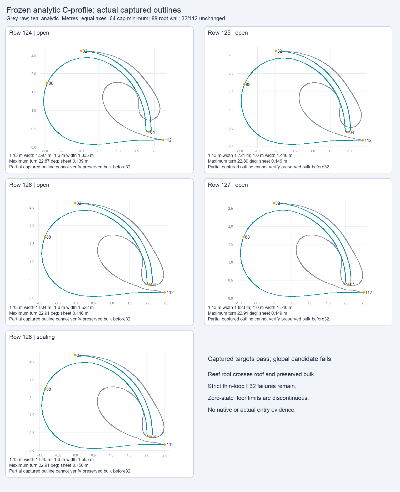
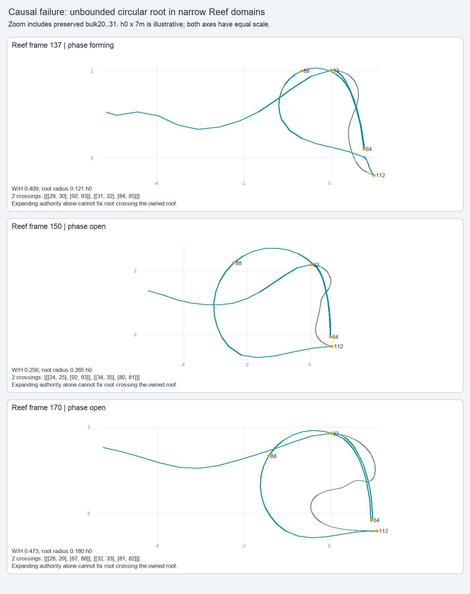

# Analytic C-profile: captured targets pass, global model rejected

This single frozen offline trial replaces the 32–112 crest-to-toe contour with a paired analytic C sheet, rolled cap, broad root and analytic floor. It passes both declared opening-width targets in the five captured outlines, but global Reef crossings and discontinuous zero-state floor limits prevent porting or adoption. No tuning, silent repairs, production implementation or native test occurred during archival.

| Prescribed scope | Attempted | Valid | New clean → crossed |
| --- | ---: | ---: | ---: |
| Captured outlines | 5 | 5 | 0 |
| All source frames | 1,224 | 1,219 | 39 |
| Adjacent F32 parameter interpolation | 3,648 | 3,632 | 116 |
| Lifecycle grid | 376 | 367 | 15 |
| Parameter/case grid | 672 | 672 | 23 |

The 39 raw and 116 adjacent new crossings are real Reef failures: the low-floor circular root becomes too large for its narrow steep roof and intersects both owned roof and preserved bulk. Owning more outside vertices alone would not remove the owned intersections. The separate 15 phase and 23 cross-case crossing flags arise from intended cap/plateau contact stored a few Float32 ULP below the plane, at most about 3e-8 h0. These remain failures in the original report, classified separately without being silently passed.

Strict representability rejected five raw frames, 16 adjacent samples and nine phase samples. Independently, eight algebraic zero-state audits found maximum floor-shape jumps of **0.0124035 h0 at formation** and **0.0175864 h0 at retirement**. Precision-aware collapse therefore cannot by itself fix lifecycle continuity. The exact [limit and causal diagnostics](causal-diagnostics.json.gz) preserve these audits.

Captured continuous widths were 1.597–1.840 m at gap ≥1.13 m and 1.335–1.565 m at gap ≥1.60 m; all exceeded the 1.25 m width requirement. Maximum stored turn was 22.91°, and nominal sheet thickness 0.139–0.150 m. These projected measurements do not prove native appearance, contact, body fit, reachability or tube entry. Captures start at point32 and cannot establish preserved-bulk compatibility; their inferred authored touchdown is labeled.

Authored touchdown initiates sealing. Actual modeled cap impact occurs at approximately 1.149 TD for seven held inputs and 1.169 TD for Reef. The trial frees old material64/throat88 semantics and does not preserve their original velocity meaning. Its exact [integration and next-scope plan](integration-and-next-scope.md) lists the shared provider, parameter blending, lifecycle, landmarks and derived-channel requirements. The plan is not implemented or accepted.

## Exact evidence

The [recipe](recipe.md), [prototype](prototype.py), [evaluator](evaluate.py), [start receipt](evaluation-start.json), original README/manifest, [summary](summary.json.gz), full [report](report.json.gz), diagnostics, three selected [failure profiles](failure-profiles.json.gz), evaluation log and plotting source are preserved. The original report gzip is unchanged and decodes to the exact 16,346,149-byte report. Both figures are original numeric plots, not native imagery:

`input-references.json` identifies all eight public assets and references prior captured inputs and immutable historical helpers/receipts, without another raw input bundle. It does not compare against or rewrite current production adoption.

Run `python3 verify.py` for archive/gzip/reference/asset-byte and stored-receipt checks. `python3 verify.py --original` also reads the original scratch/dependency bytes while they exist. Verification imports no prototype/game code, reconstructs no geometry, runs no evaluation and launches nothing. It is evidence preservation, not numerical/native validation or adoption.
