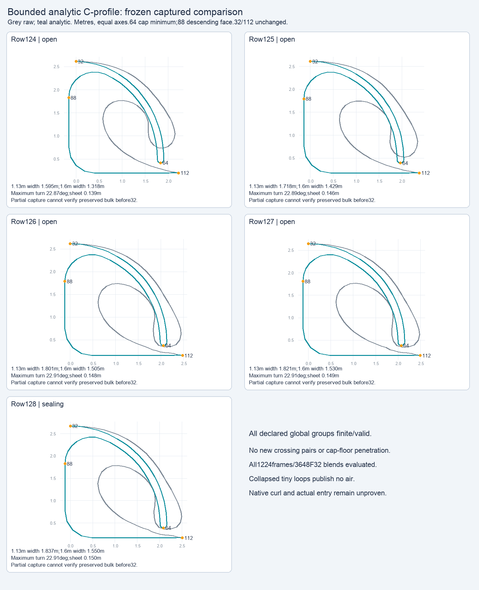

# Bounded C model and consumer evidence

This archive preserves a candidate that remains unadopted. Corrected precision-v4 passes its declared offline query groups and provider checks, but the final consumer run is **8 passed / 1 failed**: a real **0.311457mm Reef roof/root mesh inversion** remains. No native appearance, body passage, ordinary entry, FPS improvement or source adoption is established here. Native evidence is intentionally omitted while root owns its separate experiment.

The original recipe replaces the whole owned curl/face region while preserving the authored outer anchors and outside contour. Queries blend parameters before construction and publish one metric profile for drawing, contact, sheet/void and crash consumers. Actual cap-boundary motion is separate from approximate fluid velocity. Current atmospheric void is separate from prospective jet-water budget; air is captured at closure and released monotonically as remaining volume vanishes.

| Frozen trial | Retained outcome |
|---|---|
| v1 | Original groups pass: 5 captures, 1224 asset frames, 3648 adjacent F32 blends, 376 lifecycle queries and 672 case-pair queries. Later exact Pad20 full queries fail in a **3.1935ms retirement band**; successful coarse grids do not erase that failure. |
| precision-v2 | Current roof/tail envelope fixes retirement snap, but added 342-query grid has **39 early root-feasibility failures**. The first evaluator adapter error and repair remain exact separate receipts. |
| precision-v3 | Requested-thickness representability gate removes root failures, but unchanged spatial budget fails **39 / 522 added queries**, **1 asset frame** and **7 adjacent blends** because floor-tail controls move. |
| original precision-v4 | Structural connector/floor tangent fixes those budget failures. A later monotonicity check exposes one literal constant-X interpolation arithmetic error, a 1-ULP backward edge/180° corner. This unsuccessful implementation and its receipts remain unchanged. |
| corrected precision-v4 | Common-X/scalar-Y connector arithmetic passes **6447 declared queries**, including all original groups and 522 precision queries; all 40 switch pairs are valid. No new proper crossing pairs or cap-floor penetrations under the recorded conventions. **30 / 30 provider tests** pass; strict TypeScript exits 0 on combined source. |
| Final consumers | **8 / 9** focused assertions pass in **6.95s**. Current-void ledger and actual SweptCrash conservation/removal checks, current sheet tables, cap-floor projection and actual/deferred shared edge pass. Neighboring age/weight final mesh check retains the Reef failure, byte-identical to its prior canonical receipt. |

V4's original shape coefficients and normal lifecycle are unchanged. Unresolved precision loops preserve current roof controls, cap64 and floor tail while using an explicit zero-thickness connector. Inherited Reef bulk crossings, tiny resolved F32 facets/large quantized turns, connector corners and material-index discontinuities remain disclosed. Maximum switch material-index displacement is 0.0088081 nondimensional; sampled symmetric contour distance is 0.00073239 nondimensional, not an analytic Hausdorff bound. Captured width targets pass offline, but they do not prove rider/board clearance or natural passage.

The consumer history retains first failures, including the initial 25.6677µm projected cap-floor issue and later roof/return inversions. Corresponding floor plateau allocation and canonical physical diagonals remove the other recorded inversions without changing model coefficients, fade or tolerances. The remaining case is periodic-reef42-l12, sloped water, ages1.7867453098/1.7897453308, weights0.1958139539/0.0570964739, roof segment43 vs upper-root81. Both per-row contours remain ordered; 75,710 other sampled ordered columns agree with actual indexed drawing/contact. This is a triangulated surface correspondence defect, not a passing contour proof.

`models/` contains exact original recipes, prototypes, evaluators, complete lossless reports, failures, causal analyses, goldens, test logs and source hashes. `source/final/` preserves the final provider/consumer source bytes and relevant tests; `source/accepted-baseline/` preserves changed-file baseline bytes. The exact canonical consumer and final provider patches are retained. The golden test fixture is evidence only; historical test imports still name its original scratch path. The verifier never imports these programs or executes them.

`design/design.md` is a read-only next-scope note. Its minimum structural proposal is shared pre-F32 paired sheet coordinates, projected water datum and identical physical triangle cells within a bounded row allocation. Common datum alone is insufficient. The existing 40k vertex budget, actual contact bins, worker packets and fixed-row witnesses/scanner are assessed. Auxiliary remeshing is more invasive; neither design was implemented. No unsupported all-domain roof/return X containment proof is claimed.

The other two phase-grid figures are numerical model plots too, not native pixels. Captures and the eight unchanged BRL2 assets are referenced by exact bytes/hashes in `input-references.json`, reusing prior research archives rather than duplicating them. Evaluator source retains its exact historical absolute paths; any future numerical reproduction must restore those dependencies explicitly and be authorized separately.

From this directory, run `python3 verify.py` for portable archive, gzip and referenced-input integrity. Run `python3 verify.py --original-scratch` to additionally verify every selected original payload/transport, prior original helper, raw case dump and accepted baseline snapshot in the still-existing scratch directories. Both modes check recorded outcomes and retained failures; neither reruns geometry, tests or native simulation, and neither grants entry/adoption approval. `verification.json` records packaging-time results. Only this new documentation subtree was written; original scratch/source bytes were left unchanged.
