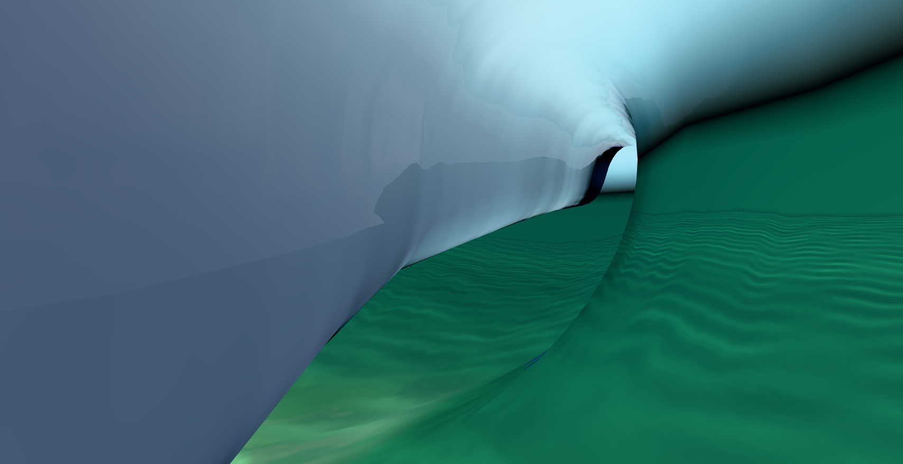
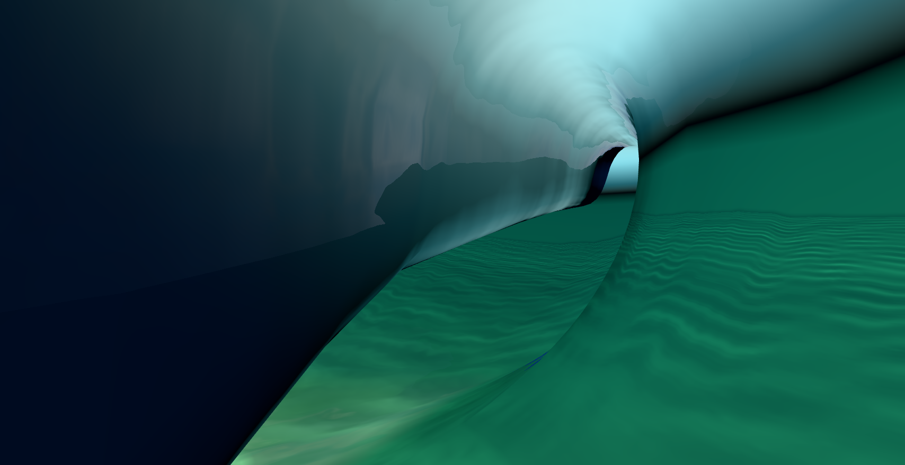

# Curved lip transmission

Rich water now samples transmitted environment radiance through two approximate interfaces: the fragment's entry normal and the slice's mean outer-lip normal. Rays which cannot leave that interface, including total internal reflection, contribute no transmitted environment light. The previous diffuse hemisphere sample made the underside look uniformly grey. The new view has a darker green lip and a clearer light/dark distinction at the opening. Broad canopy geometry, jagged bands and awkward seams remain; this is a material improvement, not completion of the tube goal.

The two original images come from separate freshly initialized seed-1 Padang scenes, Hs 4 m / Tp 10 s, 24 components, 1 m spacing, after 1,047 normal steps. Both use held drawing and the same fixed corridor camera. Four frames at 0 / 0.05 / 0.10 / 0.15 physical seconds have matching observed configuration, camera, sea clock, landmarks, roof metrics and indexed ray intersections. These observations do not prove equality of the complete physical state. [Baseline report](baseline-report.json), [candidate report](candidate-report.json).

Both native arms completed with no runtime/shader console errors and closed their owned process groups and ports. [Baseline receipt](baseline-owner.json), [candidate receipt](candidate-owner.json). Strict TypeScript, the candidate production build and 13 mesh shader-composition tests pass. Classic retains its earlier diffuse background; the tested Rich equations are unchanged by that restoration.

The far normal is a slice average, and no ray is traced to an actual exit point. Local curvature, cavity occlusion and exit offset remain approximate. Ambient fill and existing scattered sunlight remain when direct environment transmission is blocked. A preceding parallel-interface trial showed clouds painted onto the lip and was replaced; its sources and results remain in `/private/tmp/tube-directional-20261004`. Remaining frames and the bounded native harness remain in `/private/tmp/tube-curved-transmission-20261004`; these copied reports are evidence, not a packaged replay.

The actual rendered indices also rule out back-face culling as a repair for the two tested obstructions: both hit a front-facing explicit underside, at 0.539 m in the old straight-tangent view and 1.628 m in the short corridor view. No surfaces were hidden to obtain these pictures. Rider entry, collapse geometry and the user's major fins still need work.
