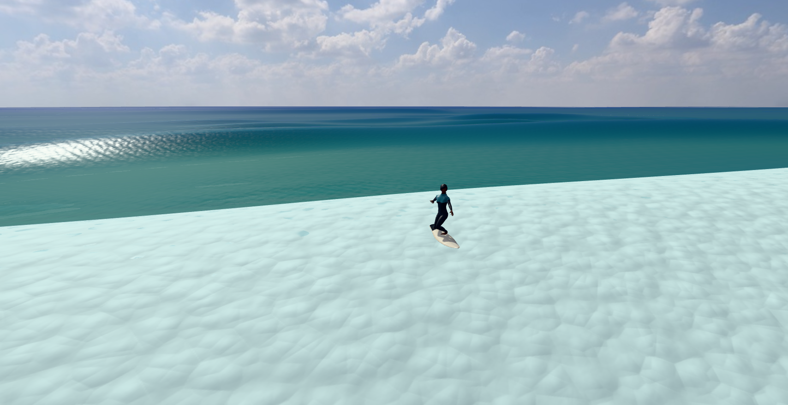

# Gentle ordinary entry trial

Gentle steering delayed the balance fall, but this ordinary Big trajectory produced no drawn tube. All 395 recorded steps had zero loft indices and zero `crestBreaking`; both checkpoint inventories had zero raw front records. Root inspected both original PNGs and saw no visible tube. There was no partial, connected entry, or contained witness, and the optional movie trigger never fired. This is counterevidence about reaching a front on the ordinary path, with no tube shape or rider clearance verdict.

This was a separately declared trial after the [prior Big run](../descending-curl-experiment/README.md), not a reinterpretation of it. The production Autopilot still supplied position, paddle, target, and requested steering. Standing input started at zero, was capped at ±0.2, and changed by at most 0.4 input units per second. Crouch remained 1, Compress 0, trim 0, and pocket reflex false. The driver used one ordinary `1/60` step per iteration, one natural manual popup, ordinary ride-follow camera, no resets, and stopped on the first published fall.

| Recorded outcome | Prior Big | Gentle trial |
| --- | ---: | ---: |
| First standing step | 83 | 83 |
| Balance fall step | 162 | 395 |
| Standing post-step rows | 79 | 312 (83–394) |
| First standing to fall | 1.3167 s | 5.2 s |
| Maximum absolute standing bank | 70° | 10.7901085° |
| Steps with zero drawn loft indices | 162/162 | 395/395 |
| Partial or connected entry | None | None |

The gentle trial recorded 6.5833 seconds of physics. Its first invalid standing-wave sample was step 376. Input control uses the pre-step phase (`inputView.ride.phase`), so the 312 standing-input rows are steps 84–395; this differs from the post-step standing interval above. The manual popup at step 11 recorded cue false and telemetry within its predeclared gate. The published popup later retained both outcome `stood` and refusal `sinking`; those original fields remain intact.

The next constraint is to explain why this ordinary Big trajectory publishes no front and no loft before assessing curl dimensions or deep-tuck clearance. Extending standing time alone did not bring a tube onto this path. There is no entry or adoption pass in this receipt.

The run used actual menu Big settings (Padang, 3.8 m, 18 s), no overrides, rich sea/water, GPU execution, seed 1, 64 components, dx 2, and fine spacing 1. The frozen, unadopted descending-curl build is `tube-whole-curl-descending-20261004-513ad9d39`, accepted base `513ad9d396fd7f33b11ab1bbf5e0b460fad3e931`, with preparation HEAD `0ab379ba1cdb64b44e8023833399a428990afa60`. Its 49 asset hashes equal the [prior preparation](../descending-curl-experiment/menu-big/preparation.json). The unchanged 347,555-byte [diagnostic Autopilot bundle](../descending-curl-experiment/menu-big/diagnostic-autopilot.mjs.gz) and exact [experimental production diff](../descending-curl-experiment/attempt-3/production-model.diff.gz) are referenced by verified hashes rather than copied again. The archived 328-input snapshot is identical to the original before/after preparation snapshots.

The owner recorded exit 0, complete capture, and independent closure after 25.6971 wall seconds. Cleanup took 0.1992 seconds; owned ports 4291/9701 closed with no remaining owned PIDs, while user ports 4310/4311 stayed open. The copied assets and diagnostic sources were recorded unchanged. These are capture and closure results, not entry results. The original early source-only TCP receipt contains sandbox `EPERM`; the later recorded read-only preflight and completed run receipts are preserved separately without rewriting that failure.

This directory retains the exact owner, launcher, preparation, checks, report, NDJSON, diagnostic source/helpers, and two original PNGs. Gzip files are lossless copies with original and transport byte/hash receipts in [manifest.json](manifest.json). Original scratch files were read only; all 80 files (36,863,353 bytes) matched before and after archival. [review.json](review.json) contains the compact recorded comparison. No production source, previous archive, root README, or Git state was changed by this archive task.

Run `python3 docs/research/tube-stability-2026-10-04/gentle-ordinary-entry/verify.py` from the repository root for byte hashes, gzip integrity, referenced prior receipts, report/NDJSON consistency, and recorded owner closure. Add `--original` while the original scratch still exists to compare its complete byte inventory. The verifier does not launch a browser, native driver, server, build, test suite, or numerical simulation, and does not certify entry or adoption.

