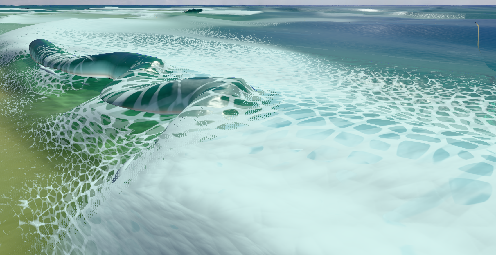
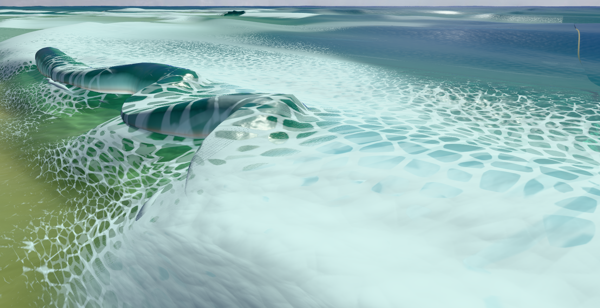

# Rejected horizontal collapse

The tested candidate compresses the post-touchdown pocket with one monotone horizontal chart while retaining the existing vertical fade. The first piecewise chart passed the geometry checks but introduced a squared shelf in the native picture. A cubic Hermite transition made its crest/back joins smooth in source and still passed the layer-order checks; it did not remove the visible regression. **Neither candidate is adopted.** The accepted vertical-collapse implementation is restored.

The completed native comparisons use the same declared seed, spot, settings, camera and four physical offsets (0, 0.1, 0.3, 0.5 seconds). At 0.5 seconds the smooth candidate’s middle canopy has a flatter squared upper shelf and a more angular front edge than the baseline’s rounded bulge. The 0.1-second view is broadly similar; the 0.3-second view still has an abrupt upper fold and a detached-looking white underside. Independent visual review agrees that this is not a tube-quality improvement. Both versions retain broad canopy lobes and conspicuous joins.

The two original PNGs below are inspection views: only the spray and bubble meshes were temporarily hidden at the paused state, then their visibility was restored. The ordinary High frames are heavily obscured by spray. These inspection pictures do not establish normal gameplay visibility, continuous motion, physical clearance, or reproduction of the user’s recording.

| Accepted baseline, +0.5 s | Rejected smooth candidate, +0.5 s |
| --- | --- |
|  |  |

The candidate passed 104 targeted geometry/contact checks, followed by the six helper checks including the added endpoint-slope regression; strict TypeScript and production build also passed. Those checks protect sampled geometry and do not establish visual quality. Source and the tracked diff are retained here; full native reports and the other original frames remain under `/private/tmp/tube-collapse-native-20261004`. Each native owner confirms its browser group and owned ports closed. The earlier 12-frame baseline exceeded its command deadline after seven retained frames; subsequent declared four-frame captures completed.

The baseline topology has two, two, four and five row components across the four offsets. The selected late row is tapered to zero by run-end sealing at +0.5 s, while the local +0.3-second rows have weight equal to fade and are not additionally sealed. Initial pictures already show three roof lobes with only two connected components, so cuts alone cannot explain all visible lobes. Formation controls shading and mouth lighting, not triangle existence. A future repair needs actual run boundaries and break reasons mapped to the visible edges before attributing those joins.
