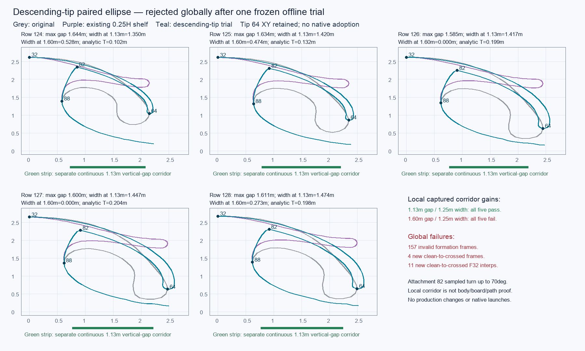

# Rejected descending ellipse

This frozen offline recipe is rejected. It enlarged the openings in five captured sections while preserving the original low tip at point 64, but it failed across the shipped frames and their time interpolation. It was not integrated or adopted. This archive task changed no production source, previous archive, root README, Git state, or port, and performed no new numerical or native run.

Of 1,224 raw frames from eight assets, 157 attempts were invalid and four previously clean frames became crossed. Of 3,648 declared adjacent-time interpolation samples at 0.25/0.50/0.75, 498 had an invalid endpoint; 3,150 were evaluable and 11 became newly crossed. Invalid endpoints were reported rather than replaced with raw geometry. Exact failure locations, interpolation shares, and crossing pairs remain in the lossless report.

All 157 invalid frames have negative floor-normal depth: the retained crest is below the floor-parallel line through the retained tip, outside this quarter ellipse's domain. Raw-to-target formation morphs also fold the cap into the inner return. Separately sampled outer/inner facets cross when the analytic sheet becomes extremely thin. All four crossed frames also cross before Float32 storage, so Float32 rounding does not explain them.

| Newly crossed case/frame | New proper crossings | Recorded attribution |
| --- | ---: | --- |
| pad19-a20-l12 / 137 | 1 | Raw-to-target morph fold |
| pad19-a20-l12 / 138 | 1 | Raw-to-target morph fold |
| pad19-a30-l12 / 135 | 22 | Thin independently sampled facets; the unblended internal target already has 26 crossings |
| periodic-padang19s-l12 / 173 | 3 | Raw-to-target morph folds |

The five actual captured sections remained clean. Their continuous width at a 1.13 m vertical air gap grew to 1.350–1.474 m, with maximum gap 1.585–1.644 m. They all pass the declared numerical target of 1.13 m gap over 1.25 m width. All five fail the more generous target of 1.60 m gap over 1.25 m width. Disjoint parity-air intervals were measured separately; these measurements do not establish rigid body or board clearance. The sampled inner section is about 0.101–0.204 m thick, but the discretized attachment at point 82 still turns 51.78–70.04° and the opposite distance at root point 36 is 0.366–0.402 m. Local gains do not override the full-frame rejection.

This chart is a numeric plot of the stored polylines, not a native rendered result. Captured coordinates are actual metres; raw case profiles remain in h0 units, and any 7 m conversion in the original receipts is illustrative. Proper-crossing checks omit endpoint contact, collinear overlap, and volumetric clearance; the fixed interpolation grid does not prove arbitrary blends or 3D continuity. No rideability, entry, or native appearance claim follows from these receipts.

The exact [recipe](recipe.md), prototype, evaluator, diagnostics, [review](review.json), original summary, failure profiles, evaluation/diagnostic outputs, original manifest, and original README are retained. The original README is a separate lossless gzip copy. This portable README uses a relative plot link; the original text remains intact. Only the existing compressed report is archived, with both its compressed and original byte hashes; the raw report is not duplicated. Generated bytecode and all-profile payloads are not copied.

[input-references.json](input-references.json) references the previously archived five captured polylines, eligible-frame metadata, exact measurement helpers, and eight committed asset SHA receipts. The raw BRL1/BRL2 bytes were decoded directly for the failed trial rather than through the transformed production factory. Original input payloads and helper archives are reused. Recorded before/after hashes for the 12 experimental production files are identical.

[manifest.json](manifest.json) records archive and original hashes. All 17 original scratch files (3,808,476 bytes) matched before and after archival. Run `python3 docs/research/tube-stability-2026-10-04/rejected-descending-ellipse/verify.py` from the repository root to check byte hashes, gzip integrity, referenced inputs/assets, and stored rejection receipt consistency. Add `--original` while the original scratch exists to check its complete byte inventory. The verifier imports no prototype or evaluator and launches no simulation, browser, native driver, build, or server; passing it certifies transport preservation, not geometric acceptance.
