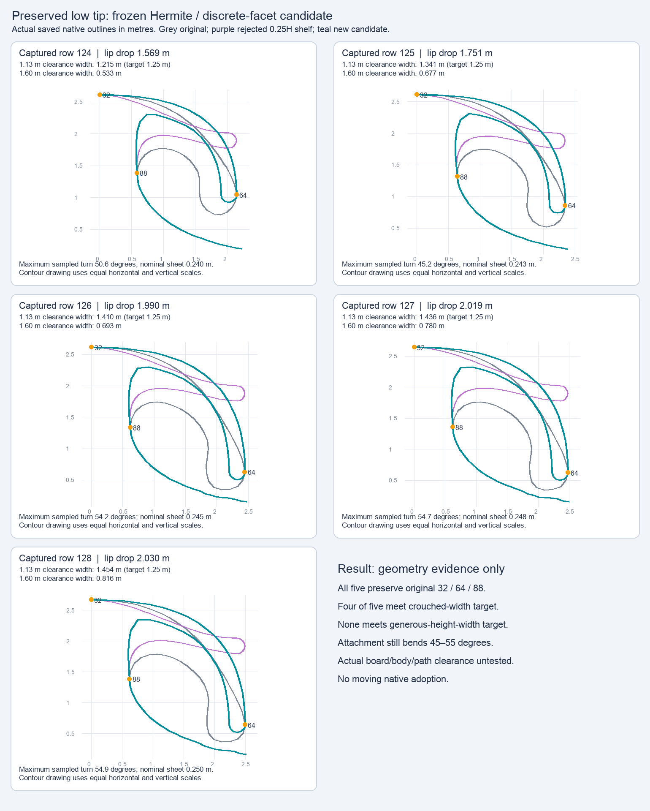
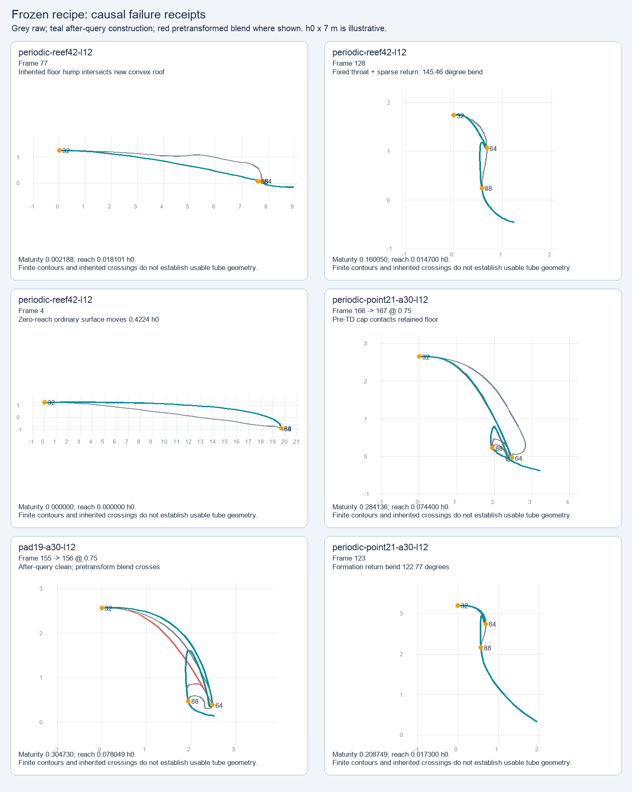

# Rejected descending Hermite / facet trial

This frozen offline trial produced finite geometry across its declared inputs, but was rejected as a complete game representation. Retained-floor crossings, sharp formation turns, ordinary-wave displacement and terminal lifecycle discontinuity remained. Neither the curve nor its consumer integration was adopted. No tuning, extra evaluation or native run occurred during archival.

The fixed recipe reconstructs a Hermite roof and a paired discrete sheet while preserving crest32, original tip64, throat88 and the outside contour. The retained floor and fixed throat constrain the attachment. Read the exact [recipe](recipe.md), [prototype](prototype.py), [evaluator](evaluate.py), and [causal analysis](causal-analysis-and-next-scope.md). The source/code freeze preceded measurements.

| Stored evaluation scope | Finite / attempted | Previously clean → crossed | Increased inherited crossing count |
| --- | ---: | ---: | ---: |
| Five actual captured outlines | 5 / 5 | 0 | 0 |
| All raw frames, eight cases | 1,224 / 1,224 | 0 | 1 |
| Raw F32 interpolation, then joint construction | 3,648 / 3,648 | 0 | 2 |
| Transform endpoints, then F32 interpolation diagnostic | 3,648 / 3,648 | 12 | 16 |

The authoritative after-interpolation order introduced no clean-to-crossed profile, but worsened an inherited Reef floor hump: frame77 changed from two crossing pairs to four, with count increases also at 77→78 shares 0.25 and 0.5. All exact new, removed and moved pair receipts remain in the full report. Transforming frames once before interpolation is unsafe for this construction; its 12 new clean crossings and 14 active sheet half-plane violations are retained separately.

Captured continuous widths at gap ≥1.13 m were 1.215, 1.341, 1.410, 1.436 and 1.454 m. Four met the declared 1.25 m width; the first missed. All five failed width ≥1.25 m at gap ≥1.60 m, despite maximum gaps of 1.663–1.711 m. These are projected geometry criteria, not board/body/path clearance or entry proof. Nominal sheet thickness was 0.240–0.250 m, while attachment portions were thicker.

The global lifecycle still introduced 27 raw frames with new turns over 90°; the worst positive-reach turn was 145.46° at Reef frame128. All 876 zero-reach outer roofs changed, by up to 0.42244 h0. Source tip64 stayed exact, but that did not preserve whole-envelope velocity or true cap impact. One already-contacting terminal interpolation remained in cap-floor contact. Original margin-failure counts (154 raw, 399 after interpolation) are preserved; causal diagnostics classify these as collapsed zero-reach endpoint residuals, with zero active violations in that order.

The result motivates a shared **32–112 analytic face/curl representation and explicit formation → open → sealing/impact → retirement lifecycle**. That broader model would need coherent thickness/curvature constraints, surface motion, contact, held opening, void/sky and crash channels. This is the recorded next scope, not evidence that it succeeds.

## Preserved inputs and provenance

The exact lossless [report](report.json.gz), [summary](summary.json.gz), [causal diagnostics](causal-diagnostics.json.gz), six [failure profiles](failure-profiles.json.gz), original README, evaluation start/output and final original manifest are retained. `report.json.gz` preserves the original compressed bytes and decodes to the original 8,784,384-byte report; its `productionAtEnd` field is the exact end receipt. Both numeric figures are original pixels, not native screenshots:

`immutable-source-baseline.json` and `baseline/` preserve the twelve-file comparison and parent's intentional restoration receipts. Start/end source hashes matched before root restored the rejected live WIP. The archived source patch is referenced by exact hash in `input-references.json`; no comparison against today's restored/adopted live source is made. Existing captured inputs, metadata and helpers are referenced from prior archives. Eight public asset hashes identify all 1,224 raw frames without another input bundle.

Run `python3 verify.py` here for archive, gzip, reference, asset-byte and stored-receipt consistency checks. `python3 verify.py --original` also reads the original scratch and immutable baseline while those paths exist. The verifier imports no prototype/game code, reconstructs no geometry and launches nothing. It is a byte-preservation check, not a numerical/native rerun or acceptance pass.
