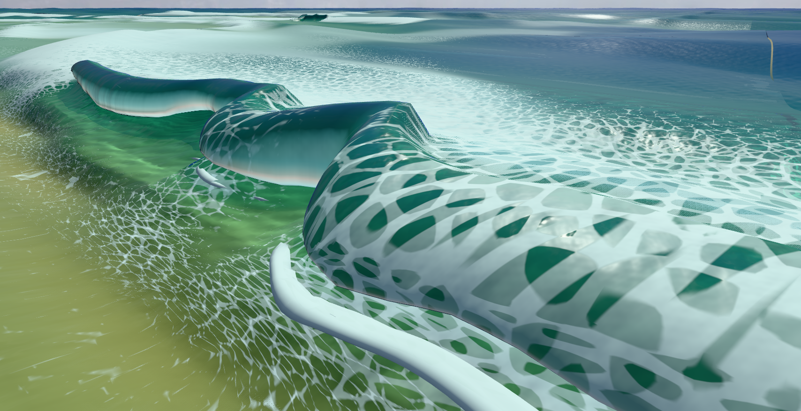
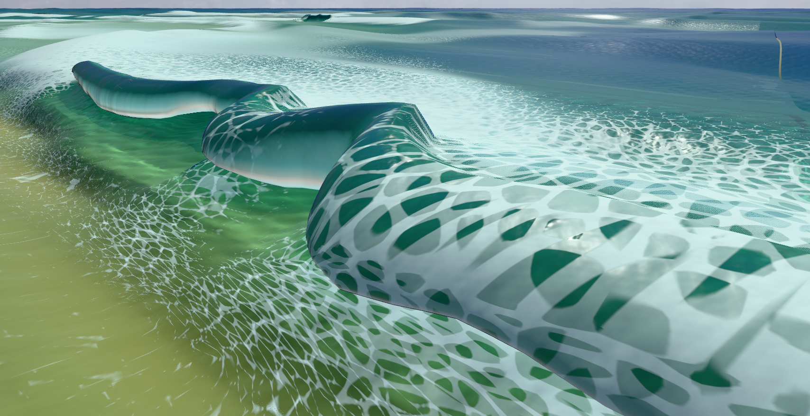
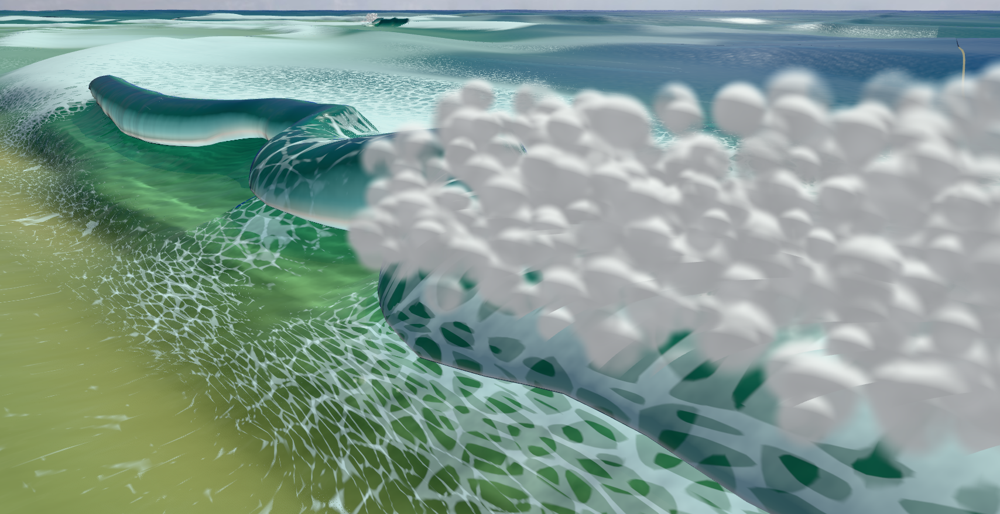

# Detached splash sheet attribution

The detached white band beneath the lip is drawn by the separate `LipSheetMesh` in this accepted-build diagnostic. Hiding that mesh removes the foreground curved band and the smaller strip beneath the middle canopy at +0.3 seconds; at +0.5 seconds it removes the narrow strip beneath the rear canopy. The main tube's broad lobes, white edge shading and awkward roof/face joins remain. The resulting small rendering simplification below is accepted; it is not an overall tube-quality pass.

Both pictures are original canvas PNGs. An independent visual review agrees with the attribution. The ordinary scene is heavily obscured by spray; its original pictures remain with the complete scratch run at `/private/tmp/tube-lip-attribution-20261004/native-first`. The inspection view preserves water foam and all other geometry. It is a shape diagnostic, not the game's normal appearance.

## Captured state and restoration

The finite run serves the accepted frozen `tube-deep-crouch-final-20261004` build, representing production source at `422d8d519ddf722875621a8fe41603c3940a5be5`, without rebuilding it. It uses the prior seed-1 Padang stage-2 scene, Rich/High graphics, a 1708×879 canvas at pixel ratio 1, 1047 ordinary 60 Hz steps to settle, then 18 and 12 further steps. The fixed exterior camera and front-48 selection follow the earlier collapse comparison. No time search or alternative pose is used.

Observed sea clocks are 553.173058749449 after settling, 553.4730587494489 at +0.3 seconds and 553.673058749449 at +0.5 seconds. At each paused state, the run draws the normal scene, hides only the spray/bubble Points, additionally hides `mode.lipSheet.mesh`, and finally renders the barrel's existing region view. A `finally` block restores every visibility and the prior region setting and redraws normally. Assertions pass for unchanged host snapshot identity, referenced arrays, physics clock, camera, drawn position words and indices. No physics or production source change is made.

The [region picture](region-no-splash-030.png) uses the live barrel diagnostic: red marks the lip/shoulder region, blue the back wall and green the rest. Substantial red canopy geometry remains after the splash sheet is hidden. The complete [native report](native-report.json) records two states and eight original PNG receipts, with no browser or shader errors. Only the three +0.3-second inspection witnesses are copied here; the other originals remain in the scratch run. [Archive hashes](archive-integrity.json).

The [independent owner receipt](native-owner.json) records completion in 64.025498 seconds and closure of its process group and diagnostic ports 4281/9691. The separately requested playable server at port 4310 remains running. Source-only preparation, explicit single invocation and bounded cleanup are retained in [the owner](run.py), [the capture](native.mjs), [the launcher](native-owned.mjs) and [the ray helper](ray-faces.mjs). Those sources retain their original scratch paths; rerunning them requires a fresh output directory and the stated existing frozen build.

## Roof boundaries observed separately

The diagnostic wraps the actual loft builder's `dropOverlaps` and `sealRuns` methods, forwarding arguments and calling each original once, to retain joins before/after overlap removal and weights before sealing. It writes no source arrays. The current drawn front-48 rows form one joined run at each captured time: rows 72–158 at +0.3 seconds and 73–139 at +0.5 seconds. The overlap pass removes only the strip immediately before those runs, rows 71 and 72 respectively. It does not split their local interior.

At +0.3 seconds, all eight retained rows within 2 m of the selected initial sigma have unchanged joins and unchanged pre/final seal weights. At +0.5 seconds, row 139 is a run end: its fade/pre-seal weight is 0.039294254034757614, while its final weight is zero; the preceding two retained rows are also tapered. This confirms the end taper in that later state. It does not attribute the broad lobes to that taper, and original pre-overlap gaps are not assigned a cause.

Rich splash construction groups parcels by column, strip launch timestamp and kind, then links adjacent columns by a launch-time tolerance without checking their current separation. That permissive topology is a source-supported candidate for stretched splash curtains. The present images prove which mesh draws the band; they do not prove that a particular connection is physically invalid or justify a distance threshold. Clean roof/water joins and real rider entry/passage remain unfinished.

## Actual splash connections

A separate finite telemetry run records the exact last-built splash input at the same two predetermined times. It reconstructs Rich's grouping, greedy neighbor selection and complete-cell gates to measure parcel edges, rather than spline vertices or visible pixels. It does not change production source or draw screenshots. [Report with top-five endpoints and histograms](edge-telemetry/native-report.json), [byte-exact +0.3-second input](edge-telemetry/splash-input-030.f32), [byte-exact +0.5-second input](edge-telemetry/splash-input-050.f32).

| Measurement, 1 m column width | +0.3 s | +0.5 s |
| --- | ---: | ---: |
| Last-built splash records | 82 | 133 |
| Matched neighboring strips / complete cells | 16 / 45 | 29 / 73 |
| Longest joined chain, columns | 11 | 17 |
| Cross-column parcel edges | 60 | 98 |
| Edge length range, m | 0.832–2.423 | 0.846–2.806 |
| Maximum birth-time difference from recorded age, s | 0.150 | 0.150 |
| Rendered vertices / indices | 3,100 / 11,904 | 4,150 / 15,936 |

Distance bins below 1, 1–2, 2–4 and at least 4 column widths contain respectively `[16, 41, 3, 0]` and `[23, 71, 4, 0]` edges. The longest +0.5-second edges link columns 148→149 near the fixed target, with approximately 0.1333 seconds' birth-time difference. The +0.3-second maximum is elsewhere, so the maximum distance alone is not attributed to the foreground band. Strip launch stamps use the lip model's own clock; the age-derived birth times are descriptive snapshot-clock values, not independently observed launch events.

These data show long splash curtains without an extreme edge-length outlier or an established universal cutoff. They support considering a simpler depiction of splash water rather than inventing a distance threshold. [Independent closure](edge-telemetry/native-owner.json) completes in 56.80 seconds with ports 4282/9692 closed and no surviving owned processes. The user's separate port 4310 stays running. The input files and sources are preserved with [archive hashes](edge-telemetry/archive-integrity.json).

## Accepted rendering simplification

At swept spots, `PhysicalMode.update` now supplies zero parcels to the separate lip-sheet renderer. The barrel continues to draw its own jet, while the existing foam, spray and bubble effects depict splash water. The splash parcels remain in the simulation; this change adds no physics, contact or mask edits. Non-swept spots still supply their original full parcel count. This removes the continuous white ribbons rather than imposing an unsupported distance cutoff on their connections.

The empty input clears positions and indices in both water looks. A source review finds no stale geometry or normal look/host/detail-switch reappearance issue: look changes invalidate the cache, and host changes trigger a refresh. The suppression follows the configured swept mode even while its library is unavailable. Rich's existing ten geometry tests, including empty input, pass; `npx tsc -b` and the separate production Vite build also pass.

A fresh candidate run serves only `/private/tmp/tube-no-splash-ribbons-20261004/dist`, build ID `tube-no-splash-ribbons-20261004`. It retains the exact predetermined scene, camera, settle and two capture times. Its [comparison](simplified-render/comparison.json) passes actual config/graphics, camera, five initial cross-section arrays, clocks, front/tube/lip counts, all listed retained barrel metrics and run traces. These are bounded checks between independently initialized scenes, not full physical-state equality. The candidate splash mesh has zero vertices at both times, and each original inspection PNG is **byte-identical** to the corresponding accepted-build capture with only the splash sheet hidden. The +0.3-second inspection witness above therefore also represents the candidate's pixels without duplicating the image file.

An independent visual review confirms that the band removal remains visible in normal rendering despite heavy spray, with no observed canopy regression in these two states. The ordinary scene retains its dense spray plume, which still obscures much of the tube. The cleanup removes the detached bands; the broad canopy and roof/face problems are explicitly unresolved, as are rider entry and sustained passage. [Native report and PNG receipts](simplified-render/native-report.json), [source and evidence hashes](simplified-render/archive-integrity.json). All four original candidate PNGs remain in the scratch run.

The [independent candidate owner](simplified-render/native-owner.json) completes in 57.745320 seconds, closes ports 4283/9693 and leaves no surviving owned processes. Its report contains no runtime/shader errors. The user's port 4310 deliberately keeps serving the earlier frozen accepted build while development continues; this accepted cleanup does not silently replace that test session.
