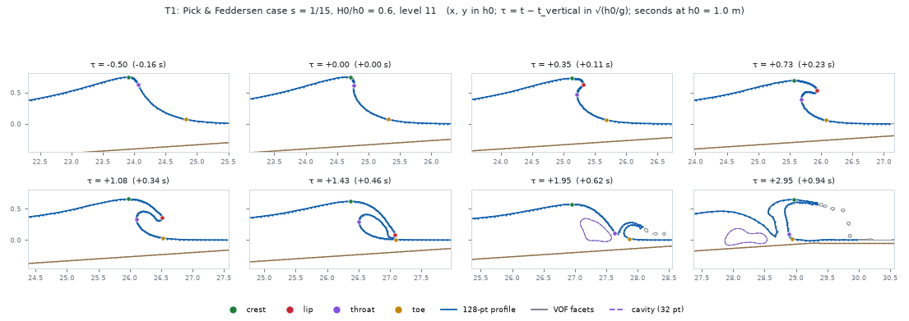
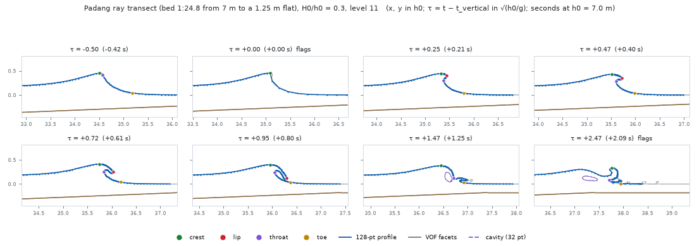

# Barrel profiles from Basilisk: the first runs

Our own 2D simulations now run. On a 1:15 slope they reproduce the published overturn shape once about 6 grid cells span the thrown lip. Padang Padang's first tube is provisional, because its lip spans only 2–4 cells. The runs also show that the game's Padang wedge is gentler than its build sheet asks.

*Round 6, 2026-09-29. Basilisk 2D, built from its GitHub mirror (GPL-3.0) on Mostert & Deike's published setup. Solitary waves, lab-scale viscosity and surface tension, 4 CPU cores in the cloud session.*

## Does it match the published shapes?

Yes, once about 6 cells span the lip. What matters is cells across the thrown lip, not cells per wave height, and gentle slopes throw thinner lips.

| Case (cells across the lip) | Tube area ÷ H² | Lip area ÷ H² | Width ÷ length | Tilt | Within tolerance? |
| --- | --- | --- | --- | --- | --- |
| 1:15, level 11 (about 6) | 0.316 / 0.360 | 0.229 / 0.188 | 0.435 / 0.424 | 32.6° / 32.5° | Yes |
| 1:15, level 10 (about 3) | 0.317 / 0.360 | 0.275 / 0.188 | 0.352 / 0.424 | 23.5° / 32.5° | No: tilt and lip |
| 1:30, level 11 (about 2) | 0.083 / 0.158 | 0.148 / 0.051 | 0.359 / 0.361 | 38.6° / 48.7° | No: tube half size |

Each cell is simulation / Pick & Feddersen's fit at H0/h0 = 0.6. The tolerances are ±0.05 in area, ±0.1 in width ÷ length and ±5°. The breaker height matched the fit within 0.04 in every case.

## Padang Padang's first tube (provisional)

On the game's bed at the peak, a 2.1 m swell over the 7 m wedge base throws a tube 2.0 m long, 0.8 m wide and 1.5 m high at touchdown, tilted 48°. Its length ÷ width of 2.46 sits inside Mead & Black's 1.42–3.43 for real reefs. But its area is half what the slope fit predicts, probably because its lip spans only 2.4 cells.

**The wedge is gentler than intended.** The build sheet asks for about 1:18–1:20 along the wave's path, from Mead & Black. The game's bed code applies 1:19 across the 40° crest line, so the swell climbs 1:24.8, or about 1:23 once refraction turns it [inferred]. A second run used 1:19 along the path:

| At the peak | The game today (1:24.8) | 1:19 along the path |
| --- | --- | --- |
| Face goes vertical | 16 m before the reef flat, in 1.9 m of water | 3.6 m before it, in 1.4 m |
| Lip lands | On the wedge | On the reef flat |
| Tube at touchdown | 2.0 × 0.8 m, 1.5 m high | 2.3 × 0.9 m, 1.4 m high |
| Tube area ÷ H² (slope fit) | 0.125 (0.247) | 0.208 (0.335) |
| Tilt | 48° | 32° |
| Tube open, vertical to touchdown | 0.82 s | 0.85 s |

The steeper wedge throws a tube 1.7× larger for its height, closer to the "very steep/hollow" reef Mead describes. At Padang's 35–40° peel, a tube open for 0.82 s spans about 7–8 m of crest [inferred].

## What a library costs

Level 13 is where published studies converge; level 11 is proven only for steep, thick-lipped cases. A library of 60–120 runs costs:

| Grid | Cell at h0 = 7 m | One run here | 60–120 runs here | 60–120 runs on the M4 Pro (estimate) |
| --- | --- | --- | --- | --- |
| Level 11 | 16 cm | 22 min (measured) | 22–44 h | 3–13 h |
| Level 12 | 8 cm | 1.5–2.4 h | 4–12 days | 0.5–3.5 days |
| Level 13 | 4 cm | 6–15 h | 15–75 days | 2–22 days |

Levels 10–11 were timed on the 1:15 case; finer levels are extrapolated at 4–6.4× per level. On the M4 Pro each run takes one core, since Apple's compiler has no OpenMP, and 8–10 run at once.

## Profiles for the loft

- **The format works.** Every saved frame is resampled to 128 points with crest, lip tip, throat and toe at fixed indices, as the swept-barrel build asks. A 72-frame Padang sample is in [notes/round6-tube-profiles/data/](notes/round6-tube-profiles/data/).
- **The open tube is clean.** From vertical face to touchdown the landmarks are found in 92–100 % of frames.
- **Before vertical it jitters.** Only 76–89 % are clean, because the lip there is just the steepest point of the face. Defining it by arc length would fix that [inferred].
- **After touchdown the landmarks lose their meaning.** The surface splits into splash-up, droplets and an air pocket carried under the whitewater.
- **The full runs are temporary.** Their 177 MB live only in the cloud session; the notes say how to rebuild them.

## Your decisions

1. **Padang's wedge.** Recommended: 1:19 along the path, about 1:15 across the crest line, since that is the sourced value. The Padang session would then re-check its peel.
2. **Padang at level 13.** Recommended: yes, overnight here (6–15 h), after the wedge decision, so it runs on the bed the game will have. Don't tune the game to today's sizes.
3. **Grid level for the library.** Recommended: pick per case so that at least 6 cells span the lip. That means level 12 for steep and reef cases, level 13 for gentle beaches, and level 11 only for quick design sweeps.
4. **After touchdown.** Recommended: what the roller build already plans ([roller-build.md](roller-build.md)). The library's tube ends at touchdown and blends into the roller on the same loft, and droplets and bubbles go to the particle layer.
5. **Periodic swell.** Recommended: later. Padang's 14–17 s swell over a shallow reef is close to a train of solitary waves; beaches with shorter swell will need it.
6. **The setup file,** GPL-3.0 as a derivative of Basilisk's. Recommended: commit it in its own folder under its GPL header. It is an offline tool that never ships with the game (not legal advice).

Details, commands and every number: [notes/round6-tube-profiles/tube-profiles.md](notes/round6-tube-profiles/tube-profiles.md).
