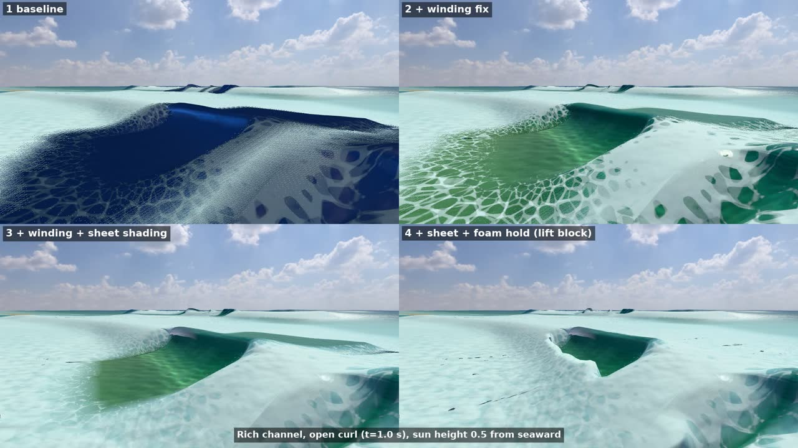
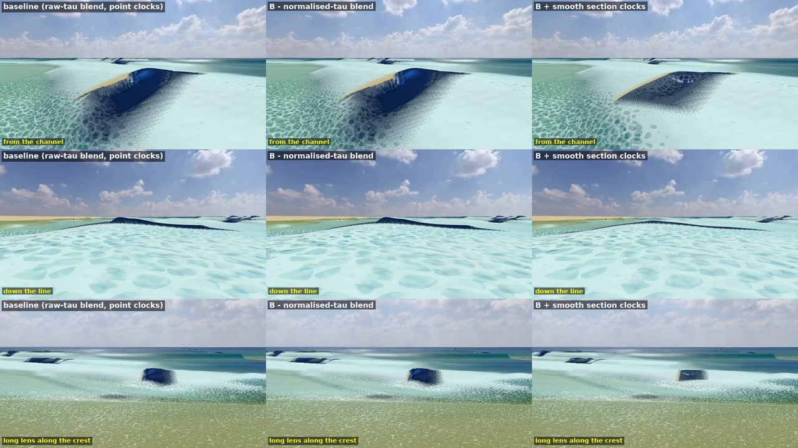
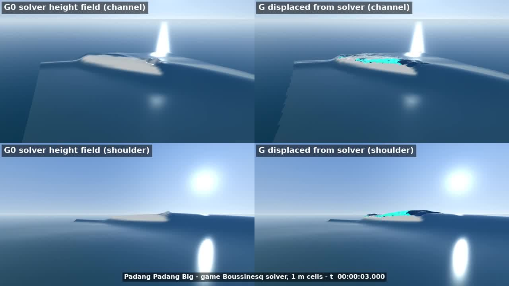

# In-game tests: the colour fix, the blended library and the displaced surface

2026-10-01. These are throwaway prototypes in scratch worktrees of `claude/padang-mesh` and main, never merged. Each test shows the real game at Padang Padang on the Big offshore swell, with the same sea and the same cameras for every variant. Software rendering in the cloud container, so the frames are small.

**Verdict:**
- **The colour fix works.** The winding fix alone removes the navy. With the sheet shading and the foam hold, the curl reads as a glassy hollow.
- **The blended library barely matters on this sea.** What matters is the clocks, which stall, and the missing cases above A0 0.45.
- **The displaced surface can't make a tube from the solver's output.** The solver breaks too early and too low.

## 1. Colour fix and foam hold

| Variant (Rich, sun height 0.5) | Lip L / hue | Face L / hue | Throat L |
|---|---|---|---|
| Today | 0.057 / 219° navy | 0.051 navy | 0.053 |
| + winding fix | 0.104 / 182° | 0.139 / 173° | 0.081 |
| + sheet shading | 0.206 / 205° | 0.144 / 174° | 0.110 |
| + sheet, low sun behind the wave | 0.53, warm white-amber | 0.15 | 0.24 |

- **The winding:** the loft's triangles faced against their normals. Flipping them fixed 12,144 of 12,236. The other 92 are twisted at the fold.
  - The Mac's colour agent found the same root cause, in commit 638dc5e (not on GitHub when this was written).
- **The sheet shading** follows [tube-colour-fix.md](tube-colour-fix.md). It needs one gate beyond that page: the library's points 64–88 collapse onto one point before the throw, so the sheet weight starts only once the lip overhangs. The gate's 0.05–0.3 m is inferred.
- **The foam hold** follows the ruling on the lifted block: full lift from 0.1 H behind the crest to the toe, ramping to 0 over 0.5 H. The back and the flat ahead keep the solver's foam; the face and lip stay clear until touchdown.
- **Passes:**
  - no navy;
  - the lip is lighter than the face;
  - lit from the front, the lip is at least 0.8× the face's luminance;
  - the lip is never darker than the back wall.
- **Fails: the lip is not greener than the face.** Clear water transmits blue best, so a thin sheet lit by the open sky reads pale blue-grey. Two ways to get the emerald lip seen in photos, both for PR 6 and the owner:
  - light the lip from the wave's own water behind it, not the open sky;
  - use Padang's sourced water-colour terms (plankton and dissolved organics, [underwater-colour.md](underwater-colour.md)).
- **Also seen:**
  - a pale step where the lifted toe meets the flat ahead;
  - a bright streak along the face at low sun, possibly the 92 twisted triangles.
- **Cost:** about 10 µs per open slice for the lip thickness: about 0.45 ms a frame typically, up to 2.9 ms at 290 slices (M1-class CPU, loaded).
- **Tests:** 397/397 in `src/scene` and `src/wave/barrel`; `tsc` is clean.

## 2. Blended library and smooth clocks

- **The game already blends.** It blends the two cases bracketing A0, but it reads both at the same raw τ, so late in the break it mixes in a case that has already collapsed.
  - Aligning both cases' timing to touchdown fixes that. At A0 0.375 and 95 % of the way to touchdown, the cavity grows from 0.22 to 0.77 m² (offline check).
  - In the game it changes little. The typical open cavity goes from 0.026 to 0.031 m²; in the A0 0.25 bin it grows 48 %.
- **On this sea the tube's size hardly varies along a front.** A0 spreads by only 0.005 along a front (median), but 0.14–0.48 between fronts.
  - Most Big-swell fronts sit at A0 0.47–0.48, above the largest case (0.45), so they are clamped to it.
  - **The library's real gap is cases at A0 ≈ 0.55, 0.65 and maybe 0.75, plus 0.35 and 0.40.**
- **The clocks stall.**
  - Today's per-point clocks advance at 0.61× real time (median), and 14 % are paused at any moment. The tube freezes for about 3 s, its clocks stuck between −0.84 and 1.1 s.
  - The smooth section clocks remove the torn ribbons and draw one clean tube: neighbour gradient p95 0.61 → 0.23 s/m, and none paused. But the real-time floor hides the stall instead of fixing it, so the tube completes within about 1 s.
  - **Fix why the throws stall before choosing a clock.**
- **Cost:** none measurable. The loft is 4.4–5.0 ms in every variant.

## 3. Displaced surface on the solver's own output

- **The setup:** the game's Boussinesq solver (1 m cells, CPU tier) at Padang Padang, with the Big swell and seed 1.
  - Its fields were dumped every 1/24 s around a peeling wave.
  - 55k surface parcels move with the surface velocity the Boussinesq profile implies, u_s = ū − (H²/3)∇(∇·ū), clamped.
  - Parcels launch ballistically where the solver's breaking strength passes 0.3.
- **The result: no tube.**
  - At the solver's onset the crest is about 2.8 m high, with a 28–36° face. Within 1.5 s it is a 1.5 m bore. Down the line it is 1.8 m with a 20° face, which is spilling.
  - A lip thrown at 1.3c clears the face by about 0.5 m and closes within 0.5 s; at 1.55c it is a 1 m by 0.5 m hook. Throwing 1 s later is worse, because the crest has already collapsed.
  - The "parcel outruns the crest" trigger never fires: surface speed reaches at most 0.73c.
  - The solver's peel is 16–22 m/s and patchy.
- **Cost:** 165–225 ms a frame in node for 55k parcels; WebGPU about 2–3 ms (provisional).
- **Worth it only once something holds the crest up** and steepens it for 1–2 s past the solver's onset: the stored profiles doing the shape, or a delayed onset. This confirms the tube review's item 2: the solver breaks too early and spends the crest height the tube needs.

## What this changes in the ranking

1. **Ship the winding fix now.** It's a few lines and removes the navy. The sheet shading and foam hold follow; the green lip is a PR 6 lighting decision.
2. **Fix the stalled throws.** That is a solver and front issue, not a drawing one. Then choose the clock (smooth sections remove the torn ribbons).
3. **Add library cases above A0 0.45:** about 0.55 and 0.65, then 0.35 and 0.40. These are offline Basilisk runs on the M4 Pro. Aligned timing comes free with them.
4. **Park the displaced surface** until the crest is held up past onset.
