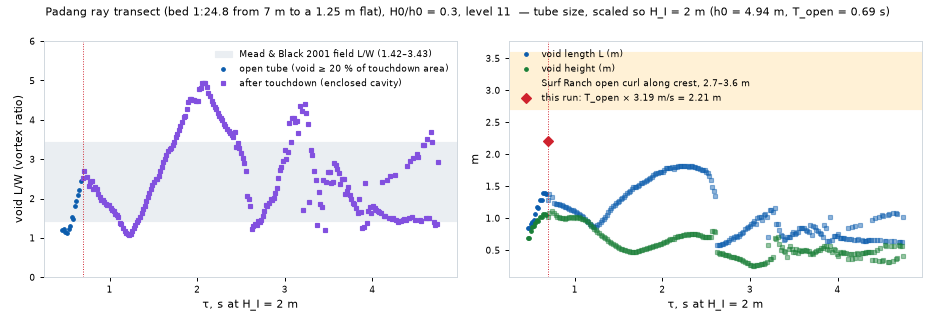

# Tube profiles in Basilisk: install, benchmark, validation, Padang Padang's first transect (research round 6)

Written 2026-09-29 for Breakline's water-physics knowledge base. It is the first time the owner's tube-build decision (2026-09-28: one surface swept along the crest from our own Basilisk 2D profiles on the game's bed transects) has been tried in practice. Everything here ran in a Linux cloud container (4 vCPU Intel Xeon @ 2.80 GHz, 15 GB RAM, gcc 13.3), not on the M4 Pro.

**Tags.** [measured] = measured in this round's own runs; [modelled] = a published simulation or fit; [inferred] = my reasoning or extrapolation. Every run number is dimensionless unless a unit is given: lengths in h0 (the still-water depth offshore of the slope), time in √(h0/g).

**Where things are.** Builds, runs, scripts and full outputs are in the session scratchpad `…/scratchpad/basilisk/` (`runs/slope.c`, `runs/<case>/facets/`, `analysis/*.py`). The scratchpad is temporary and may be deleted; §7 gives everything needed to rebuild. In the repo: three images in `img/` and one sample library in `data/`.

---

## 0. The answer in brief

- **It builds and runs.** Basilisk compiled from the public GitHub mirror in about 40 s (qcc and the CPU grids; only the GPU backends failed, as expected). basilisk.fr, falk.ucsd.edu, cambridge.org and zenodo.org were all blocked by the network policy (HTTP 403), but the mirror also carries the Basilisk wiki, **including both sandbox setups** (`sandbox/wmostert/shallow.c` and `sandbox/ffeddersen/shoal_RE0_BO4000.c`), so nothing had to be rebuilt from the papers. [measured]
- **Licence:** the mirror's `basilisk-source/src/COPYING` is the **GNU GPL version 3**. That settles the round-2 "reportedly GPL (unverified)" note. The runs' output (profiles) is data, not code. The setup file `slope.c` is a derivative of Mostert's sandbox file and so is GPL-3.0 too; it is kept out of the repo until the owner decides (§8). [measured]
- **Cost.** One solitary-wave run from rest to about 5 √(h0/g) after touchdown took **207 s at level 10 and 1331 s at level 11** (4 OpenMP threads, clean machine). That is a factor of 6.4 per level. The published converged resolution (Δx/h0 ≈ 6×10⁻³) needs level 13 on a 40 h0 domain, which extrapolates to **6–15 h per run** here. [measured; extrapolation inferred]
- **Validation (T1), s = 1/15, H0/h0 = 0.6, level 11:** overturn area A_O/H_I² 0.316 against Pick & Feddersen's fit of 0.360; jet area 0.229 against 0.188; aspect W_O/L_O 0.435 against 0.424; angle θ_O 32.6° against 32.5°; breaker index 2.13 against 2.14. **All four are inside the round-2 tolerance** (±0.05 area, ±0.1 aspect, ±5°). The second case, s = 1/30, fails on area (0.083 against 0.158) and angle (38.6° against 48.7°) at level 11. There the jet is only about 2 cells thick, so it needs level 12–13. [measured against modelled]
- **Padang Padang (T2), the game's own transect at the peak, H0/h0 = 0.3 at the 7 m wedge base, level 11:**
  - The face goes vertical over 1.9 m of water, 16 m before the reef flat's edge. The jet lands 0.82 s later, 8.4 m further in, still on the wedge (7.6 m before the flat's edge).
  - At touchdown the tube is **2.0 m long, 0.80 m wide and 1.5 m high, tilted 48°, L/W 2.46** (inside Mead & Black's 1.42–3.43), with H_I = 2.8 m.
  - It is **small for its height**: A_O/H_I² is 0.125, about half of what the planar-slope fit gives (0.247). Part of that is probably resolution: its jet is about 2.4 cells thick, as in the failed s = 1/30 case.
  - Treat Padang's sizes as provisional until it is rerun at level 13. [measured; interpretation inferred]
- **The game's wedge is 1:24.8 along the wave's path, not 1:19.** The branch's `PADANG` bed puts the 1:19 across the 40° crest line, so the swell, fed square to the tank, climbs it at 1:19/cos 40° = 1:24.8. A 1:19 run was started for comparison (§4.4). [measured from the game's bed code]
- **Landmarks:**
  - Crest, lip tip, throat and toe are found automatically in **92–100 % of open-tube frames** (vertical face to touchdown) and 76–89 % of the frames before vertical, where the "lip" is only the steepest point and jitters.
  - **After touchdown the outer-surface landmarks fail from the first frame.** The tube becomes an enclosed air cavity, found in 94–100 % of those frames. The surface splits around splash-up, droplets and bubbles (up to 34 loose pieces per frame).
  - The loft needs a rule for what the swept surface follows after touchdown (§5). [measured]
- **Owner decisions:** grid level against compute (§6); whether to rerun Padang at level 13 (overnight here); the 1:19 versus 1:24.8 wedge; periodic runs; where the GPL setup file lives (§8).

---

## 1. T0: install and benchmark

### 1.1 Getting Basilisk [measured]
- `git clone https://github.com/comphy-lab/basilisk-C.git` (depth 1, 51 s). The mirror's last sync was 2026-09-28 ("Auto-update basilisk-wiki from Darcs repository", commit 082dd5c9). It holds `basilisk-source/` (the Darcs source tree) and `basilisk-wiki/` (the site, including the sandboxes).
- Build: `cd basilisk-source/src && ln -s config.gcc config && export BASILISK=$PWD PATH=$PATH:$PWD && make -k`.
  - A parallel `make -j4` races and fails. Run it serially: 38 s.
  - qcc and the CPU grids build. The gpu, cuda, hip and opencl subdirectories fail for lack of their libraries, which does not matter here.
- Licence: `src/COPYING` is the GPL v3 text (29 June 2007).
- Sandbox files found in the mirror: `basilisk-wiki/sandbox/wmostert/shallow.c` (Mostert & Deike 2020) and `basilisk-wiki/sandbox/ffeddersen/shoal_RE0_BO4000.c` (Feddersen et al. 2024).
  - Feddersen's file runs a 1000-time-unit air-only wind spin-up on an embedded boundary before switching to water (`T_TRANSITION 1001`), then shoals at level 14 on a 60 h0 box. It is a wind study and far costlier than needed here.
  - **I built on Mostert's `shallow.c`.**

### 1.2 The setup used (`runs/slope.c`, derived from `shallow.c`) [measured]
Kept from `shallow.c`:
- centred Navier–Stokes, two-phase, momentum-conserving VOF, surface tension, reduced gravity;
- Re = 4×10⁴, Bond number 1000, density ratio 1/850, viscosity ratio 17.4×10⁻⁶/8.9×10⁻⁴;
- the Green–Naghdi soliton initial condition;
- the bed as a zero-velocity water-filled volume fraction;
- the adaptation tolerances (f 10⁻⁸, u 2×10⁻³, bed 10⁻²), with the minimum level at LEVEL − 5.

Changed:
- The bed is a polyline: a flat of depth 1, a slope S1 to depth HMID, a slope S2 to depth HS, then a flat. That is Pick & Feddersen's reef-flat domain, and the game's transects.
- The interface is written with `output_facets` every 0.025 (every 1.0 before a set start time).
- A timing log.
- The time step is capped at 0.02. Without the cap, the Padang case took 0.07-sized steps and stalled.
- f is clamped to ≤ 1 where the soliton overlaps the bed. `shallow.c` lets it reach 2.

### 1.3 Wall times [measured]
Same case throughout the benchmark: s = 1/15, H0/h0 = 0.6, a 40 h0 domain (soliton at x = 7, slope foot at 15, flat at 0.05 from 29.25). The face goes vertical at t ≈ 13.2, the jet lands at t ≈ 14.7, and the run ends at t = 20.

| Level | Δx/h0 | Cells per H_I | Threads, machine state | To vertical | To touchdown | To t = 20 | Steps | Leaf cells |
|---|---|---|---|---|---|---|---|---|
| 10 | 0.0391 | 15 | 4, clean | 66 s | 90 s | **207 s** | 1790 | 21–31 k |
| 11 | 0.0195 | 32 | 4, clean | 429 s | 543 s | **1331 s** | 3963 | 47–70 k |
| 12 | 0.0098 | 63 | 2, contended | — | — | stopped at t = 4.2 after 910 s | 520 | 92–103 k |

- **Contention.** From 16:31 another agent's headless-Chromium job shared the 4 vCPUs, using 1–3 cores. It started just as a 4-thread run froze: OpenMP threads spin-wait when a core is taken. Later runs therefore used 2 threads with `OMP_WAIT_POLICY=passive`, and **their times are upper bounds**. The level-10 and level-11 rows above ran before it and are clean.
- **Per-level factor:** 3.9× (level 10 → 11) before breaking, and 6.4× through touchdown and splash-up. After touchdown the step falls to about 0.002, driven by droplet speeds. On 2 contended threads level 12 cost 14× level 11 to t = 4.2; allowing about 3× for the contention, that is roughly 4.5× clean [inferred].
- **Other runs (2 threads, contended):**
  - Padang level 10: 868 s to t = 36.
  - Padang level 11: vertical at 1369 s, touchdown at 1597 s, t = 31 at 3141 s.
  - s = 1/30 level 11: vertical at 676 s, touchdown at 933 s, stopped at t = 20.95 after 2201 s.

### 1.4 Extrapolated cost [inferred from the measured rows]
- **One run at the published converged resolution.** Δx/h0 ≈ 6×10⁻³ is level 13 on a 40–48 h0 domain (4.9–5.9×10⁻³). Multiplying the level-11 time by 4–6.4 per level gives, on this 4-core box with 4 threads: level 12 = **1.5–2.4 h**, level 13 = **6–15 h** per run through splash-up; level 13 to touchdown only = 2.4–6 h.
- **Domain matters too.** Gentle slopes need longer domains and longer travel: a 1:50–1:100 beach is 2–4× the 1:15 case, and a periodic train several times more (§4.5).

| 60–120 runs | Here (4 vCPU, 4 threads, one run at a time) | M4 Pro, estimate |
|---|---|---|
| Level 11 (Δx/h0 ≈ 0.02) | 22–44 h | 3–13 h |
| Level 12 (≈ 0.01) | 4–12 days | 0.5–3.5 days |
| Level 13 (≈ 0.005, published) | 15–75 days | 2–22 days |

**M4 Pro assumptions (estimate, not measured):**
- Apple clang has no OpenMP, so run one case per performance core, single-threaded. That is the better way to fill a library anyway, since runs are independent. The 12-core M4 Pro has 8 P-cores; the 14-core has 10.
- Single-thread time = this box's 4-thread time × the 4-thread OpenMP speed-up (assumed 2.5–3.5; not measured, because of the contention) ÷ the M4 P-core's speed advantage over this 2.8 GHz Xeon vCPU (assumed 1.5–2×).
- Net: each M4 core finishes a run in 1.25–2.3× this box's 4-thread time, and 8–10 run at once.
- Memory is no constraint: about 100 MB per level-12 run.
- Homebrew's libomp would restore OpenMP on macOS, but for a library, one run per core is the better use of the cores.

---

## 2. T1: validation against Pick & Feddersen (2026)

### 2.1 How the metrics were measured [measured method; definitions partly inferred]
- **Pick & Feddersen's paper (falk.ucsd.edu), cambridge.org and Zenodo were blocked, so I could not re-read their exact definitions.** I used the conventions recorded in this repo's round-1 and round-2 notes: area of the void and of the jet, L along the void's tilted major axis, W across it, and θ the tilt from horizontal, all at the last output before touchdown.
- H_I is taken as the crest elevation above still water at that frame. That is my assumption about their "height at impact".
- Implementation (`analysis/metrics.py`, `interface.py`):
  1. The PLIC facets are chained into polylines: mutual-nearest endpoints within 0.6 Δx, then any two chain ends within 3 Δx joined, closest first.
  2. The main surface is the chain spanning the domain.
  3. **Vertical face:** the steepest descending face angle, interpolated to 90°.
  4. **Touchdown:** the first frame where the tip is within 2 Δx of the surface ahead, an enclosed air loop larger than 0.002 h0² appears within 3 h0 of the crest, or the overhang disappears.
  5. **Void:** the surface from the tip, under the jet, back to the throat and down the face to the point nearest the tip, closed by a straight chord to the tip.
  6. **L_O:** the void polygon's diameter. **θ_O:** that chord's angle from horizontal. **W_O:** the width across it.
  7. **Jet:** the water above the void where the surface is multi-valued, cut at the vertical through the throat.
- Output every 0.025, so "just before touchdown" is at most 0.025 early; the remaining tip gap was 2.4–3.7 Δx. As a check at s = 1/15 level 11, the enclosed cavity in the first frame after touchdown gives the same area (0.315), W/L 0.43 and θ 32°.
- Pick's fits are in ψ0 = s/(H0/h0)^¼, from the repo's round-2 notes: A_O/H_I² = 5.319ψ0 − 0.043; A_J/H_I² = 37.072ψ0² − 0.587ψ0 + 0.020; W_O/L_O = 1.661ψ0 + 0.298; θ_O = −5746.4ψ0² + 225.2ψ0 + 48.4; γ_b = 0.871 e^(11.874ψ0).
- Their domain matches mine except for where the wave starts: a deep flat, the slope, then a flat at hs/h0 = 0.05, 10 h0 long.

### 2.2 Results

| Case | ψ0 | Level (Δx/h0) | Jet thickness in cells (inferred) | A_O/H_I² sim / fit | A_J/H_I² sim / fit | W_O/L_O sim / fit | θ_O sim / fit | γ_b sim / fit | Within ±0.05 / ±0.1 / ±5°? |
|---|---|---|---|---|---|---|---|---|---|
| s = 1/15, H0/h0 = 0.6 | 0.0757 | 11 (0.0195) | ≈ 6 | **0.316 / 0.360** | 0.229 / 0.188 | **0.435 / 0.424** | **32.6° / 32.5°** | 2.13 / 2.14 | **yes** (area −0.044, jet +0.041, aspect +0.011, angle +0.1°) |
| s = 1/15, H0/h0 = 0.6 | 0.0757 | 10 (0.039) | ≈ 3 | 0.317 / 0.360 | 0.275 / 0.188 | 0.352 / 0.424 | 23.5° / 32.5° | — | area and aspect yes; jet +0.09 and angle −9° no |
| s = 1/30, H0/h0 = 0.6 | 0.0379 | 11 (0.0273) | ≈ 2 | 0.083 / 0.158 | 0.148 / 0.051 | 0.359 / 0.361 | 38.6° / 48.7° | 1.36 / 1.37 | **no** (area −0.075, jet +0.10, angle −10°; aspect fine) |
| Padang ray (1:24.8, flat at 0.179), H0/h0 = 0.3 | 0.0570 | 11 (0.0234) | ≈ 2.4 | 0.125 / (0.247) | 0.128 / (0.098) | 0.407 / (0.388) | 48.0° / (43.6°) | 1.70 / 1.66 | Not a like-for-like test: the flat is 3.6× deeper than the fits' (in brackets) |

Other published numbers for the nearest case: Surf Ranch slope 0.0693, H0/h0 = 0.6, flat at 0.371. There Feddersen et al.'s 2024 Basilisk DNS gives A_O/H² 0.352, W/L 0.300, A_J/H² 0.219, θ 29° [modelled], and the field lidar gives A/H² 0.2–0.42 and W/L 0.26–0.5 [measured]. My s = 1/15 level-11 result sits between them.

**Findings:**
- [measured] The breaker depth index matches the γ_b fit to within 0.04 in all three cases (the height of the steepening crest over the depth where the face goes vertical). The s = 1/30 value uses the 1.0-spaced frames, because that wave went vertical at t ≈ 15.2, before the fine output began at 16.
- [measured] **Level 11 reproduces all four overturn metrics at s = 1/15.** Level 10 already gets the area right but flattens the void by 9° and thickens the jet by 0.09 H².
- [measured] **At s = 1/30, level 11 does not.** The jet is thin: the fit's 0.051 H² over a 0.45 h0 void is about 0.06 h0, about 2 cells. The tip touches, separates and re-touches over 0.2 time units, and the void closes early and small.
- [inferred] **What a coarser grid costs:** the requirement is cells across the jet, not cells per wave height. About 6 cells across the jet reproduced the fits; about 2–3 did not. That matches the ~13 cells across the jet that Feddersen et al. 2024 call "well resolved" at level 14. Gentle slopes and small H0/h0 throw thinner jets and so need finer levels: level 12 for 1:20–1:15, level 13 for 1:30 and gentler (my estimate from the jet-area fit).


*Pick & Feddersen's s = 1/15, H0/h0 = 0.6 case at level 11. The blue line is the 128-point resampled profile; dots mark crest (green), lip tip (red), throat (purple), toe (amber); the grey lines are raw VOF facets. τ is the time since the face went vertical. The last two panels are after touchdown: the enclosed cavity (grey) and the splash-up.*

---

## 3. What a periodic swell would change [inferred, from the round-2 sources]
- **Trend reversal.** Solitary waves have no preceding trough, set-down or return flow. Pick & Feddersen note that Blenkinsopp & Chaplin's periodic reef waves grow overturn area with H0/hc, while solitary waves shrink it. So periodic runs must be checked, not assumed.
- **Padang's swell is close to solitary in shape.** June–September swell is 14–17 s (build sheet). At the 7 m wedge base, c ≈ √(gh) ≈ 8.3 m/s, so the wavelength is 115–140 m (16–20 h0), kh ≈ 0.31–0.38, and the Ursell number is high. Long swell over a shallow reef is cnoidal, with short peaked crests and long flat troughs, close to a train of solitary waves. So the solitary run is a reasonable first proxy there. It is a poorer proxy for short-period swell or deep-water breaks.
- **Cost of a periodic run.** It needs a wave-maker or relaxation zone. None is in Mostert's file, and I did not check whether Basilisk ships a two-phase one. It also needs 3–5 wavelengths of domain (50–100 h0 at Padang) and several waves to reach a steady set-up: 3–6× the cost of a solitary run.

---

## 4. T2: Padang Padang's first transect

### 4.1 The bed, from the game's code [measured]
- Source: `PADANG` in `src/wave/Bathymetry.ts` on branch `origin/claude/padang-padang` (f132989, 2026-09-29): `deep 25, foreSlope 1/20, kneeDepth 12, rampSlope 1/80, baseDepth 7, wedgeSlope 1/19, crestDepth 1.25, peakX −60, peakZ −170, angle 40`.
- The game's depth, sampled along the swell's path (+z) at the peak (x = peakX):
  - 1:20 from 25 m to about 12 m (z ≈ −720);
  - 1:80 to 7.0 m (z ≈ −313);
  - **1:24.8** to the 1.25 m flat (z ≈ −170), which runs to the beach face at z ≈ −6.
- `padangSeaward()` measures distance across the 40° crest line, so the 1:19 is normal to the crest line. Along the swell's path it is 1:19/cos 40° = 1:24.8. **If the intent was an orthogonal gradient of 1:19 along the wave's path (Mead & Black), the game's wedge is 30 % gentler than intended.** That is a question for the Padang session.

### 4.2 The run [measured]
- Dimensionless with h0 = 7 m (the wedge base at the peak): a flat of depth 1, then 1:24.8 to depth 0.1786 (1.25 m), then that flat. The soliton starts at x = 8, the slope's foot is at x = 17, and the flat begins at x = 37.37.
- **Simplification:** the 1:80 ramp from 12 m to 7 m is replaced by the 7 m flat. It is 400 m (57 h0) long and would have more than doubled the domain; that ramp only shoals the wave slowly.
- H0/h0 = 0.3 (H0 = 2.1 m at 7 m). Level 11 (Δx/h0 = 0.0234 = 16 cm) on a 48 h0 (336 m) box.
- Also ran level 10 (Δx 33 cm).
- Froude scaling: x_m = x·h0 and t_s = t·√(h0/g), which is 0.845 s per unit at h0 = 7 m.

### 4.3 What the barrel looks like [measured]
At native scale (h0 = 7 m), level 11:

| Stage | τ (√(h0/g)) | τ (s) | What happens |
|---|---|---|---|
| Crest peaks | just before 0 | — | Crest 0.460 h0 = **3.2 m** above still water over 1.9 m of water (H/h = 1.70; fit 1.66) |
| Face vertical | 0 | 0 | At x = 35.09 h0, 2.28 h0 = 16 m before the reef flat's edge; depth 0.271 h0 = **1.9 m** |
| Open curl | 0 → 0.975 | 0 → **0.82 s** | The lip throws forward and down; the void grows from a sliver |
| Touchdown | 0.975 | **0.82 s** | The jet lands at x = 36.29, still on the wedge in 1.55 m of water. **Tube 2.0 m long (L), 0.80 m wide (W), 1.5 m high, 0.99 m² in section, tilted 48°, L/W 2.46.** H_I = 2.8 m. Jet 1.0 m² |
| Cavity carried | 1 → 6.7 | 0.8 → 5.7 s | The enclosed air pocket keeps about 1.0 m² (0.021 h0²) as it is carried shoreward and flattened; L/W swings 1.1–4.5 |
| Splash-up | ≳ 1.3 | ≳ 1.1 s | The jet's rebound throws a second, smaller overturn ahead (strip, last panel) |

- **Scaled to H_I = 2 m** (h0 = 4.94 m, so everything, bed included, shrinks by 0.71):
  - tube 1.4 m long, 0.56 m wide, 1.05 m high;
  - open time T_open = **0.69 s**;
  - at Surf Ranch's along-crest speed (3.19 m/s) that is an open curl of **2.2 m** of crest, against the lidar's 2.7–3.6 m (see the tube-size figure).
- **At Padang's own peel** [inferred]: crest speed at breaking √(g(h+H)) ≈ √(9.81 × 4.7) ≈ 6.8 m/s at native scale. With the 35–40° peel the Padang session designs for, the break point runs along the crest at c/tan α ≈ 8.1–9.7 m/s. The open curl is then about **6.6–8.0 m of crest** at native scale (T_open 0.82 s).
- **Roundness** [measured]: L/W at touchdown is 2.46, mid-range in Mead & Black's 1.42–3.43. Their fit for a 1:24.8 orthogonal gradient (Y = 0.065X + 0.821, with X as the run per unit rise, per round 2) gives 2.43. A close match, though Mead & Black's X definition was itself inferred in round 2.
- **Size** [measured, with the resolution caveat]:
  - A_O/H_I² = 0.125 is well below the planar-beach fit (0.247) and the Surf Ranch field range (0.2–0.42). The jet (0.128 H²) is relatively thick.
  - The void is a compact, steep (48°) pocket rather than a round, open barrel.
  - Two causes are likely: (a) resolution, since the jet is about 2.4 cells thick at level 11, as in the failed s = 1/30 case, which halved its area; and (b) a shallow, steep breaking condition (H/h 1.7, touching down in 1.55 m of water).
  - Level 10 gave A_O/H_I² 0.153 and θ 10°, so the level-to-level scatter is itself large here.
  - **Do not tune the game to these sizes yet; rerun Padang at level 13 first** (Δx 4 cm at h0 = 7 m, about 10 cells across its jet).


*Padang Padang's ray transect at the peak (bed brown: 1:24.8 up to the 1.25 m flat), level 11. Coordinates in h0 = 7 m; seconds at 7 m. "flags" marks frames where the automatic landmark checks failed.*



*Left: void length over width against Mead & Black's field range. Right: void length and height in metres, scaled so H_I = 2 m, and the open curl's crest length at Surf Ranch's along-crest speed against the lidar's 2.7–3.6 m. Circles are the open tube (void at least 20 % of its touchdown area; earlier slivers are dropped); squares are the enclosed cavity after touchdown. The dotted line is touchdown.*

### 4.4 The 1:19 wedge
PENDING_1_19

### 4.5 Limits of this first pass [inferred]
- 2D: the cavity after touchdown is an idealised 2D air tube; in 3D it breaks up within about a wave period (round 2).
- Lab scale: Re 4×10⁴ and Bo 10³ against field values of about 10⁷ and 10⁵. Droplet counts and splash detail are lab-scale; the overall shape scales by Froude.
- A solitary wave, not a swell train (§3). The 1:80 ramp was omitted. There is no wind; Padang's dry-season offshore wind (7–13 kn) makes barrels rounder (round 1).

---

## 5. Profiles in the shape the loft needs

### 5.1 The format [measured]
- `analysis/library.py` resamples each frame's main surface to **128 points by arc length, with fixed indices**: back end 0, crest 32, lip tip 64, throat 88, toe 112, front end 127.
  - The window runs from 2 h0 behind the crest to 1 h0 past the toe.
  - Each span between landmarks is spaced evenly in arc length.
- Landmark definitions:
  - **crest**: the highest point;
  - **lip tip**: the most forward point after the crest before the surface turns back; before overturning, the steepest face point;
  - **throat**: the most recessed point under the lip (LH82's x′ = 0); equal to the lip before overturning, so the lip has zero length at τ ≤ 0 as `swept-barrel-build.md` asks;
  - **toe**: the first point ahead of the lip that is within 10 % of the crest height of still water and flatter than 1:4.
- After touchdown:
  - lip = throat = the outer-surface point nearest the cavity's front;
  - the enclosed cavity is stored as a separate closed **32-point loop**.
- Each frame carries t, τ (from the vertical face), τ in seconds, a phase (pre, open, post), the flags, H, and the tube's L, W, height, area and angle.
- The repo sample, `data/padang-ray-L11-profiles.json` (188 KB), holds every second frame from τ = −0.6 to 3.0 (72 frames) of the Padang level-11 run. The full libraries are `runs/<case>_library.json` in the scratchpad.

### 5.2 How reliably the landmarks are found [measured]
A frame counts as clean when:
- the landmarks are in order along the surface;
- the throat is not ahead of the lip;
- the toe is more than 2 points past the throat;
- no landmark jumps more than 0.35 h0 between 0.025-spaced frames;
- the main surface is not torn inside the window.

| Run | Before vertical | Open tube (vertical → touchdown) | After touchdown | Cavity found after touchdown |
|---|---|---|---|---|
| s = 1/15, level 11 | 79 / 89 (89 %) | **58 / 58 (100 %)** | 91 / 214 (43 %) | 214 / 214 |
| s = 1/15, level 10 | 44 / 47 | 29 / 29 | 35 / 128 | 121 / 128 |
| s = 1/30, level 11 | (no fine output) | 29 / 29 | 85 / 171 | 168 / 171 |
| Padang, level 11 | 70 / 92 (76 %) | 36 / 39 (92 %) | 92 / 230 (40 %) | 229 / 230 |

**Where it breaks:**
1. **Before vertical,** the "lip" is the steepest point of a gently curved face. Its maximum is flat, so it jitters along the face by up to 0.35 h0 between frames. The shape is right, but the parameterisation along the curve jumps, and blending such frames could smear. A fix: define the pre-vertical lip by a fixed fraction of arc length between crest and toe [inferred].
2. **In the open tube** it works. The failures were one-frame toe jitters at Padang.
3. **After touchdown the outer surface stops being one tube.**
   - The jet joins the face; splash-up throws a second overturn ahead.
   - Droplets and bubbles appear: up to 34 separate loops per frame at s = 1/15 level 11, and 9 at Padang.
   - Over the thin 0.05 h0 or 0.18 h0 flats the PLIC chain tears, the "toe" collapses onto the touchdown point, and the crest can jump to the splash-up.
   - The 128-point set exists for every frame, but its lip, throat and toe are then a convention, not a physical feature.
4. **The cavity** is found reliably (94–100 %), but it becomes the entrained air pocket carried under the roller. At Padang it persists to τ = 6.7 (5.7 s at 7 m) with a nearly constant area. That is not what a surfer sees as the tube.

**What the loft needs to decide** [inferred]:
- Either stop the swept barrel at touchdown and hand over to the roller build (`roller-build.md`).
- Or define the post-touchdown surface as the outer envelope, drawn and collided, with the cavity as a separate, shrinking inner surface drawn only from inside the tube.
- Either way, droplets and bubbles belong to the particle layer, not the loft.

---

## 6. What the owner must decide
1. **Grid level against compute:**
   - Level 11 finishes a whole library in about a day here, or hours on the M4 Pro, but is only validated for moderately steep, thick-jet cases (1:15).
   - Level 13 matches the published convergence but costs 2–22 days on the M4 Pro for 60–120 runs.
   - A middle path [inferred]: level 12 for steep and reef cases, level 13 only for gentle beaches, and level 11 for quick design sweeps.
2. **Rerun Padang at level 13** before its tube sizes feed the game: 6–18 h here with 4 clean threads.
3. **Which wedge Padang should have:** the game's 1:24.8 along the path, or 1:19 along the path (a bed change). This affects the Padang session's peel design.
4. **Periodic runs:** whether to build a wave-maker for the Padang set. Its long-period swell is close to solitary (§3).
5. **What the swept surface follows after touchdown** (§5.2).
6. **The GPL setup file:** `slope.c` is GPL-3.0 as a derivative of Basilisk's sandbox code. Commit it to the public repo under its GPL header, or keep it outside. The profiles it produces are data.

---

## 7. How to rebuild [measured]
```
git clone --depth 1 https://github.com/comphy-lab/basilisk-C.git
cd basilisk-C/basilisk-source/src && ln -s config.gcc config && export BASILISK=$PWD PATH=$PATH:$PWD && make -k
# s = 1/15, H0/h0 = 0.6 (T1):
qcc -O2 -fopenmp -DLEVEL=11 -DTMAX=20 -DTOUT0=11 -DDTOUT=0.025 slope.c -o s15_L11 -lm
# s = 1/30 (T1):
qcc -O2 -fopenmp -DLEVEL=11 -DS1=0.0333333333 -DDOMAIN=56 -DTMAX=24 -DTOUT0=16 -DDTOUT=0.025 slope.c -o s30_L11 -lm
# Padang ray transect at the peak (T2), h0 = 7 m:
qcc -O2 -fopenmp -DLEVEL=11 -DS1=0.0403226 -DHMID=0.1785714 -DHS=0.1785714 -DA0=0.3 -DXW=8.0 -DXTOE=17.0 \
    -DDOMAIN=48 -DTMAX=31 -DTOUT0=20 -DDTOUT=0.025 slope.c -o pad_L11 -lm
mkdir -p run/facets && cd run && OMP_NUM_THREADS=4 OMP_WAIT_POLICY=passive nohup ../pad_L11 &
# analysis (Python 3, numpy, scipy, matplotlib):
python3 metrics.py RUN LEVEL DOMAIN SLOPE A0 TMIN
python3 library.py RUN LEVEL DOMAIN SLOPE A0 H0_METRES TMIN
python3 render.py RUN_library.json strip.png tube.png 2 "title" RUN/bed.dat
```
- Defaults in `slope.c`: LEVEL 11, S1 = 1/15, HMID = HS = 0.05, A0 = 0.6, XTOE = 15, XW = 7 (soliton centre), DOMAIN = 40, Bo 1000, Re 4×10⁴, DT ≤ 0.02.
- Do not name a macro `X0`: it collides with Basilisk's domain origin.
- Setting TOUT0 too late misses the vertical face. The s = 1/30 wave went vertical at t ≈ 15.2 with fine output starting at 16. Start fine output about 3 time units before the level-10 run's vertical time.

## 8. Sources
- Basilisk source and wiki mirror, including the GPL-3.0 `COPYING` and both sandbox files: [github.com/comphy-lab/basilisk-C](https://github.com/comphy-lab/basilisk-C), synced 2026-09-28.
- Mostert & Deike 2020, JFM 890 A12, setup `sandbox/wmostert/shallow.c` (read in the mirror).
- Feddersen et al. 2024, setup `sandbox/ffeddersen/shoal_RE0_BO4000.c` (read in the mirror). DNS metrics as recorded in round 1 (`../round1-breaking-foam-tubes/barrel-physics.md`).
- Pick & Feddersen 2026, JFM 1040 A8: fits and domain as recorded in round 2 (`../round2-barrel-profiles-padang/profile-library.md`). **The PDF could not be re-opened this round** (falk.ucsd.edu blocked), so the metric definitions are the repo's record of them.
- Mead & Black 2001 roundness range and fit, and the Surf Ranch open-curl estimate: as recorded in round 2 (`profile-library.md`, `along-crest-barrel.md`).
- Padang's bed: `src/wave/Bathymetry.ts` on `origin/claude/padang-padang` at f132989.
