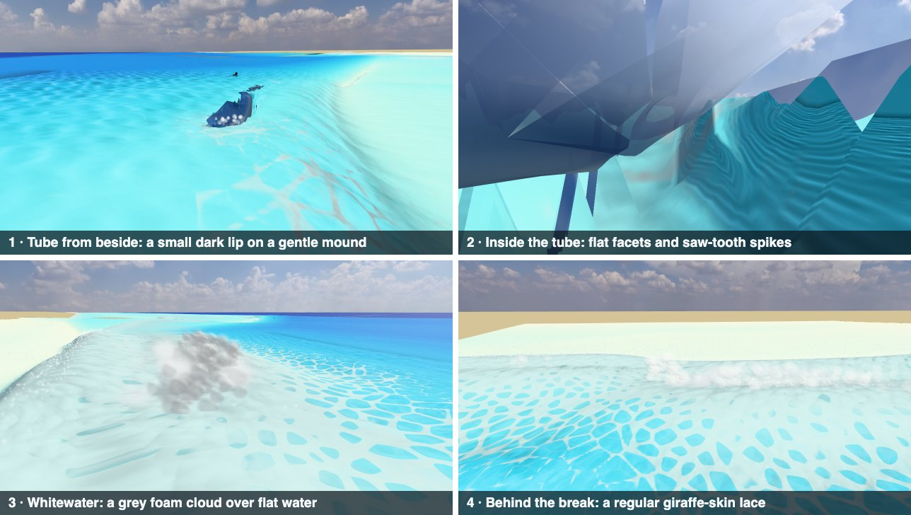

# Wave Physics Research

Sep 28, 2026 · @vicente

## Verdict

The waves form well, but everything after the break sits on a surface that cannot fold. The solver's breaking model holds the face near 17°, right for a broken bore but not for a pitching lip. So the tube is a pocket under a thin, separate sheet, cut into 1 m slices, and whitewater is paint on flat water. Research, film and shipped surf games agree on the fix: one surface swept from simulated 2D overturn profiles and timed by the solver, then whitewater with a body.

**Decided on 2026-09-28:** build the swept surface (row 1 below). A new Padang Padang spot, built in its own session, is its first testbed. The Reef session keeps its reef-shape values for it.

**Open for you (2026-09-29):** the biggest Reef swells can still blow the solver up, and the fix is an architecture choice: Solver stability.

## Why it doesn't read as a real surf wave

Everything after the break is added beside a surface that cannot fold, and each piece is drawn on its own, so they never read as one wave.

*The Reef practice wave, Rich look, midday, from the game's water-sheet view on latest main, which runs the CPU tier. Until a fix on 2026-09-28 (commit 33fae37), the GPU tier the M4 plays on threw no lips at all; since PR #66 it is checked to match the CPU tier event for event.*

- **The face never stands up.** The solver's breaking model damps any face steeper than about 13–17° once breaking is under way. That is right for a broken bore, but a plunging face goes vertical. This Reef wave peaks near 27°.
- **The tube has the right size but no wall.** Its void is close to measured sizes for these beds, about 0.8–1.1 m long at Hs 1.4 m ([Pick & Feddersen 2026](https://www.cambridge.org/core/journals/journal-of-fluid-mechanics/article/scaling-the-shape-of-shoaling-and-overturning-solitary-waves/D43EDB6346C8975E77258A291CFCB4EF)). Only the lower half of the overturn is cut, though, so its back wall is the slope and it reads as a pocket high on the face (shot 1).
- **The lip is thin, separate and all-or-nothing.** A plunging 1 m column throws one strip of 8 water parcels, once; a spilling column throws nothing. The strip is drawn on its own, only as thick as its water, and shows as a dark, crumpled sheet.
- **Each metre of crest breaks on its own clock.** Every 1 m slice throws, flies and closes by itself, so from inside the tube you see flat facets and saw-tooth spikes (shot 2).
- **Whitewater has no body.** The broken wave is flat water painted with a regular lace of 0.7 m cells (shot 4). The foam ball is a grey cloud floating above it (shot 3), and spray is round dots. Foam is painted as one opaque colour, so over the Reef's bright water it comes out darker than the water: 0.92×, measured on screen.

## What research and surf media do instead

- **Coastal models don't overturn either.** Eddy-viscosity breaking "suppresses overturning" by design ([Papoutsellis et al. 2019](https://arxiv.org/pdf/1910.08982)). Its \~17° face matches broken bores measured by LiDAR, 16–22° ([Martins et al. 2018](https://purehost.bath.ac.uk/ws/files/170060912/Martins_et_al_JGR2018.pdf)). A plunging face goes vertical once the crest water reaches about 85 % of the crest's speed ([Derakhti et al. 2020](https://arxiv.org/pdf/1911.06896)).
- **Film and surf games sweep 2D profiles along the crest.** [Mihalef et al. (2004)](https://www.math.fsu.edu/~sussman/BreakingWavesElectronic.pdf) extruded simulated 2D breakers into a 3D tube. Sony's *Surf's Up* interpolated 2D profiles with tube depth and length controls ([Bredow et al. 2007](https://www.imageworks.com/sites/default/files/2023-10/making-waves-for-surfs-up.pdf)). [True Surf (2025)](https://www.meta.com/blog/true-surf-launch/) blends 2D slices from its own 2D water simulation, peeling from spilling to barrel. Lab plungers repeat closely ([Erinin et al. 2022](https://arxiv.org/abs/2210.01925)), so a library of simulated profiles is honest.
- **Real-time 3D fluid is heavy.** A 64³ grid plus 112k particles inside a height field ran at 30 fps on a 2013 GPU ([Chentanez, Müller & Kim 2014](https://matthias-research.github.io/pages/publications/hybridsim_preprinted.pdf)). The M4 Pro has less memory bandwidth than that card.

## What to change, ranked

Keep the solver: its face is right for broken bores, and pushing it steeper makes hybrid breaking models unstable ([Kazolea & Ricchiuto 2018](https://www.math.u-bordeaux.fr/~mricchiu/kr18.pdf)). Change what sits on top of it.

| # | Change | What you would see | Cost | Rests on |
| --- | --- | --- | --- | --- |
| 1 | Draw and collide the breaking section as one surface: full 2D overturn profiles (face, lip, cavity) from an offline simulation library, picked by the solver's slope, height and depth, swept along the crest on a smooth slice clock | The wave stands up, pitches a thick lip and opens a round barrel that peels as one, with no teeth or facets | Small per frame (a lookup and a few thousand vertices; my estimate), plus a one-off set of 2D simulations | [Mihalef 2004](https://www.math.fsu.edu/~sussman/BreakingWavesElectronic.pdf), [Surf's Up](https://www.imageworks.com/sites/default/files/2023-10/making-waves-for-surfs-up.pdf), [True Surf](https://www.meta.com/blog/true-surf-launch/) |
| 2 | Time the lip by crest speed: it forms at 0.85 and throws at 1.0, with strength scaling smoothly from spilling to plunging | Faces visibly steepen before they throw; spilling waves curl a little instead of only foaming | Negligible | [Derakhti 2020](https://arxiv.org/pdf/1911.06896), [Bacigaluppi 2019](https://arxiv.org/pdf/1902.03021) |
| 3 | Give whitewater a body: a roller about 2.9 H long with a 16–25° face, foam that ages from fresh to lace and lasts longest on the reef, greener aerated water, and foam drawn as a layer that only adds light | A tumbling white front with height, and foam trails that fade believably | Low | [Martins 2018](https://purehost.bath.ac.uk/ws/files/170060912/Martins_et_al_JGR2018.pdf), [Koepke 1984](https://user.eumetsat.int/s3/eup-strapi-media/pdf_il_07_07_13_a_dfa14e9e2f.pdf), [Callaghan 2012](https://doi.org/10.1029/2012JC008147) |
| 4 | Shade for light, not only thickness: a lip glow with a longer light path, a darker throat, spray that is clear when young and white when old, stretched along its motion and bright only when backlit | Emerald backlit lips, a readable tube interior, and spray that stops swamping the impact | Low (shaders) | [Pope & Fry 1997](https://omlc.org/spectra/water/data/pope97.txt), [Barré-Brisebois 2011](https://colinbarrebrisebois.com/2011/03/07/gdc-2011-approximating-translucency-for-a-fast-cheap-and-convincing-subsurface-scattering-look/), [Surf's Up](https://www.imageworks.com/sites/default/files/2023-10/making-waves-for-surfs-up.pdf) |
| 5 | Later: a GPU particle patch for the pour and splash, on the M4 tier only | True splash-up and air pockets | High, and it differs between machines, so cosmetic only | [Chentanez 2014](https://matthias-research.github.io/pages/publications/hybridsim_preprinted.pdf) |
