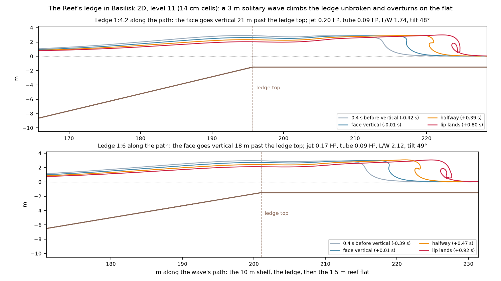

# The Reef's ledge in Basilisk

You asked (2026-09-30) for the Reef's own transect to be run, to source its provisional lip and tube. The runs work and resolve the lip, but a solitary wave doesn't break where the Reef does: it climbs the ledge whole and overturns on the reef flat. So they source the lip's thickness, not the jet or tube at the ledge. That needs periodic swell.

*Basilisk 2D at level 11 (14 cm cells), on your M1 alongside other work, about 1.5 hours per case. The bed is the Reef's peak (`REEF` in `src/wave/Bathymetry.ts`) along the wave's path, from the 10 m shelf up the ledge to the 1.5 m reef flat, with a 3 m solitary wave that breaks at about the Big swell's height. The ledge climbs 1:2.29 across its crest line. The game's waves cross it obliquely, so the runs take 1:4.2 (the steepest crossing the Teahupo'o report measured) and 1:6 (near the game's median reading).*

| Along the path | Jet ÷ H² | Lip thickness | Tube ÷ H² | Tube length ÷ width | Tilt | Open, vertical to touchdown | Cells across the lip |
| --- | --- | --- | --- | --- | --- | --- | --- |
| 1:4.2 | 0.20 | 0.41 H | 0.085 | 1.74 | 48° | 0.80 s | 9 |
| 1:6 | 0.17 | 0.28 H | 0.089 | 2.12 | 49° | 0.92 s | 6 |
| The game today (provisional) | 0.44–0.47 | 0.5 H | 0.43 | 1.42 (held) | 23° |  |  |

## What the runs show

- **The wave breaks on the flat, not the ledge.** It goes vertical 18–21 m past the ledge top, and its lip lands on still water 1.5 m deep. Solitary waves don't break on slopes steeper than 12° ([Grilli et al. 1997](https://digitalcommons.uri.edu/oce_facpubs/207/)); 1:4.2 is 13.4°. The Reef, and the game's Reef, throw at the ledge into a drained trough, the step, which only periodic swell produces.
- **The lip is thick:** 0.28–0.41 H, thicker on the steeper crossing. That supports the thick lip Shand describes at Teahupo'o ("about half the wave height"), though not yet as a measurement at the ledge.
- **The tube is small and steep,** because the lip lands on the face about 1 m above still water, with no trough to fall into. Its length over width, 1.7–2.1, sits inside Blenkinsopp & Chaplin's lab reef (1.46–2.28) and the field's 1.70–3.15 at closure, both as quoted by [O'Dea et al. 2021](https://agupubs.onlinelibrary.wiley.com/doi/full/10.1029/2021GL093664).
- **Level 11 resolves it:** 6–9 cells across the lip, where round 6 found about 6 enough. The level-9 test, at 1.6 cells, overstated the jet by half and the tube by 80 %.
- **For the lip-jet source:** the jet is 8–9 % of the water above the trough within a tapered ±2H window, the window the predictor session now uses.

## Your decisions

1. **Periodic swell for the Reef (recommended).** Sourcing the Reef's jet and tube at the ledge needs a wave train with its trough, the step. That means a wavemaker or a periodic initial wave in Basilisk: your "periodic swell later", now needed here. My estimate is about a day of setup, then a few hours per case at level 11–12 on the M4 Pro. The same runs would give Padang's swept barrel its onset lag for swell; today it uses the solitary lag as an upper bound.
2. **Until then, keep the Reef's provisional values** (jet 0.47 H², tube 0.43 H², tilt 23°, length over width 1.42). These runs don't break where the Reef does, so they can't replace them; the lip thickness is the one value they support.

Scripts: `tools/basilisk/run_reef.sh`. Notes: [notes/round6-tube-profiles/reef-ledge.md](notes/round6-tube-profiles/reef-ledge.md).
