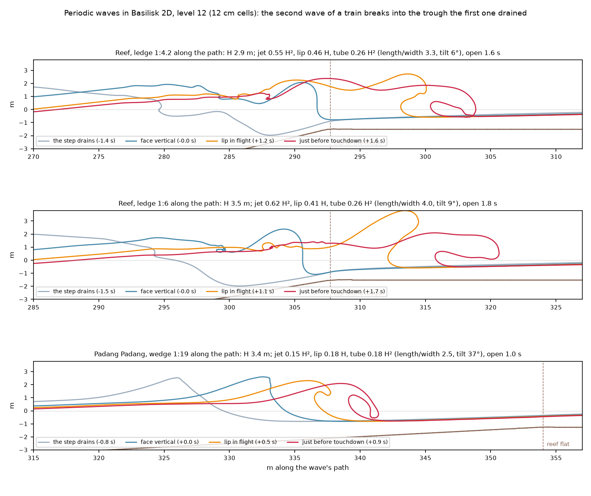

# The Reef's ledge in Basilisk

You asked for the Reef's own transect, then for periodic waves. The periodic runs work. The second wave of a train breaks at the ledge top, into the trough the first one drained: the step. They source the Reef's thick lip and its jet, close to the game's provisional values, and they support the tube it draws. They also give Padang's lag for swell.

*Basilisk 2D, with a train of two cnoidal waves: 3 m at 14 s on the Reef's 10 m shelf, and 2.1 m at 16 s on Padang's 7 m foot. The second wave is the one studied. The runs use level 10 until it nears the break, then level 12 (12 cm cells) around it, giving 11–12 cells across the Reef's lip and 5.6 across Padang's. Each took about 2 hours on your M1, alongside other work.*

| Per breaking height H | Reef 1:4.2 | Reef 1:6 | The game's Reef (provisional) |
| --- | --- | --- | --- |
| Breaking height H | 2.9 m | 3.5 m |  |
| Jet | 0.55 H² | 0.62 H² | 0.44–0.47 H² |
| Lip thickness | 0.46 H | 0.41 H | 0.5 H |
| Tube at 85 % of its flight: area, length ÷ width, tilt | 0.34 H², 1.48, 19° | 0.45 H², 1.80, 19° | 0.43 H², 1.42, 23° |
| Tube just before the lip lands | 0.26 H², 3.3, 6° | 0.26 H², 4.0, 9° |  |
| Open, face vertical to touchdown | 1.6 s | 1.8 s |  |

## What the runs show

- **The step is real, and it moves the break to the ledge.** The first wave's backwash drains the ledge to about 2 m below still level. The second wave's face steps where the backwash meets it, then goes vertical at the ledge top and throws its lip 10–12 m. A single solitary wave instead broke on the flat, 18–21 m past the top.
- **The thick lip is sourced:** 0.41–0.46 H, near Shand's "about half the wave height".
- **The jet is a little bigger than the game asks:** 0.55–0.62 H² against 0.47.
  - It takes 57–64 % of the crest's top water within ±2H, while the lip-jet source lets a cell give at most 20 %.
  - On main, 48–62 % of the Reef's throws already fall short at 0.47.
- **The tube as drawn is supported.** It is round for most of its flight: 0.34–0.45 H² and 1.5–1.8 times as long as wide at 85 %. It flattens only as the lip lands (3.3–4.0). The swept barrel should take that time course from the profile library.
- **Padang:**
  - Jet 0.15 H², tilt 37° and length ÷ width 2.5, all near the plane-slope fits. Its tube is 0.18 H², half the fit, capped by the flat.
  - Its lag for swell is 2.32 √(h0/g), about 2 s, 16 % under the solitary value. The Padang session now uses it.
  - Two more cases give lags of 0.22 √(h0/g) for a small 14 s swell and 1.60 for a big 18 s one. The lag isn't a clean function of depth: the small wave breaks right where the solver onsets it. So the Padang session may key the throw on the Navier–Stokes breaking depth instead.

## Your decisions

1. **The Reef's jet.** Recommended: raise it to about 0.55–0.6 H², now sourced. If you do, also let the lip-jet source take up to about 30 % of a cell's water on the Reef (from 20 %), or more throws will fall short.
2. **The Reef's tube and lip.** Recommended: keep them. The provisional 0.43 H², 1.42 and 23°, and the 0.5 H lip, are supported by the runs.

The solitary runs, their limits and every number are in [notes/round6-tube-profiles/reef-ledge.md](notes/round6-tube-profiles/reef-ledge.md) and [periodic-runs.md](notes/round6-tube-profiles/periodic-runs.md). The solitary runs' figure: [img/reef-ledge-overturn.png](img/reef-ledge-overturn.png). Scripts: `tools/basilisk/run_periodic.sh` and `analysis/plunge_measure.py`.
