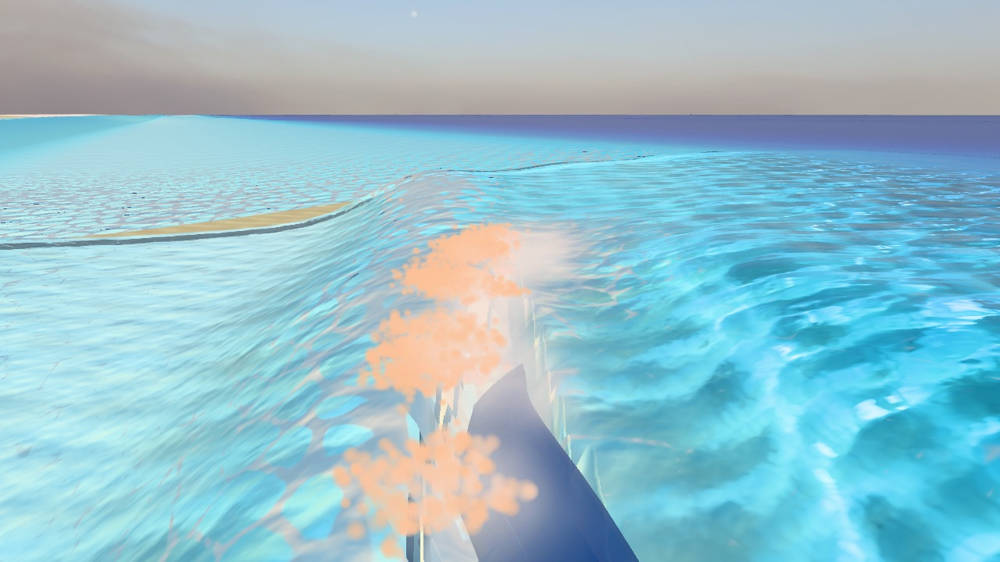

# Spray and mist: from dots to a veil

The game throws spray at the right moments: lip landings, bores, offshore wind and air escaping the tube. It draws them as round, flat-lit discs, though. What you see in real spray is how dense it is: white where it is thick, clear and glowing toward the sun where it is thin, and lingering as haze for minutes. Fixed, a reef slab bursts into a white core that thins into a backlit veil, spit pulses out of the tube, offshore wind blows spray back off every lip, and a salt haze hangs over the break.

## Why it reads wrong

- **Discs, not a veil.** Drops are drawn as 6–14 cm sprites at 0.8 opacity (`SprayCloud.ts`). Real drops are 0.05–3 mm: you only ever see how dense they are.
- **No drop optics.** Mist scatters light forward with g = 0.6 (`mist.ts`), where water drops have 0.86–0.88. So there is no backlit glow and no rainbow, and foam-ball sprites take the sun's colour: salmon at sunset (above).
- **Wrong launch point.** Spray starts where a parcel lands, but real spray peels off the rims of flying sheets. A 0.2 mm drop thrown up at 10 m/s rises only 14 cm, so height has to come from the sheets, and from the wind for fine spray.
- **Mist dies too fast, and there is no haze.** Mist lives 4 s and never rises, while fine spray takes from 14 s to over 5 minutes to fall 1 m. Reef plumes reach 25–35 m. Above water the scene has no haze at all.
- **The offshore veil barely exists,** because its onset uses absolute wind. **The 4,096-drop pool clips the Reef's biggest moments:** it is full on 17 % of steps.

## The numbers to hit

- **Jet impact** ([Chanson et al. 2002](https://staff.civil.uq.edu.au/h.chanson/reprints/coastal02.pdf), [Erinin et al. 2023](https://arxiv.org/pdf/2210.01923)):
  - a burst under 0.4 s at a 6 m/s impact, throwing drops 2.5 m out;
  - drop sizes up to 3 mm, the count falling as d⁻² below about 1 mm and d⁻⁶ above;
  - drop speeds 0.5–2× the impact speed;
  - about a third of the drops at impact, about half from the splash-up, the rest as late fizz.
- **Offshore veil** ([Veron 2015](https://bpb-us-w2.wpmucdn.com/sites.udel.edu/dist/b/10612/files/2020/12/Veron-2015-spray-annurev.pdf), [Troitskaya et al. 2017](https://www.nature.com/articles/s41598-017-01673-9)): spray tears off once the wind relative to the crest exceeds 7–11 m/s, in drops of mostly about 0.1 mm radius. At a surf break the wave's own speed counts, so 3–4 m/s offshore is enough on 1.5–2 m waves \[inferred\].
- **Bore front** ([Wüthrich et al. 2021](https://staff.civil.uq.edu.au/h.chanson/reprints/Wuthrich_Shi_Chanson_jfm_2021.pdf)): 2.5–3 mm drops thrown forward at 1.5× the bore's speed and 30–45°, reaching 0.3–1.5 m.
- **Spit:** lasts 2–3 s; its speed has never been measured. A 2D simulation's trapped air caps it near 45–65 m/s \[provisional\].
- **Haze** ([Porter et al., lidar](http://www.soest.hawaii.edu/higear/SEASpaper/UHlidar_F.pdf)): near breaks, light is dimmed 6–16× more per metre than in clean air, cutting visibility from about 60 km to roughly 4–10 km. Plumes are present about half the time.
- **Optics** (Mie theory with [Bohren 1987](https://patarnott.com/atms749/pdf/BohrenMultipleScattOpus.pdf), computed):
  - drops block twice their own cross-section of light, and half of what they scatter goes within 5° of straight ahead;
  - optical depth is 1.5 × the water per unit area ÷ the drop radius;
  - spray is see-through near 1 and white only above about 15;
  - the rainbow sits 40.5–42.4° from the point opposite the sun.

## What to change, ranked

All changes are Rich only and cosmetic online; Classic stays byte-identical.

| # | Change | What you would see | Cost, M1 measured / M4 Pro estimated |
| --- | --- | --- | --- |
| 1 | Draw spray by its optical depth: opacity, whiteness and forward glow from the drop physics, streaked along its motion, clear when young, faded near the camera, with an optional rainbow | A white core thinning into a glowing veil; gold spit at sunset | Shader only: under 0.3 / 0.1 ms |
| 2 | Release spray in stages from the right places: impact burst, splash-up rims, spit pulses, bore spray. Never drop impacts from the budget. Later, launch from the swept surface's lip | The Reef explodes and hangs | A 16k pool: +2.5 / 1–1.5 ms per step, 0.6 / 0.2 ms to draw |
| 3 | Salt haze and plumes that follow the sets and drift downwind | Scale: the sun side glows, plumes trail the sets | Under 0.1 ms in existing shaders |
| 4 | An offshore veil off every lip, triggered by wind plus wave speed | The classic offshore look at Padang Padang and the Reef | About 0.1 ms |
| 5 | A tube-camera guard against spray filling the view | A steady frame rate in the barrel | 0.4–0.5 ms, only when on |
| 6 | GPU spray, 50k–250k drops | Denser, finer explosions | 0.36 ms to simulate 262k; 3.3 / about 1 ms to draw |

The M1 timings were taken in Chrome on a loaded machine, ±50 %. M4 Pro figures are inferred from core counts.

## Your decisions

1. **Optics:** fully physical, where sparse spray goes faint when front-lit, or a minimum visibility for readability.
2. **Haze above water:** yes or no, and whether it follows the sets.
3. **Budget:** a bigger CPU pool on the M4 Pro now, or GPU spray.
4. **Unmeasured spit and veil:** accept provisional models, or fund a 3D Basilisk run for the spit.
5. **Rainbows:** in or out.
6. **Order:** my recommendation is shading and haze now, and new emission once the swept surface exists.

**Decided 2026-09-29, as recommended:** physical optics with a readability minimum; salt haze that follows the sets; a 16k CPU pool now and GPU spray later; the provisional spit and veil models accepted; rainbows in. The order is shading and haze now, and new emission once the swept barrel exists.
