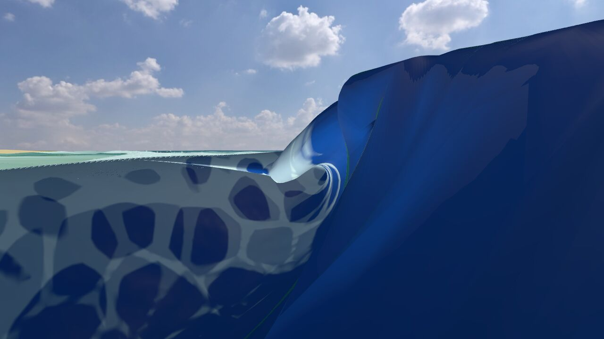
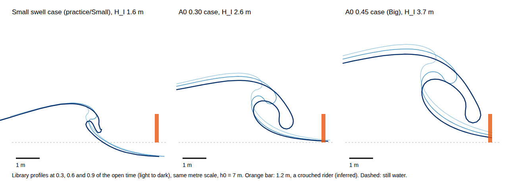

# Tube review: Padang Padang's drawn barrel (PR #92)

2026-09-30. From the owner's clip on the M4 Pro and our own captures of `claude/padang-mesh` at Padang Padang, on the Big offshore swell, in both looks. The fix for item 1 is written up in [tube-colour-fix.md](tube-colour-fix.md).

**Verdict:** the drawn barrel has the right kind of shape, but it is shaded by the wrong water, it sits on foam the solver made about 2 s early, and at practice size it is too small to ride. Fix the shading first. It is cheap and removes the navy.

## What you see now

- **A dark navy stripe** on pale, foam-laced water. It shows in the owner's clip and in both looks ([clip 13 s](img/tube-review-owner-13s.jpg), [channel, Rich](img/tube-review-padang-big-channel-rich.jpg), [Classic](img/tube-review-padang-big-channel-classic.jpg)). Close up it is a flat slab ([clip 19 s](img/tube-review-owner-19s.jpg)).
- **Stippled edges:** the 1 m dithered seam shows as speckle ([shoulder](img/tube-review-padang-big-shoulder-rich.jpg)).
- **Several ribbons:** each is one breaking front's swept strip (inferred).
- **A small curl, not a barrel:** on the Big swell the opening is about 0.8 m across, on a wave about 2.1 m high. The practice swell made one 4 m front in about 30 s, and it was drawn flat.
- **Inside the tube reads as underwater:** fog and sand ([inside](img/tube-review-padang-big-inside-rich.jpg)).
- **It melts rather than closes:** sand-coloured bands and white slits along its edge ([collapse, about 1 s](img/tube-review-padang-big-collapse-series.jpg)).
- **The old tube elsewhere:** at the Reef it is a carved pocket in pale water, with foam balls filling the view ([beside](img/tube-review-reef-old-beside-rich.jpg), [inside](img/tube-review-reef-old-inside-rich.jpg)).

## Why

1. **Shading: the barrel is drawn with the far-ocean shader, not the wave's.**
   - It takes the far-ocean foam and normals, and no crest light.
   - Its colour comes from the height above the seabed, so the lip, the thinnest water on the wave, is drawn as the deepest and darkest.
   - Its caustics look for the reef through that false depth, which makes the sand bands.
   - Foam is zeroed across the whole strip.
2. **Timing: the solver breaks early.** It breaks 2.2–2.8 √(h0/g) before the Navier–Stokes face goes vertical, about 2 s at the 7 m foot. So its whitewater is already there when the drawn lip throws.
3. **Size.**
   - The Small case's opening is about 0.035 H². That's under the field's 0.05–0.3 H² and about 12× under Pick & Feddersen's plane-slope fit (0.41 H² at 1:19). It is also under-resolved: 4.1 cells across the lip, against the 6-cell rule.
   - A front shorter than 5 m sits entirely inside the 2.5 m end blends, so it is never raised.

   
4. **Camera:** the underwater test reads the solver's height, not the drawn surface.
5. **Motion.**
   - At one slice, the clock ran 0.02–0.19 s per 0.1 s of sea, so the lip lurches (provisional: one slice).
   - After touchdown the slice fades over 0.3 s, with no splash-up or roller.

## What to change (ranked)

| # | Change | What you'll see | Owner | Cost (M4 Pro, provisional) |
|---|---|---|---|---|
| 1 | Shade the barrel with the wave's own shading (foam, aeration, crest light). Take the body colour from the lip's thickness, not the depth to the reef; caustics only where it lies on the water. See [tube-colour-fix.md](tube-colour-fix.md) | The navy goes. The lip glows cyan-green at its tip, darker toward the root; a darker throat | PR 6's shading, pulled forward (Classic changes on the barrel) | ≤ about 0.1 ms |
| 2 | Under each front, hold back the solver's foam and aeration until that slice touches down, then release them from the crash curve. Spray from the drawn tip | A glassy face and an open curl, with whitewater erupting at the pit | PR 5 | Small: the mask is already read |
| 3 | Size: rerun the Small case at level 13 before judging. If it holds, practice uses Medium or bigger. Floor the end blend for short fronts | A tube a rider fits in, or an honestly small curl | You, then the library | 3–8 h offline with OpenMP (libomp) |
| 4 | Test the camera against the drawn barrel (PR 4's "covered") | Inside the tube in air: dark throat, bright mouth | PR 4 | About 1 µs a frame once the contact is bucketed |
| 5 | Collapse over √(2W/g), about 0.3–0.6 s, then hand over to the roller; smooth the clock's rate | The tube closes and detonates instead of melting | PR 5, roller build | Not measured |
| 6 | Switch the other spots only after items 1–2 | The Reef doesn't inherit the navy ribbons | PR 7 | Deletes code |

## Decisions for you

1. Pull item 1 out of PR 6 into a fix now. It changes Classic's pixels on the barrel, which your Classic rule allows, but confirm it.
2. Run the level-13 Small case on the M4 Pro, and decide whether practice at Padang Padang moves to Medium.
3. Under the drawn barrel, hide the solver's early foam (display only), or delay the solver's breaking (physics, bigger).
4. Keep PR 7 waiting on items 1–2.

## Not verified

- **Sources:** these pages were blocked from this container, so their numbers come from the knowledge base's earlier readings: [Pick & Feddersen 2026](https://falk.ucsd.edu/pdf/Pick2026JFM_ScalingWaveOverturning.pdf), Feddersen et al. 2024, Surf's Up's course notes and Mead & Black 2001.
- **The Big capture:**
  - its slice sat 1.7 m from its front's end, inside the blend, so it may be drawn smaller than the library shape;
  - it made 53 lookups outside the library's cases;
  - its breakers were about 2.1 m, low for Hs 3.8 m.
- **The ribbons:** that they are separate fronts, not leftover slices, is inferred.
- **Costs:** all provisional; none measured on the M4 Pro.

Sources for the fixes: [Pope & Fry 1997](https://omlc.org/spectra/water/data/pope97.txt) (absorption), [Barré-Brisebois 2011](https://colinbarrebrisebois.com/2011/03/07/gdc-2011-approximating-translucency-for-a-fast-cheap-and-convincing-subsurface-scattering-look/) (thickness-based translucency), [O'Dea et al. 2021](https://www2.whoi.edu/staff/elgar/wp-content/uploads/sites/153/2021/08/145.pdf), [Martins et al. 2018](https://purehost.bath.ac.uk/ws/files/170060912/Martins_et_al_JGR2018.pdf) (the roller), and [Making Waves for Surf's Up](https://www.imageworks.com/sites/default/files/2023-10/making-waves-for-surfs-up.pdf).
