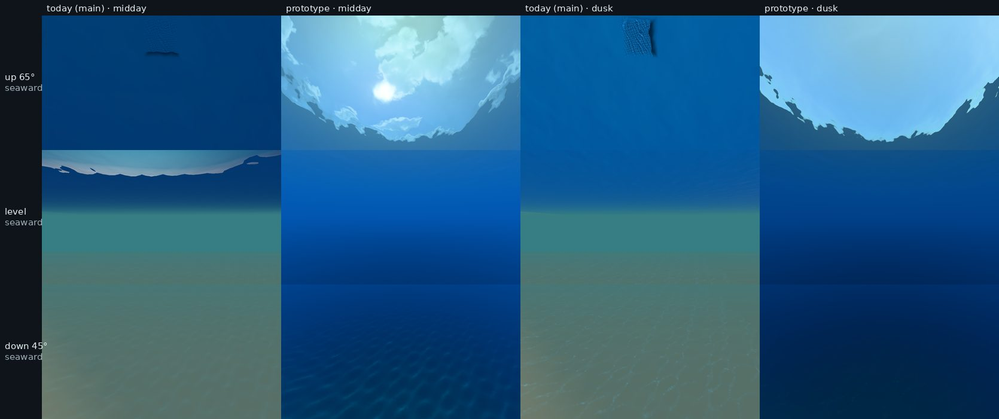
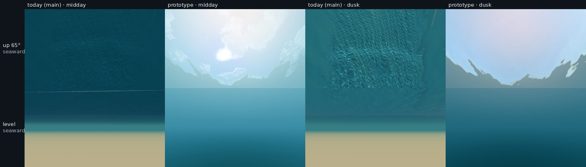

# Underwater prototype: colour, fog and the sky from below

A throwaway build of items 1–2, in Rich only, hits both visibility targets and the 97° sky window, and leaves Classic untouched. But it is darker than today, and looking up is only 4–10× brighter than looking level, not the measured 25×. Three calls are yours before a real PR.

*Water sheet, CPU tier, software rendering, 2026-09-29. Built off main 425ae4a and never committed.*

## What was built

- **Colour and fog from each spot's own water.** Each colour fades at its own rate, from the game's existing optics. The Beach is scaled up to the 7 m sighting floor; the Reef stays physical. Light dims with depth, and the seabed is lit by the real sun and sky with caustics, not a painted gradient.
- **The surface from below.** A Snell's window shows the sky and sun, and a mirror of the water and bed lies beyond it. Foam and plume glow as a ceiling, and caustics stop under whitewater.

Typecheck and all 199 test files pass, the same as untouched main.

## Measured against the targets

| Check | Target | Today | Prototype |
| --- | --- | --- | --- |
| Dark object, Reef | About 20 m (optics: 22.4 m) | Still visible at 40 m | 22.5 m; about 15 m on an 8-bit screen |
| Dark object, Beach | The 6–8 m floor (physical: 2.2 m) | Same as the Reef | 7.1 m |
| Sky window | 97.2° on flat water | None | 98.3–98.4° at the Reef; 97.5° at the Beach at dusk, no clean edge at midday |
| Looking up ÷ level | About 25× ([Tyler 1960](https://misclab.umeoce.maine.edu/education/VisibilityLab/reports/SIO_60-9.pdf), overcast lake) | 0.2–0.7×: the ceiling is darker than the fog | Reef 6.5× midday, 10.2× dusk; Beach 3.9× and 5.0× |
| Seabed at dusk | Darker than midday | Identical | 43 % darker |
| Classic | Unchanged | — | Pixel-identical to main |

## What falls short

- **It is dark.** The level view is 2–3× darker than today's, and the Reef bed at 10 m reads navy. At the Beach the sand no longer shows in the level view, because bed and water come out almost equally bright.
- **No coastal green.** The Reef reads saturated blue and the Beach cyan-grey. The game's optics have no dissolved-organic or chlorophyll absorption.
- **Up ÷ level misses 25×.** Tyler's ratio is for an overcast lake. Under a sun, the level view gets brighter while the zenith does not. A real build should fit sunny measurements instead.
- **Smaller gaps.** Dusk is only 43 % darker, because the photo sky already dims low suns. The Beach window stays sharp where turbid water should blur it. Nothing was timed, since the renderer here is software.

## Your decisions

1. **An underwater exposure gain.** Recommended: yes, one gain that brings the level view back to today's brightness. The physics shapes stay, as with the gains you accepted for Rich above water.
2. **The floor at the Point.** Its water is physically 4.3 m. Recommended: apply the 7 m floor wherever the water is murkier than that, since the floor exists for readability.
3. **Water colour.** Accept the blue Reef and grey Beach, or fund a sourced per-spot absorption term. Recommended: fund it; the per-frame cost is a few numbers per spot (estimate).

## What a real PR must do differently

- Fog inside the materials, not in an extra full-screen pass. That saves the memory round trip on Apple GPUs and fogs bubbles and spray correctly.
- Fit the level brightness to sunny measurements, then re-measure looking up against looking level.
- Blur the window with turbidity, and give the far-field ocean and the lip sheet the same underside.
- Unit-test the fading and the light from above against the table above.

Details, code references and the diff: [notes/round5-underwater/prototype-1-2.md](notes/round5-underwater/prototype-1-2.md) and [prototype-1-2.diff](notes/round5-underwater/prototype-1-2.diff).
