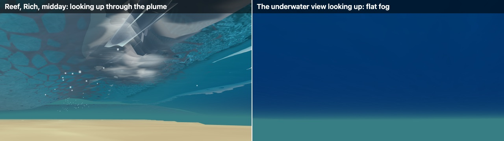

# Underwater: from a flat tank to moving water

Today the underwater view is a flat teal fog around a painted floor, with white dots for bubbles. Real surf seen from below is lit from above through a bright window in a silver ceiling, and the whole water mass moves: it surges a couple of metres with every wave, slides back along the bed, and fills with rolling white clouds and brown sand behind each break. The solver already carries most of that motion; the renderer throws it away.

## Why it reads flat

- **One fog everywhere.** Every spot and hour gets the same teal `FogExp2` (`main.ts`). It still shows 61 % contrast at 20 m.
  - The game's own water optics say a black object vanishes at 2.2 m at the Beach and 22 m at the Reef.
  - At the Reef, red should be gone within 10 m \[computed\].
- **No window to the sky.** The surface is shaded from below with the above-water formula: a pale matte sheet, where there should be a bright window set in a mirror.
- **No light from above.** The seabed is an unlit painted gradient, as bright at dusk as at noon. Measured underwater, looking up is about 25× brighter than looking level ([Tyler 1960](https://misclab.umeoce.maine.edu/education/VisibilityLab/reports/SIO_60-9.pdf)).
- **The water doesn't move.**
  - Bubbles are 7 cm dots that ride the depth-averaged current and vanish after 3 s.
  - The plume is paint on the ceiling.
  - There is no surge, undertow, vortex or sand, and caustics keep dancing under whitewater.
- **Players rarely see it.** Ride cameras stay above the surface; duck-dives and hold-downs are only heard, as a muffle.

## What happens down there

- **Surge:** under 1.4 m, 12 s waves in 3–5 m of water, the whole column sways ±1.8–2.4 m at 0.9–1.2 m/s, nearly the same at every depth. Vertical motion is ±0.35 m at mid-depth and zero at the bed \[computed, linear theory\]. Near-bed flow reaches about ±1 m/s under plunging breakers ([Aagaard et al. 2021](https://doi.org/10.3390/jmse9111300)).
- **Currents:**
  - undertow 0.05–0.4 m/s at Duck in a storm ([Garcez Faria 1997](https://calhoun.nps.edu/server/api/core/bitstreams/7a30faa6-893a-4ede-af9a-5f711de8fe8c/content)), and up to 0.8 m/s near the bed behind a flume bar ([van der Zanden et al. 2018](https://ris.utwente.nl/ws/files/29784531/Zanden_et_al_2018_Journal_of_Geophysical_Research_Oceans.pdf));
  - rips about 0.3 m/s, pulsing above 1 m/s for 25–250 s ([MacMahan et al. 2005](https://calhoun.nps.edu/server/api/core/bitstreams/b2de88ce-653b-4133-9d3e-bf1d78390d59/content)).
- **Plunge:**
  - the trapped air tube is driven down and breaks into bubbles within about a second at lab scale ([Deane & Stokes 2002](https://pdodds.w3.uvm.edu/files/papers/others/2002/deane2002.pdf));
  - the bubble plume falls at 30–45 % of the jet's speed ([Chanson et al. 2002](https://staff.civil.uq.edu.au/h.chanson/reprints/coastal02.pdf));
  - each splash-up makes a new vortex and cloud about every 1.1–1.3 s, trailing tilted bubble columns ([Watanabe et al. 2005](https://eprints.lib.hokudai.ac.jp/dspace/bitstream/2115/1425/1/JFM545.pdf)).
- **Bubbles:** a young plume holds over 10 % air, falling to about 1 % within one or two periods. Millimetre bubbles rise at 0.2 m/s, 50 µm ones at 0.5 cm/s ([Leifer et al. 2006](https://publications.tno.nl/publication/34610132/xa5thE/leifer-2006-bubbles2.pdf)), so a fine haze lingers for tens of seconds.
- **Sand:** plunging vortices lift clouds more than 0.5 m, at 3–7 kg/m³ near the bed; beach sand settles at 3–5 cm/s. Reef carbonate sand is coarse and falls out in seconds.
- **Optics:**
  - the sky fills a 97° window, widening toward 180° under breaking waves ([Lynch 2014](https://doi.org/10.1364/ao.54.0000b8));
  - near-surface flashes reach about 10× the mean light ([Darecki et al. 2011](https://doi.org/10.1029/2011JC007338));
  - light shafts stay steeper than 42° above horizontal whatever the sun's height \[computed\].

## What to change, ranked

All of this goes in Rich only, is cosmetic online, and runs only while the camera is underwater. None of the costs was timed: they are estimates scaled from round 4's M1 measurements.

| # | Change | What you would see | Cost, M1 / M4 Pro |
| --- | --- | --- | --- |
| 1 | Colour and fog from each spot's own water: fading by colour, light brightest from above and dimming with depth, a seabed lit by the actual sun | Reef clear blue-green to about 20 m; Beach murky within a few metres; dusk goes dark | 0.1–0.3 / under 0.1 ms |
| 2 | The surface from below: Snell's window, a mirror beyond it, foam as a glowing ceiling, no caustics under whitewater | A bright, rippling disc of sky in a silver ceiling | Under 0.05 ms |
| 3 | Tracer specks moving with a 3D flow rebuilt from the solver | The water mass sways, drifts and swirls | 0.8–1.4 / 0.3–0.5 ms for 32k specks |
| 4 | The bubble plume as a volume, from the aeration field the rider already feels, plus a lingering fine-bubble haze | White clouds rolling behind each break; hold-downs that white out | 0.3–1.0 / 0.1–0.3 ms |
| 5 | Light shafts from the surface's real focusing, and caustics on the rider | Swaying shafts in reef water that vanish under whitewater | 0.3–0.8 / 0.1–0.3 ms |
| 6 | Sand clouds, mainly at the Beach | Brown puffs under each plunge, settling over tens of seconds | 0.1–0.3 ms per step, drawn with item 4 |
| 7 | An underwater ride camera and a waterline that splits the frame | Players see their own duck-dives and hold-downs | About 0.05 ms, only near the surface |
| 8 | Once the swept barrel exists: the tube's air cavity from below, collapsing into vortex clouds | The tube from underneath | Small |

Items 1–2 come first: moving tracers in a flat fog still read flat. The whole package is estimated at 0.6–1.3 ms on the M4 Pro.

Items 1–2 were prototyped on 2026-09-29: [underwater-prototype.md](underwater-prototype.md).

## Showing the water move

Move tracers with the same flow that pushes the rider:

- the solver's depth-averaged current, shaped over depth as the rider's water already is (within 2 % of FUNWAVE-TVD's Boussinesq profile);
- vertical flow from continuity;
- in broken waves, a roller layer moving at √(gd) over the undertow;
- eddies from the aeration field's turbulence;
- bubbles rising and sand sinking at speeds set by their size.

The surge, a slow shoreward creep at the top and a seaward drift along the bed then appear on their own. Each tracer shows something different: specks show the surge and the rips, bubbles the roller and the vortex, sand the vortices striking the bed. Finding Nemo called the same idea floating "particulate".

## Your decisions (settled 2026-09-29)

1. **Visibility:** physical colours and fading with a readability floor of about 6–8 m, as Subnautica chose. Plumes still white out briefly.
2. **Ride camera:** follows the rider underwater in duck-dives and hold-downs, with a waterline splitting the frame, in Rich only. Classic stays unchanged.
3. **Haze and sand:** drawn only, cosmetic, and allowed to differ between online players.
4. **Order:** 1–2 now, 3 next, 4 with 6, then 5; 7 after that; 8 after the swept barrel.
