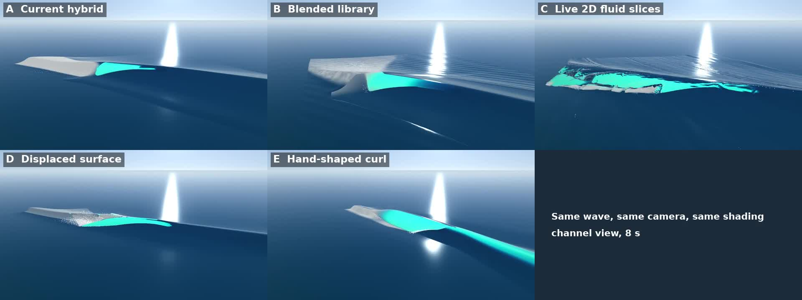

# Wave methods compared: five throwaway prototypes

2026-10-01. The owner asked to see the alternatives to the current tube method side by side. Each one builds the same peeling plunging wave: about 3.5 m, a 1:19 bed, peeling at 11 m/s. Each is drawn by one shared renderer with the same cameras and the same simple water shading, so only the method differs. They are throwaway prototypes and none is merged. Each method's notes are in [notes/round7-wave-methods/](notes/round7-wave-methods/).

**Verdict:** keep the hybrid and grow it into the blended library (B). It is real physics, it varies down the line, and it is cheap. The displaced surface (D) is the one new idea worth a later experiment. Live fluid slices (C) are too costly for the look they give at real-time resolution.

| | Method | Where the curl comes from | Cost per frame (node, measured) | WebGPU, M4 Pro (provisional) | Looks |
|---|---|---|---|---|---|
| A | Current hybrid | Stored Basilisk run, lofted along the crest on smooth clocks | 4.6–6.4 ms | under 1 ms | A real plunging lip and an open throat. The tube is short and appears abruptly at the shoulder. There's a kink where the curl meets the swell, and the bore has no volume |
| B | Blended library | Several stored runs blended by the local wave height | 8.7 ms median (blend 1.4 ms) | under 0.2 ms for the blend | The tube changes size and shape down the line, from a spilling curl to an open barrel, with no pops. The bore and collapse are the same weak stand-ins as A's |
| C | Live 2D fluid slices | A coarse particle fluid simulation (APIC), run live | 1.17 s of CPU per simulated second at 0.25 m cells; 33.5 s at 0.1 m | 2–4 ms per section, 6–10 ms for a whole wave | The most chaotic and "wet" of the five, but at an affordable grid the lip is stubby and late. It needed a fudged starting push to plunge at all |
| D | Displaced surface | One mesh whose points move with the water; the lip is thrown ballistically | 358 ms (118k vertices, unoptimised) | 1–2 ms | One water and one shader, with no seam. The lip's path matches Basilisk within about 0.1 s and 0.5 m, but its gravity was fitted to Basilisk. The face only reaches about 65° and the cavity is small; staircase artefacts on the oblique crest |
| E | Hand-shaped curl | Shaped by eye | 7–9 ms | under 0.2 ms | The cleanest, roundest barrel, but every section is the same, so it reads as computer graphics. It ignores the reef and the swell |

## What this means for the game

- **B is the cheap way to variety:** about 40–70 offline cases (7–11 MB) make every wave's tube depend on its own height, slope and period. It builds on what PR #90–92 already ship.
- **D is the only alternative that removes the seam itself,** because the curl is the water's own surface. It would still need the stored runs to check its shape. Worth a test after Padang Padang, as a drawing layer over the solver's flow.
- **The weak points common to all five are the same as the game's:** the bore after touchdown has no volume, and there's no splash-up or roller. That's PR 5 and the roller build, whichever method draws the curl.
- **The shared shading is simple:** a saturated cyan lip and no foam texture. Judge shape and motion from these videos, not the final look.
